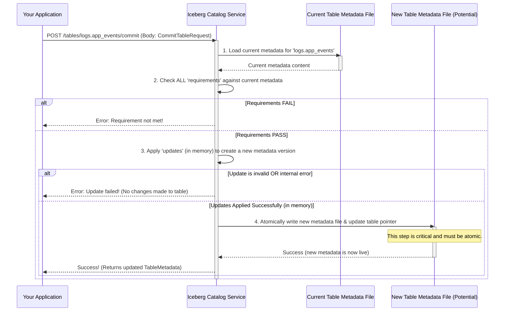

# Chapter 6: Commit Operations

Welcome to Chapter 6! In [Chapter 5: Metadata Updates](05_metadata_updates_.md), we learned about the individual "tools" or commands, like `SetPropertiesUpdate` or `AddSchemaUpdate`, that we can use to specify changes to a table's metadata. Each of these tools describes a single, specific modification.

But what if you want to make *several* changes to a table at once? For example, you might want to add a new column, change the table's owner, and register a new snapshot of data all at the same time. How do you ensure that either *all* these changes are applied successfully, or if *any one* of them fails, *none* of them are applied? This is where **Commit Operations** come in.

## The "Save All" for Your Table Metadata

Imagine you're working on a big project with many files, like writing a book with several chapters or coding a software module with multiple source files. When you're ready to save your work, you often have a "Save All" button. This button ensures that all your changes across all open files are saved together. If there's a problem saving one file (maybe the disk is full), you wouldn't want the other files to be saved in an inconsistent state. You'd want the "Save All" to either succeed completely or fail completely, leaving your project as it was before you tried to save.

A **Commit Operation** in the Iceberg `open-api` is very similar. It's like a "Save All" for a batch of metadata changes to a table or view. It groups multiple [Metadata Updates](05_metadata_updates_.md) together and applies them **atomically**.

**Atomically** means:
*   **All or nothing:** Either all the specified updates are successfully applied to the table metadata, and the table moves to a new, consistent state.
*   **Or, if anything goes wrong:** If even one update is invalid, or if certain conditions (called requirements) aren't met, then *none* of the updates are applied. The table metadata remains unchanged, just as it was before the commit operation was attempted.

This "all or nothing" behavior is crucial for maintaining data integrity. You don't want your table to end up in a half-updated, confusing state.

### Our Use Case: Safely Updating Table Location and Owner

Let's say we have a table, `logs.app_events`, and we want to do two things:
1.  Change its physical storage location (maybe we're migrating data).
2.  Update its `owner` property to `'DevOps Team'`.

We want these two changes to happen together. If changing the location succeeds but updating the owner fails (or vice-versa), we'd prefer the whole operation to fail, leaving the table as it was. A Commit Operation allows us to do exactly this.

## Key Parts of a Commit Operation

A commit operation typically involves two main components that you send to the Iceberg catalog service:

1.  **Requirements (Assertions):** These are conditions that *must be true* for the commit to even be attempted. Think of them as safety checks.
2.  **Updates:** This is the list of actual [Metadata Updates](05_metadata_updates_.md) you want to apply (like `SetLocationUpdate`, `SetPropertiesUpdate`).

Let's look at these more closely.

### 1. Requirements (Assertions): The Safety Checks

Before making any changes, it's often wise to check if the table is in the state you expect it to be. Requirements, also called assertions, let you do this. If any requirement is not met, the commit operation fails immediately, and no updates are applied.

Why are these useful?
*   **Preventing Accidental Overwrites:** You can assert that you're updating the table with a specific UUID. If the table got renamed or replaced without you knowing, this check would fail, preventing you from modifying the wrong table.
*   **Avoiding Conflicts:** If multiple users or processes are trying to update the same table, requirements can help prevent conflicting changes. For example, you can assert that the table's current schema ID is what you expect, ensuring no one else changed the schema since you last read it.
*   **Ensuring Correct State for Creation:** When creating a new table, you'd use a requirement to assert that a table with that name doesn't already exist.

**Common Requirement Types:**

*   **`assert-create`**: Used when creating a table. It asserts that the table does *not* already exist. If it does, the commit fails.
*   **`assert-table-uuid`**: Asserts that the table being modified has a specific `uuid`. This is a strong guarantee you're working with the exact table you intend.
*   **`assert-current-schema-id`**: Asserts that the table's current `schema-id` matches a specific value.
*   **`assert-default-spec-id`**: Asserts that the table's default partition spec ID matches a specific value.
*   And several others for checking specific aspects of the table's metadata.

These requirements are defined as Pydantic [Data Models](04_data_models_.md) in the `rest-catalog-open-api.py` file. For instance:

```python
# Snippet from rest-catalog-open-api.py (conceptual structure)
from pydantic import BaseModel, Field
# ... other imports ...

class TableRequirement(BaseModel):
    # This 'type' field tells the server what kind of assertion it is.
    # Specific requirement classes will define this 'type'.
    type: str

class AssertTableUUID(TableRequirement):
    # For this requirement, the 'type' would be 'assert-table-uuid'
    type: str = Field('assert-table-uuid', const=True) # Example value
    uuid: str # The UUID we expect the table to have

class AssertCreate(TableRequirement):
    # For this requirement, the 'type' would be 'assert-create'
    type: str = Field('assert-create', const=True) # Example value
    # No other specific fields needed for assert-create
```
In this example, `AssertTableUUID` checks if the table's unique identifier matches the provided `uuid`. `AssertCreate` simply checks if the table exists (and fails if it does).

### 2. Updates: The Changes to Apply

This is a list of the [Metadata Updates](05_metadata_updates_.md) we learned about in the previous chapter. Each item in the list describes a specific change, like:
*   `SetLocationUpdate(action='set-location', location='s3://new-path/')`
*   `SetPropertiesUpdate(action='set-properties', updates={'owner': 'Data Team'})`
*   `AddSnapshotUpdate(action='add-snapshot', snapshot=new_snapshot_object)`

If all the requirements pass, the server will attempt to apply these updates one by one (internally) to the table's metadata.

## Solving Our Use Case: Changing Location and Owner

Let's go back to our `logs.app_events` table. We want to change its location and update its owner. Assume we know its current UUID is `f0cacc2c-8498-41e0-81ac-0930e799020c`.

Here's how we'd structure a commit operation:

1.  **Table Identifier:** We need to tell the server which table we're targeting. This is done using a `TableIdentifier` object (from [Data Models](04_data_models_.md)), e.g., `namespace=["logs"], name="app_events"`.

2.  **Requirements:**
    *   We want to be absolutely sure we're modifying the correct table. So, we'll add an `AssertTableUUID` requirement:
        *   `type: 'assert-table-uuid'`
        *   `uuid: 'f0cacc2c-8498-41e0-81ac-0930e799020c'`

3.  **Updates:**
    *   To change the location:
        *   `action: 'set-location'`
        *   `location: 's3://my-company-data/new_logs_location/app_events'`
    *   To change the owner:
        *   `action: 'set-properties'`
        *   `updates: {'owner': 'DevOps Team'}`

All this information is bundled into a `CommitTableRequest` data model. This request is then sent to the Iceberg catalog server (e.g., via an HTTP POST request to an endpoint like `/v1/namespaces/logs/tables/app_events/commit`).

Here's a conceptual look at the `CommitTableRequest` structure, as defined by its Pydantic model in `rest-catalog-open-api.py`:

```python
# Snippet from rest-catalog-open-api.py (simplified for clarity)
from typing import List, Optional
# ... (other necessary imports like TableIdentifier, TableRequirement, TableUpdate)

class CommitTableRequest(BaseModel):
    # identifier: Optional[TableIdentifier] # Identifies the table if not clear from context
    requirements: List[TableRequirement]  # Our safety checks
    updates: List[TableUpdate]            # The list of changes to make
```
*   `requirements`: A list containing our `AssertTableUUID` object.
*   `updates`: A list containing our `SetLocationUpdate` and `SetPropertiesUpdate` objects.
*   The `identifier` field is used in some contexts (like transactions involving multiple tables) to specify which table this particular set of changes applies to. If you're committing to a table identified by the URL (e.g., `POST /v1/namespaces/logs/tables/app_events`), this might be optional or used for an extra layer of validation.

When the server receives this `CommitTableRequest`:
1.  It first checks the `AssertTableUUID` requirement. If the `logs.app_events` table's actual UUID doesn't match `f0cacc2c-8498-41e0-81ac-0930e799020c`, it rejects the whole request. Nothing is changed.
2.  If the UUID matches, it proceeds to apply the `SetLocationUpdate` and then the `SetPropertiesUpdate`.
3.  If both updates are valid and successfully applied internally, it finalizes the changes by writing a new version of the [Table Metadata](03_table_metadata_.md) file. The table is now in its new state.
4.  If, for some reason, applying one of the updates fails (e.g., the new location string is malformed, or there's an internal server error during the update process), *all changes are rolled back*. The table remains in the state it was in before the commit attempt.

## Under the Hood: What Happens During a Commit?

Let's visualize the process when your application sends a `CommitTableRequest`:



**Step-by-Step Breakdown:**

1.  **Load Current Metadata:** The Catalog Service first loads the most recent [Table Metadata](03_table_metadata_.md) for the specified table (`logs.app_events`).
2.  **Check Requirements:** It iterates through all the `requirements` in your `CommitTableRequest`.
    *   If any requirement (like our `AssertTableUUID`) fails (i.e., the condition is false), the entire commit operation is rejected. An error is sent back to your application, and the table remains untouched.
3.  **Apply Updates (In Memory):** If all requirements pass, the service creates a *copy* of the current metadata in its memory. It then applies each `TableUpdate` from your list to this in-memory copy.
    *   During this process, it also validates each update. For example, if an `AddSchemaUpdate` tries to add an invalid schema, this step would fail.
    *   If any update is invalid or an internal error occurs while trying to apply them, the entire commit operation is rejected. The original table metadata (on disk) is still untouched.
4.  **Atomic Write (Finalize):** If all updates are successfully applied to the in-memory metadata, the service performs the crucial atomic step:
    *   It writes the new, modified metadata to a new metadata file (e.g., `00001-newuuid.metadata.json`).
    *   It then updates the "pointer" (often a file like `version-hint.txt` or an entry in a metastore database) to say that this *new* metadata file is now the current one for the table.
    *   This "pointer update" must be atomic. This means it either fully succeeds (the table now points to the new metadata) or it fully fails (the table continues to point to the old metadata). This prevents the table from ending up in a state where it's unclear which metadata version is current.
5.  **Respond:** The Catalog Service then sends a success response back to your application, often including the newly updated [Table Metadata](03_table_metadata_.md).

The atomicity of step 4 is key. It ensures that even if the server crashes mid-operation (e.g., after writing the new metadata file but before updating the pointer), the table will either be in its old, consistent state or its new, consistent state, but never in a broken intermediate state.

## Conclusion: Safe and Sound Changes

Commit Operations are fundamental to safely managing Iceberg tables. They provide the "all or nothing" guarantee by:
*   Allowing you to batch multiple [Metadata Updates](05_metadata_updates_.md).
*   Enforcing pre-conditions through **requirements (assertions)**.
*   Applying changes **atomically**, ensuring that your table metadata transitions from one valid state to another, or stays in its original valid state if any part of the commit fails.

This robust mechanism is what allows Iceberg to handle schema evolution, data versioning (snapshots), and other metadata changes reliably, even in concurrent environments. Understanding commits is key to understanding how tables evolve in a controlled and safe manner.

With this knowledge of how metadata is defined, updated, and committed, you're getting a solid grasp of the core mechanics of an Iceberg catalog as defined by the `open-api`. In the next chapter, we'll look at a toolkit that helps ensure different implementations of this API specification actually work correctly together: [Chapter 7: REST Compatibility Kit (RCK)](07_rest_compatibility_kit__rck__.md).

---

Generated by [AI Codebase Knowledge Builder](https://github.com/The-Pocket/Tutorial-Codebase-Knowledge)