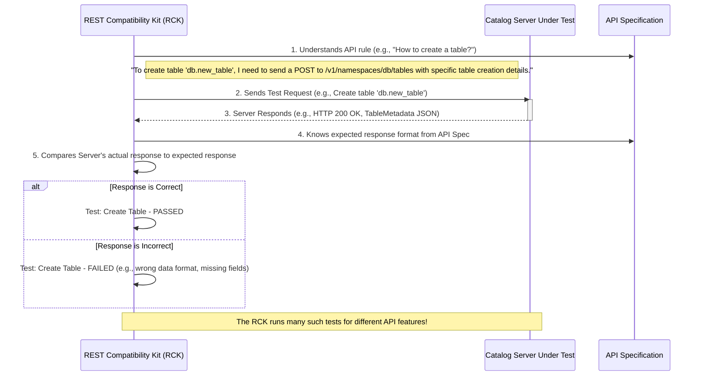

# Chapter 7: REST Compatibility Kit (RCK)

Welcome to Chapter 7! In [Chapter 6: Commit Operations](06_commit_operations_.md), we saw how changes to table metadata are bundled and applied safely using commit operations, ensuring that our data catalog remains consistent. We've learned about the [API Specification](01_api_specification_.md) that defines the rules, how data is organized into [Namespaces](02_namespace_.md), the details of [Table Metadata](03_table_metadata_.md), the [Data Models](04_data_models_.md) that structure communication, and how [Metadata Updates](05_metadata_updates_.md) are made.

Now, imagine a company decides to build its *own* Iceberg REST Catalog server. How can they be sure their server correctly follows all the rules laid out in the [API Specification](01_api_specification_.md)? If their server doesn't follow the rules, tools trying to use it might not work correctly, leading to errors and frustration. This is where the **REST Compatibility Kit (RCK)** comes in.

## The Problem: Is My New Car Safe and Well-Built?

Think about car manufacturing. Before a new car model is sold to the public, it has to go through rigorous testing. Independent agencies and internal quality control teams check if it meets design specifications, safety standards, and performs as expected. Does it brake properly? Do the airbags deploy correctly? Does the engine deliver the promised horsepower?

Similarly, if someone builds a new server implementation for the Iceberg REST Catalog API, we need a way to "test" it thoroughly. We need to ensure it "drives" according to the "rules of the road" defined by the [API Specification](01_api_specification_.md). Without such testing, different catalog server implementations might behave slightly differently, breaking the promise of interoperability that Iceberg aims for.

## What is the REST Compatibility Kit (RCK)?

The **REST Compatibility Kit (RCK)** is a testing framework and a suite of tests specifically designed to verify that a server implementing the Iceberg REST Catalog API conforms to the official specification.

**It's like that independent certification agency for cars.** The RCK runs a whole battery of tests against a REST catalog server to make sure it behaves exactly as expected according to the API rules.

Key goals of the RCK:
*   **Verify Conformance:** Checks if the server follows the [API Specification](01_api_specification_.md) to the letter.
*   **Ensure Interoperability:** Helps ensure that different Iceberg clients (like Spark, Trino, Flink) can work seamlessly with any catalog server that passes the RCK tests.
*   **Guarantee Correctness:** Helps server implementers find and fix bugs in their catalog service.

If a catalog server passes the RCK tests, it means it's a good, well-behaved citizen in the Iceberg ecosystem.

## How Does the RCK Work? A "Driving Test" for Servers

The RCK acts like an automated client application that "talks" to the REST catalog server you want to test. It performs a series of pre-defined actions and checks if the server responds correctly.

Here's a simplified idea of the process:

1.  **RCK Knows the Rules:** The RCK is built with knowledge of the [API Specification](01_api_specification_.md). It knows what requests to send for operations like "create a namespace" or "load a table," and it knows what the server's responses should look like.
2.  **RCK Performs Actions:** It sends various HTTP requests to the server, covering many different API functionalities. For example, it might try to:
    *   Create a new namespace.
    *   List namespaces.
    *   Create a table.
    *   Load table metadata.
    *   Update table properties using a [Commit Operation](06_commit_operations_.md).
    *   Try to perform invalid operations to see if the server handles errors correctly.
3.  **RCK Checks Responses:** For each request, the RCK examines the server's response:
    *   Was the HTTP status code correct (e.g., `200 OK` for success, `404 Not Found` if something doesn't exist)?
    *   Does the response body (if any) match the expected structure defined by the [Data Models](04_data_models_.md)?
    *   Are all the required fields present in the response?

It's like a very thorough driving instructor taking the server (the "car") through a comprehensive test route, checking every maneuver.



If the server consistently responds according to the specification, it passes the tests. If it deviates, the RCK reports failures, pinpointing where the server's implementation is not compliant.

## Running the RCK: Putting a Server to the Test

The `open-api` project provides the RCK, and you can run it against any Iceberg REST catalog server. This is particularly useful for developers building new catalog servers.

To run the RCK, you typically need to:
1.  **Have a running REST Catalog server** that you want to test.
2.  **Configure the RCK** to point to your server. This usually involves setting some configuration properties, like the server's address (URI).

The `README.md` file in the `open-api` project gives detailed instructions. A key piece of configuration is telling the RCK where your server is located. This is often done using a Java system property like `rck.uri` or an environment variable like `CATALOG_URI`.

For example, a simplified command to run the tests (as shown in the project's `README.md`) might look something like this:

```shell
# This is a simplified example. Refer to the project's README for the exact command.
./gradlew :iceberg-open-api:test --tests RESTCompatibilityKitSuite \
 -Drck.local=false \
 -Drck.uri=http://your-catalog-server-address:port/
```
Let's break down the important parts for a beginner:
*   `./gradlew ... test`: This part invokes the Gradle build tool to run tests.
*   `--tests RESTCompatibilityKitSuite`: This tells Gradle to run the specific set of tests that make up the RCK.
*   `-Drck.local=false`: This usually means you're *not* using a built-in test server but pointing to your own external server.
*   `-Drck.uri=http://your-catalog-server-address:port/`: This is crucial! You replace `http://your-catalog-server-address:port/` with the actual network address of the REST catalog server you want to test.

When you run this, the RCK will connect to your server at the specified `uri` and start executing its suite of tests. It will report which tests pass and which (if any) fail.

### What Kinds of Things Does the RCK Test?

The RCK is comprehensive. It tries to cover all aspects of the Iceberg REST API, including:
*   **Namespace operations:** Creating, listing, deleting, checking existence of [Namespaces](02_namespace_.md).
*   **Table operations:** Creating tables, loading [Table Metadata](03_table_metadata_.md), dropping tables, renaming tables.
*   **Metadata Updates:** Ensuring changes like adding columns, setting properties, or adding snapshots via [Commit Operations](06_commit_operations_.md) work correctly and atomically.
*   **Data Model Conformance:** Checking that request and response bodies adhere to the defined [Data Models](04_data_models_.md).
*   **Error Handling:** Verifying that the server returns appropriate error codes and messages for invalid requests (e.g., trying to load a table that doesn't exist, or providing malformed requests).
*   **View Operations:** (If views are supported by the server) Similar tests for creating, loading, and managing views.

## Why Bother with the RCK?

Using and passing the RCK offers significant benefits:

*   **For Server Developers:**
    *   **Confidence:** It provides strong assurance that their implementation is correct.
    *   **Guidance:** Failed tests pinpoint specific areas of non-compliance, guiding developers to fix issues.
    *   **Faster Development:** Catching bugs early through automated testing saves time.
*   **For Users of Iceberg:**
    *   **Reliability:** Knowing that a catalog server has passed RCK tests means it's more likely to work reliably with Iceberg client tools.
    *   **Choice:** It fosters a healthy ecosystem where users can choose from multiple compatible catalog implementations.
*   **For the Iceberg Standard:**
    *   **Strength:** A strong TCK (Technology Compatibility Kit) like the RCK helps keep the specification clear and unambiguous. If there are gray areas in the spec, writing tests for them often clarifies the intent.

Before the RCK, ensuring a new server implementation was truly compatible was a much more manual and error-prone process. The RCK automates this "quality check."

## Conclusion

The REST Compatibility Kit (RCK) is like an essential quality assurance tool for the Iceberg REST Catalog API. It's a robust test suite that acts as an independent verifier, ensuring that any server claiming to implement the API actually "plays by the rules" defined in the [API Specification](01_api_specification_.md).

By systematically testing various API operations, data structures, and error conditions, the RCK helps developers build correct and interoperable catalog services. This, in turn, strengthens the entire Apache Iceberg ecosystem by ensuring that different components can reliably work together. If you're ever involved in building or choosing an Iceberg REST Catalog server, checking if it passes the RCK is a very good sign of its quality and compatibility!

This concludes our introductory tour through the core concepts of the `open-api` project for Iceberg. We hope these chapters have given you a good foundation, from understanding the overall [API Specification](01_api_specification_.md) to the details of how metadata is managed and, finally, how compatibility is ensured!

---

Generated by [AI Codebase Knowledge Builder](https://github.com/The-Pocket/Tutorial-Codebase-Knowledge)