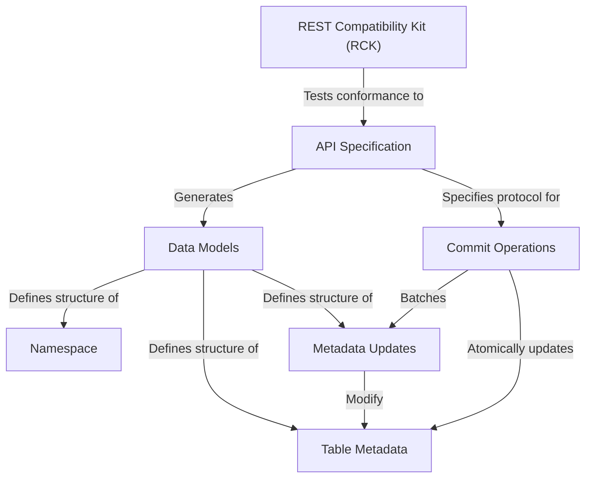

# Tutorial: open-api

This project defines the **OpenAPI specification** for an Iceberg REST catalog, outlining how clients and servers communicate to manage Iceberg data.
It provides *Python data models* automatically generated from this specification, which precisely describe the structure of data exchanged (like *table metadata* and *namespaces*).
The project also includes a **REST Compatibility Kit (RCK)**, a test suite to ensure server implementations adhere to the API specification.
Key functionalities exposed by the API include managing *namespaces*, creating and modifying *table metadata* through individual *metadata updates*, and applying these changes atomically via *commit operations*.

**Source Repository:** [None](None)

## Chapters

1. [API Specification
](01_api_specification_.md)
2. [Namespace
](02_namespace_.md)
3. [Table Metadata
](03_table_metadata_.md)
4. [Data Models
](04_data_models_.md)
5. [Metadata Updates
](05_metadata_updates_.md)
6. [Commit Operations
](06_commit_operations_.md)
7. [REST Compatibility Kit (RCK)
](07_rest_compatibility_kit__rck__.md)

---

Generated by [AI Codebase Knowledge Builder](https://github.com/The-Pocket/Tutorial-Codebase-Knowledge)