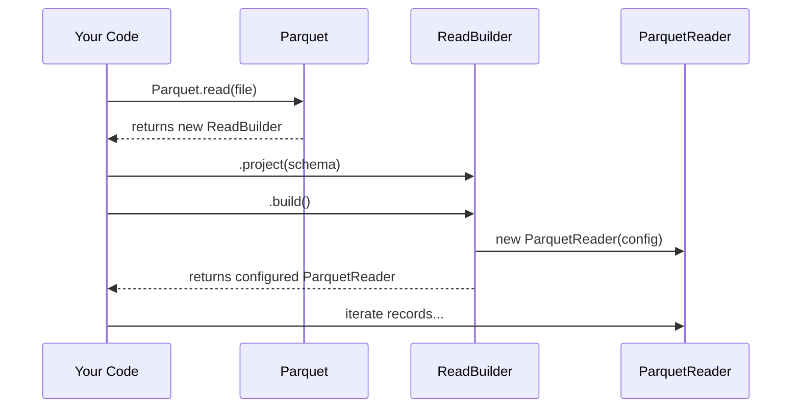

# Chapter 1: Parquet I/O Facade

Welcome to your first step in mastering the `parquet` library! Before we dive into complex details, we need a simple and reliable way to interact with Parquet files. This chapter introduces the main entry point for all reading and writing operations: the **Parquet I/O Facade**.

### What's a "Facade" and Why Do I Need It?

Imagine you're visiting a massive library. You don't want to learn the entire complex shelving system just to get a book. Instead, you walk up to the front desk, tell the librarian what you need ("I want to read this book" or "I want to add this manuscript"), and they handle the rest.

The `Parquet` class is that friendly librarian. It's a "facade"—a simplified front interface that hides the complex machinery behind it. You don't need to know the low-level details of how data is compressed, encoded, or arranged into row groups. You just make a simple request, and the facade gives you the right tool for the job.

Our main goal is simple: read data from and write data to a Parquet file. The `Parquet` facade makes this incredibly easy.

### Reading Data: A Simple Example

Let's say we have a Parquet file and we want to read the data inside. With the facade, it's a three-step process:

1.  Start with `Parquet.read()` to get a "builder".
2.  Tell the builder what you need (e.g., which columns).
3.  Build the reader and start reading!

Here’s what that looks like in code. First, we tell the facade which file we want to read.

```java
// Get an InputFile object representing our source
InputFile myFile = ...;

// Use the facade to start building a reader
Parquet.ReadBuilder builder = Parquet.read(myFile);
```

The `Parquet.read()` method doesn't immediately read the file. Instead, it gives you a `ReadBuilder`. Think of this as a request form you fill out for the librarian.

Next, we tell the builder which columns of data we're interested in. This is called "projection."

```java
// Tell the builder we want to project a specific schema
Schema mySchema = ...;
builder.project(mySchema);
```

Finally, we call `build()` to get an iterable object that we can loop over to get our data records.

```java
// Build the reader and iterate through the records
CloseableIterable<Record> reader = builder.build();

for (Record record : reader) {
    // Do something with the record...
}
reader.close(); // Don't forget to close it!
```

That's it! The facade took our simple requests and constructed a fully configured `ParquetReader` behind the scenes.

### Writing Data: Just as Easy

Writing data follows the same pattern. Let's say we want to write some records to a new Parquet file.

1.  Start with `Parquet.write()` to get a `WriteBuilder`.
2.  Configure it with the data schema.
3.  Build the writer and start adding data.

First, we tell the facade where we want to write our new file.

```java
// Get an OutputFile object for our destination
OutputFile myFile = ...;

// Use the facade to start building a writer
Parquet.WriteBuilder builder = Parquet.write(myFile);
```

Next, we must tell the writer the structure of our data by providing a schema.

```java
// Give the builder the schema of the data we're writing
Schema mySchema = ...;
builder.schema(mySchema);
```

Finally, we build an `FileAppender`, add our records one by one, and close it to finalize the file.

```java
// Build the appender
FileAppender<Record> writer = builder.build();

// Add records to the file
writer.add(record1);
writer.add(record2);

// Close the writer to finish writing the Parquet file
writer.close();
```

Simple, clean, and you didn't have to worry about compression, page sizes, or any other complex Parquet settings. The facade handled it all with sensible defaults.

### Under the Hood: The Builder Pattern

What's happening when you call `Parquet.read()` or `Parquet.write()`? The facade is using a "Builder" design pattern. It doesn't give you the final reader or writer right away. Instead, it gives you a helper object (the builder) that collects all your configurations. Once you're done configuring, the builder creates the final object for you.

Here is a diagram showing the flow for reading a file:



The facade's job is to kick off this process by giving you the correct builder.

Let's peek at the code in `src/main/java/org/apache/iceberg/parquet/Parquet.java` to see this in action. The `read()` method is surprisingly simple:

```java
// In Parquet.java
public static ReadBuilder read(InputFile file) {
  // Logic to handle encrypted files might be here,
  // but in the end, it just does this:
  return new ReadBuilder(file);
}
```

It just creates and returns a `ReadBuilder`! The builder is where the real work of assembling the reader happens. When you call `build()` on the builder, it takes all the settings you provided and constructs the final `ParquetReader`.

```java
// In Parquet.java's ReadBuilder class
public <D> CloseableIterable<D> build() {
    // ...gathers all your configurations...

    // The key part: it creates the actual reader!
    return new org.apache.iceberg.parquet.ParquetReader<>(
        file, schema, options, readerFunc, ...
    );
}
```

The `Parquet.write()` facade works exactly the same way, creating a `WriteBuilder` that eventually constructs a `ParquetWriter`.

### Conclusion

The `Parquet` I/O facade is your starting point for any file operation. It provides a simple, high-level API that shields you from the complexities of the Parquet file format.

-   To **read** a file, use `Parquet.read(inputFile)`.
-   To **write** a file, use `Parquet.write(outputFile)`.

Both methods return a builder object that you use to configure and create a fully-functional reader or writer. This pattern makes interacting with Parquet files predictable and easy to manage.

Of course, to read or write data, the system first needs to understand its structure. In our next chapter, we'll explore how the library handles this.

Next up: [Schema Conversion](02_schema_conversion_.md)

---

Generated by [AI Codebase Knowledge Builder](https://github.com/The-Pocket/Tutorial-Codebase-Knowledge)