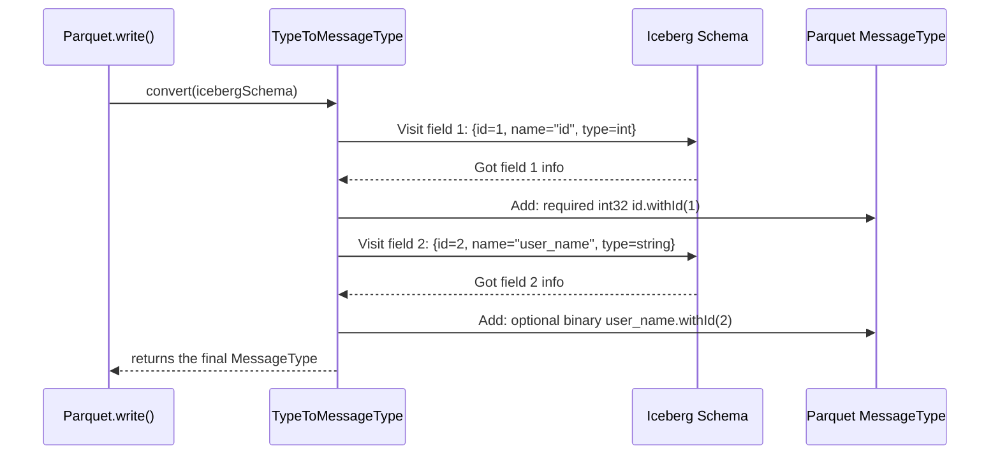

# Chapter 2: Schema Conversion

In the [previous chapter](01_parquet_i_o_facade_.md), we learned how to use the `Parquet` I/O facade to easily read and write files. But when we called `builder.schema(mySchema)`, we skipped over a crucial step: how does the library take our Iceberg schema and teach the Parquet format about it?

This chapter introduces the "universal translator" that makes this communication possible: **Schema Conversion**.

### The Two Languages of Schemas

Imagine you are trying to describe the structure of a table to two different systems: Iceberg and Parquet.

1.  **Iceberg's Schema:** Iceberg has a very specific way of defining a table's structure. It cares about column names and types, but most importantly, it assigns a **unique, permanent ID** to every field. This ID is the secret to its powerful schema evolution. You can rename a column, and Iceberg still knows which one it is because the ID hasn't changed.

2.  **Parquet's Schema (`MessageType`):** Parquet also has a way to describe data structure, called a `MessageType`. It also understands names and types, but it doesn't have the same built-in concept of a permanent field ID. It relies more on the column name.

This creates a language barrier. When we write data, we need to translate Iceberg's ID-based schema into a Parquet `MessageType`. When we read data, we need to translate the Parquet `MessageType` back into an Iceberg schema we can trust.

This translation is the core job of the **Schema Conversion** abstraction.

### Meet the Translator: `ParquetSchemaUtil`

The main tool for this job is a utility class called `ParquetSchemaUtil`. You won't usually call it directly—the `Parquet` facade does it for you—but understanding how it works is key to understanding the library.

It answers two fundamental questions:
- **Writing:** How do I convert an `Iceberg Schema` into a `Parquet MessageType`?
- **Reading:** How do I convert a `Parquet MessageType` back into an `Iceberg Schema`?

Let's look at how it handles both directions.

### From Iceberg to Parquet: Preserving the IDs

When you write a file, Iceberg needs to embed its field IDs into the Parquet file's schema. `ParquetSchemaUtil` handles this with its `convert` method.

Let's say we have a simple Iceberg schema:

```java
// Our simple Iceberg schema
Schema icebergSchema = new Schema(
    Types.NestedField.required(1, "id", Types.IntegerType.get()),
    Types.NestedField.optional(2, "user_name", Types.StringType.get())
);
```
This schema defines two columns: `id` (ID `1`) and `user_name` (ID `2`).

Behind the scenes, the write process uses `ParquetSchemaUtil` to generate a Parquet schema.

```java
// This happens inside the Parquet.write() flow
MessageType parquetSchema = ParquetSchemaUtil.convert(icebergSchema, "my_table");
```
The resulting `parquetSchema` is a `MessageType` that looks something like this (in a simplified text representation):

```
message my_table {
  required int32 id (ID: 1);
  optional binary user_name (UTF8) (ID: 2);
}
```
Notice how `ParquetSchemaUtil` not only converted the types (`IntegerType` to `int32`) but also attached the Iceberg field IDs (`1` and `2`) to the Parquet fields. This is critical for reading the data back correctly later.

### How Does it Work? The `TypeToMessageType` Visitor

The conversion from Iceberg to Parquet is performed by a helper class called `TypeToMessageType`. Think of it as a specialist that "visits" every field in the Iceberg schema and builds the corresponding Parquet type.

Here is a simplified diagram of the process:



Let's peek into `src/main/java/org/apache/iceberg/parquet/TypeToMessageType.java` to see a small piece of the logic that handles primitive types.

```java
// In TypeToMessageType.java
public Type primitive(PrimitiveType primitive, Type.Repetition repetition, int id, String name) {
    switch (primitive.typeId()) {
      case INTEGER:
        return Types.primitive(INT32, repetition).id(id).named(name);
      case STRING:
        return Types.primitive(BINARY, repetition).as(STRING).id(id).named(name);
      // ... other types
    }
}
```
This code does exactly what we described: it takes an Iceberg `PrimitiveType`, its repetition (required/optional), its `id`, and `name`, and builds a Parquet `PrimitiveType` with all the right information.

### From Parquet to Iceberg: Rebuilding the Schema

Now let's look at the reverse journey. When you read a Parquet file, the library first inspects the file's footer to get its `MessageType`. To understand this data in the "Iceberg world," it must be converted back to an Iceberg `Schema`.

This is the second main function of `ParquetSchemaUtil`.

```java
// This happens inside the Parquet.read() flow
MessageType parquetSchema = ...; // Read from the Parquet file footer
Schema icebergSchema = ParquetSchemaUtil.convert(parquetSchema);
```

This process uses another visitor, `MessageTypeToType`, which walks the Parquet schema, extracts the field names, types, and **IDs**, and uses them to reconstruct a high-fidelity Iceberg `Schema`.

The code that extracts an ID is quite simple. It first checks for a Parquet-level ID. If it's there, it uses it.

```java
// In MessageTypeToType.java
private Integer getId(org.apache.parquet.schema.Type type) {
    org.apache.parquet.schema.Type.ID id = type.getId();
    if (id != null) {
      return id.intValue();
    }
    // ... fallback logic if ID is missing ...
}
```

#### What if a Parquet File Has No IDs?

Sometimes, you might encounter older Parquet files that were not written with Iceberg and therefore have no field IDs. In these cases, Iceberg can't perform its schema evolution magic reliably.

To handle this, `ParquetSchemaUtil` has a fallback mechanism. If it detects a schema with no IDs, it assigns them based on the column order in the file.

```java
// In ParquetSchemaUtil.java
public static Schema convert(MessageType parquetSchema) {
    MessageType parquetSchemaWithIds =
        hasIds(parquetSchema) ? parquetSchema : addFallbackIds(parquetSchema);
    // ... continue conversion with the schema that now has IDs
}
```
This is a "best-effort" guess and is one of the key reasons why data written by Iceberg is more robust than generic Parquet files. The embedded IDs remove all ambiguity.

### Conclusion

Schema conversion is the bedrock of Iceberg's compatibility with the Parquet format. It's the translator that ensures nothing gets lost in translation between Iceberg's rich, ID-based schema and Parquet's `MessageType`.

- **`ParquetSchemaUtil`** is the central utility for schema translation.
- When **writing**, it uses `TypeToMessageType` to convert an Iceberg `Schema` to a Parquet `MessageType`, carefully preserving field IDs.
- When **reading**, it uses `MessageTypeToType` to convert a Parquet `MessageType` back into an Iceberg `Schema`, using the embedded IDs.

This reliable schema handling allows Iceberg to safely evolve tables and perform powerful optimizations. One of the most important optimizations is skipping entire chunks of data that aren't needed for a query.

Next up: [Row Group Filtering](03_row_group_filtering_.md)

---

Generated by [AI Codebase Knowledge Builder](https://github.com/The-Pocket/Tutorial-Codebase-Knowledge)