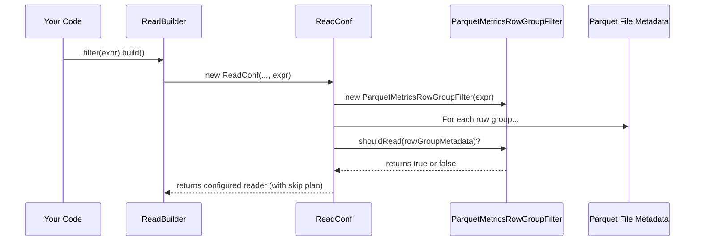

# Chapter 3: Row Group Filtering

In the [previous chapter](02_schema_conversion_.md), we learned how the library translates between Iceberg's schema and Parquet's schema, ensuring no information is lost. Now, let's see how the library uses that information to do something incredibly clever: **read less data**.

Imagine you have a massive Parquet file with a billion rows of sales data, and you only want to find sales from yesterday. Wouldn't it be great if you didn't have to read the entire billion-row file to find those few records? This chapter introduces the performance-boosting concept that makes this possible: **Row Group Filtering**.

### The Problem: Finding a Needle in a Haystack

Reading data from a disk is one of the slowest parts of any query. The less data you can read, the faster your query will be. When you ask for specific data, like `SELECT * FROM sales WHERE order_date = '2024-10-26'`, the naive approach is to:

1.  Open the file.
2.  Read every single row.
3.  Check if `order_date` matches '2024-10-26'.
4.  Keep the row if it matches, discard it if it doesn't.

This is very inefficient, especially for large files. Row group filtering is the smart way to avoid all that unnecessary work.

### The Solution: Checking the Table of Contents First

A Parquet file isn't just one giant, continuous block of data. It's internally divided into large chunks of rows called **row groups**. You can think of a Parquet file as a book, and each row group as a chapter.

Now, imagine each chapter in the book had a tiny summary page at the beginning, like:
*   **Chapter 1 Summary:** Mentions characters "Alice" and "Bob". Dates from Jan-2023 to Mar-2023.
*   **Chapter 2 Summary:** Mentions characters "Charlie". Dates from Apr-2023 to Jun-2023.
*   **Chapter 3 Summary:** Mentions characters "Alice" and "David". Dates from Jul-2023 to Sep-2023.

If you are looking for information about "David", you could read these summaries and instantly know to **skip Chapters 1 and 2** entirely. You only need to read Chapter 3.

This is exactly what row group filtering does. Before reading the actual row data, it reads the metadata "summaries" for each row group. This metadata contains statistics like the minimum and maximum values for each column within that row group.

If you query for `order_date = '2024-10-26'` and a row group's metadata says its dates range from `2023-01-01` to `2023-01-31`, the library knows that your date cannot possibly exist in that chunk. It skips the entire row group—potentially millions of rows—without reading it from the disk.

### Enabling Filtering: Just Add a Filter!

The best part is that you enable this optimization with a single method call on the builder we learned about in [Chapter 1](01_parquet_i_o_facade_.md).

Let's say we want to read data for a specific user ID. First, we create an `Expression` that defines our filter.

```java
// Define a filter to find records where user_id = 123
Expression myFilter = Expressions.equal("user_id", 123);
```

Now, we just pass this filter to our `ReadBuilder`.

```java
// Use the Parquet facade to start reading
CloseableIterable<Record> reader = Parquet.read(myFile)
    .project(mySchema)
    .filter(myFilter) // <-- This enables the magic!
    .build();

// The reader will now automatically skip irrelevant row groups
for (Record record : reader) {
    // ... process records that match the filter ...
}
```

By adding `.filter(myFilter)`, you've instructed the Parquet reader to perform row group filtering. It will now inspect the metadata of each row group and skip any that can't possibly contain `user_id = 123`.

### Under the Hood: The Filtering Process

So what happens when you call `build()` with a filter? The process is orchestrated by an internal helper class called `ReadConf`.

1.  **Initialization:** The `ReadBuilder` creates a `ReadConf` object, passing it your file, schema, and filter expression.
2.  **Filter Creation:** Inside `ReadConf`, it creates one or more specialized row group filter objects. The main one is `ParquetMetricsRowGroupFilter`, which works with min/max statistics.
3.  **Metadata Scan:** `ReadConf` then loops through the metadata of *every row group* in the file. It does **not** read the data yet, only the small metadata summaries from the file's footer.
4.  **Decision Making:** For each row group, it asks the filter: "Should I read this?" The filter compares the row group's min/max values against your expression.
5.  **Execution Plan:** `ReadConf` builds a simple boolean array (`shouldSkip`) that marks each row group as either "read" or "skip".
6.  **Reading:** When you finally iterate through the `reader`, it consults this `shouldSkip` array and only reads the data from the row groups that were marked "read".

Here's a diagram of that decision-making flow:



Let's peek at the code in `src/main/java/org/apache/iceberg/parquet/ReadConf.java` to see this in action. The logic is very direct.

```java
// Simplified from ReadConf.java's constructor
ParquetMetricsRowGroupFilter statsFilter =
    new ParquetMetricsRowGroupFilter(expectedSchema, filter, caseSensitive);

// ... other filters (dictionary, bloom) are also created ...

for (int i = 0; i < rowGroups.size(); i += 1) {
  BlockMetaData rowGroup = rowGroups.get(i);
  // Ask the filter if this row group is relevant
  boolean shouldRead = statsFilter.shouldRead(typeWithIds, rowGroup);
  this.shouldSkip[i] = !shouldRead;
}
```
This code creates the `statsFilter` and uses it to populate the `shouldSkip` array, which will guide the actual data reading process.

Now, let's look inside `src/main/java/org/apache/iceberg/parquet/ParquetMetricsRowGroupFilter.java` to see how it makes a decision. Here is a simplified version of its logic for a "greater than" (`>`) comparison.

```java
// Simplified from ParquetMetricsRowGroupFilter.java
@Override
public <T> Boolean gt(BoundReference<T> ref, Literal<T> lit) {
    Statistics<?> colStats = stats.get(ref.fieldId());
    
    // Get the MAXIMUM value for this column from the row group's metadata
    T upper = max(colStats, ref.fieldId());

    // Is the row group's max value LESS THAN our filter value?
    // e.g., filter is "price > 100", but max price in this chunk is 50.
    if (lit.comparator().compare(upper, lit.value()) <= 0) {
      // If so, no row can possibly match. Skip it!
      return ROWS_CANNOT_MATCH;
    }

    // Otherwise, there might be matching rows. We have to read it.
    return ROWS_MIGHT_MATCH;
}
```
This is the heart of the optimization. By comparing the query value against the pre-computed `max` value for the entire row group, it can decide to skip reading millions of rows in a single, cheap check.

### The Three Layers of Filtering

Iceberg is even smarter than just using min/max values. It uses a three-layered strategy for maximum skipping:

1.  **`ParquetMetricsRowGroupFilter`:** The first line of defense. Uses min/max value statistics. It's extremely fast and catches most cases.
2.  **`ParquetDictionaryRowGroupFilter`:** If the stats check passes, this filter can check the column's dictionary (a list of all unique values). If the value you're looking for isn't in the dictionary, the row group can be skipped.
3.  **`ParquetBloomRowGroupFilter`:** A final, more advanced check. A bloom filter is a special structure that can definitively say "this value is *not* in the set." It's particularly useful for `equals` filters.

The reader will only proceed to read a row group if it passes **all** of these checks.

### Conclusion

Row group filtering is one of the most important performance features when reading Parquet files. It allows query engines to be lazy and efficient by reading only the chunks of data that could possibly contain matching rows.

-   A Parquet file is split into **row groups**.
-   Each row group has **metadata** (like min/max values).
-   By providing a `.filter()` to the `Parquet.read()` builder, you enable **automatic skipping** of irrelevant row groups.
-   This happens behind the scenes, primarily driven by `ParquetMetricsRowGroupFilter` and its friends.

So far, we've focused on high-level APIs and file structures. But what if you need to programmatically inspect or manipulate a schema's structure?

Next up: [Schema Traversal (Visitors)](04_schema_traversal__visitors__.md)

---

Generated by [AI Codebase Knowledge Builder](https://github.com/The-Pocket/Tutorial-Codebase-Knowledge)