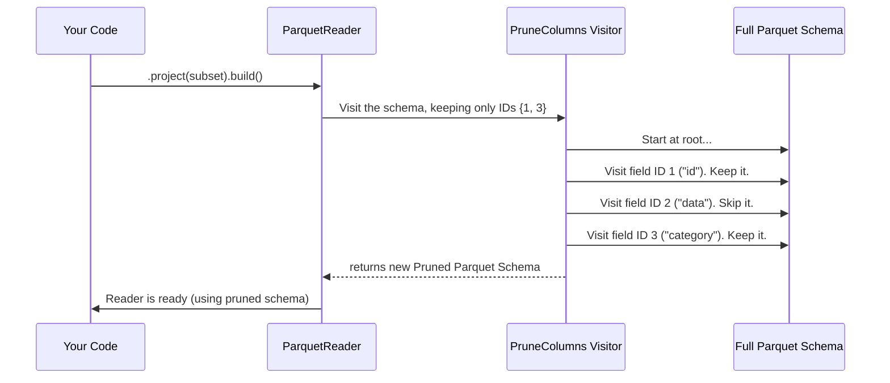

# Chapter 4: Schema Traversal (Visitors)

In the [previous chapter](03_row_group_filtering_.md), we saw how to skip entire chunks of a file (row groups) that don't match our query. This is a huge performance win. But what if we need to read a row group, but are only interested in 2 of its 50 columns? We still want to be efficient and avoid processing the 48 unnecessary columns.

This is called **column pruning**, and it's just one of many powerful operations that requires programmatically walking through a schema's structure. This chapter introduces the elegant design pattern the library uses for this: **Schema Traversal with Visitors**.

### The Problem: Performing Operations on a Complex Schema

A schema, especially a nested one with structs, lists, and maps, is a complex tree-like structure. Imagine you need to perform a specific task on every single field in the schema. For example:

*   **Column Pruning:** Create a *new* schema containing only the fields a user has selected.
*   **Reader/Writer Construction:** For each field in the schema, build the correct value reader or writer.
*   **Name Mapping:** Find a field by an old name and apply its new name.

How can you do this in a clean and reusable way? You could write a messy, recursive function with lots of `if/else` checks for each task. But there's a much better way.

### The Solution: The Visitor Design Pattern

Let's use an analogy. Imagine a schema is a large, complex office building with many floors, rooms, and corridors. You need to send someone in to perform a job, like "install a new light fixture in every room" or "take an inventory of all the chairs."

Instead of teaching the `Room` object how to install lights or count chairs, you hire a specialist—an "electrician" or an "auditor"—and give them a map of the building. This specialist, or **Visitor**, knows how to do their one job perfectly. They "visit" each room and perform their specific action.

The Visitor pattern in our library works the same way. We define a "visitor" object that contains the logic for a specific task. Then, we tell it to "visit" a schema. The visitor will traverse the entire schema tree, executing its logic at every field (struct, list, primitive, etc.) it encounters.

The library provides two main types of visitors for this.

1.  **`ParquetTypeVisitor`**: The basic tour guide. It traverses a Parquet `MessageType` on its own. It's useful when you only care about the Parquet schema's structure.
2.  **`TypeWithSchemaVisitor`**: The expert tour guide. It traverses a Parquet `MessageType` and the corresponding Iceberg `Schema` *at the same time*. This is incredibly powerful because it lets you compare the two and use Iceberg's rich information (like field IDs) to make decisions.

Let's see this in action with a real-world example: column pruning.

### Use Case: Pruning Columns with `PruneColumns`

When you ask to read a subset of columns using `Parquet.read().project(selectedSchema)`, the library needs to create a new, "pruned" Parquet schema that it will use for the read operation. This is done by a `TypeWithSchemaVisitor` called `PruneColumns`.

The goal of `PruneColumns` is simple:
*   **Input:** The full Parquet schema from the file, the Iceberg schema, and a set of selected Iceberg field IDs.
*   **Output:** A *new* Parquet schema containing only the selected columns.

This visitor is our "tour guide" whose job is to "build a new, smaller map of the building that only includes the selected rooms."

### Under the Hood: A Visitor at Work

When you build a reader with a projected schema, the library creates a `PruneColumns` visitor and tells it to traverse the file's schema.



The visitor walks the original schema and builds a new one piece by piece. Let's peek at the code inside `src/main/java/org/apache/iceberg/parquet/PruneColumns.java` to see how it handles a struct.

```java
// Simplified from PruneColumns.java
class PruneColumns extends TypeWithSchemaVisitor<Type> {
  private final Set<Integer> selectedIds;

  // ... constructor ...

  @Override
  public Type struct(StructType iStruct, GroupType pStruct, List<Type> fields) {
    List<Type> filteredFields = Lists.newArrayList();
    for (Type originalField : pStruct.getFields()) {
      Integer fieldId = getId(originalField); // Get the Iceberg ID
      // If the user selected this column, add it to our new list.
      if (selectedIds.contains(fieldId)) {
        filteredFields.add(originalField);
      }
    }

    // If we removed any fields, return a new struct.
    if (filteredFields.size() < pStruct.getFieldCount()) {
        return pStruct.withNewFields(filteredFields);
    }
    
    // Otherwise, return the original.
    return pStruct;
  }
}
```

This code is exactly what our tour guide does:
1.  It arrives at a `struct` (an office floor).
2.  It gets a list of all `originalField`s (the rooms on that floor).
3.  For each room, it checks its ID against the `selectedIds` list.
4.  If the room is on the list, it's added to the `filteredFields` (the new floor plan).
5.  Finally, it returns a new `GroupType` (floor plan) containing only the selected rooms.

This process is applied recursively to the entire schema, resulting in a perfectly pruned schema tree.

### The Power of Two Schemas: `TypeWithSchemaVisitor`

Why was `TypeWithSchemaVisitor` the right tool for `PruneColumns`? Because the decision to keep a column was based on the **Iceberg field ID**, which only exists in the Iceberg schema. The visitor's methods receive both the Parquet `Type` and the corresponding Iceberg `Type`, giving it all the context it needs.

Look at the method signature from `TypeWithSchemaVisitor`:

```java
// from TypeWithSchemaVisitor.java
public T struct(Types.StructType iStruct, GroupType struct, List<T> fields) {
  // ...
}
```
It gets both the Iceberg struct (`iStruct`) and the Parquet group (`struct`), allowing the implementation to use information from both.

Other critical parts of the library, like the builders that create readers and writers, also use `TypeWithSchemaVisitor`. For example, `BaseParquetReaders.ReadBuilder` walks the schemas to construct the right `ParquetValueReader` for each field.

### When to Use the Simpler `ParquetTypeVisitor`

What if you don't have an Iceberg schema for context? This happens when converting a generic Parquet file's schema into an Iceberg schema for the first time. In this case, `MessageTypeToType` (which we saw in [Chapter 2](02_schema_conversion_.md)) uses the simpler `ParquetTypeVisitor`.

Look at its `struct` method signature:

```java
// from ParquetTypeVisitor.java
public T struct(GroupType struct, List<T> fields) {
  // ...
}
```
It only receives the Parquet `GroupType`, because that's all the information it has. Its job is to build the Iceberg schema from scratch.

### Conclusion

The Visitor pattern is a central design choice in the `parquet` library, providing a clean and extensible way to process complex schemas.

*   It lets you define an operation (like pruning or building readers) in a separate "visitor" class.
*   The visitor **traverses** the schema tree, applying its logic at each field.
*   **`ParquetTypeVisitor`** is used for traversing a Parquet schema alone.
*   **`TypeWithSchemaVisitor`** is used for traversing a Parquet schema and an Iceberg schema together, enabling powerful, ID-based logic.

This pattern is the foundation for building the machinery that reads and writes data. Now that we understand how the library plans which columns to read/write, let's look at the objects that do the actual work of writing values.

Next up: [ParquetValueWriter](05_parquetvaluewriter_.md)

---

Generated by [AI Codebase Knowledge Builder](https://github.com/The-Pocket/Tutorial-Codebase-Knowledge)