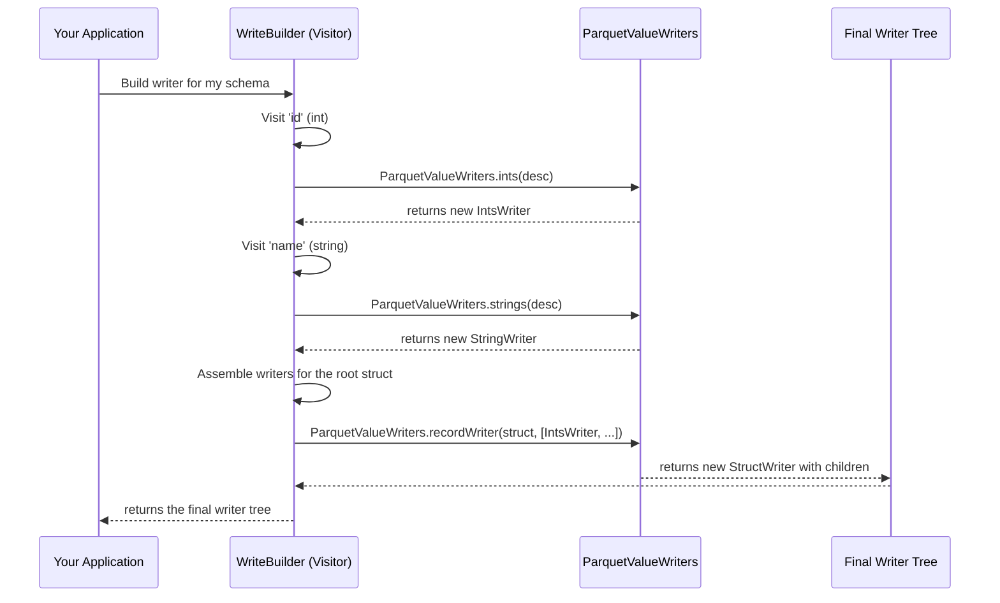

# Chapter 5: ParquetValueWriter

In the [previous chapter](04_schema_traversal__visitors__.md), we learned how the library uses visitors to traverse schemas, a crucial step for setting up read and write operations. That visitor, the `WriteBuilder`, constructs the machinery needed to actually write data. But what is that machinery?

This chapter introduces the heart of the write path: the **`ParquetValueWriter`**. This is the component that takes your in-memory data—like an integer, a string, or a whole record—and serializes it into the low-level columnar format that Parquet requires.

### The Problem: From a Java Object to Parquet Columns

Imagine you have a single `Record` object in your application's memory. This record contains a user's ID, name, and a list of their favorite colors.

```java
// Our in-memory data
Record userRecord = createRecord(101, "Alice", ["blue", "green"]);
```

How does this single object get transformed into the highly efficient, columnar format of a Parquet file?

```
// What the Parquet file stores (simplified)
Column "id":      [..., 101, ...]
Column "name":    [..., "Alice", ...]
Column "colors":  [..., "blue", "green", ...]
```

This translation is not straightforward. The system needs to:
1.  Take the `userRecord` apart.
2.  Send the integer `101` to the `id` column's data buffer.
3.  Send the string `"Alice"` to the `name` column's data buffer.
4.  Handle the list of colors, telling Parquet that "blue" and "green" are part of the *same record*.

This is the job of the `ParquetValueWriter`.

### The Solution: An Assembly Line of Specialized Writers

The library doesn't use one giant, monolithic writer. Instead, it uses an "assembly line" approach with many small, specialized writers that work together.

*   There's a writer that *only* knows how to handle integers (`IntsWriter`).
*   There's a writer that *only* knows how to handle strings (`StringWriter`).
*   There's a writer for lists (`CollectionWriter`) and one for records (`StructWriter`).

These specialized writers are then composed into a tree that mirrors the schema. A `StructWriter` for our `userRecord` doesn't write any values itself. Instead, it acts as a manager:
1.  It receives the `userRecord`.
2.  It extracts the `id` field and passes `101` to its child `IntsWriter`.
3.  It extracts the `name` field and passes `"Alice"` to its child `StringWriter`.
4.  It extracts the `colors` list and passes `["blue", "green"]` to its child `CollectionWriter`.

This `CollectionWriter` then iterates over the list, passing "blue" and "green" one by one to *its* child `StringWriter`. This design is simple, powerful, and easy to extend.

### Handling Nulls and Lists: Repetition and Definition Levels

A key responsibility of a `ParquetValueWriter` is managing two special numbers Parquet uses to represent nested and optional data:

1.  **Definition Level (DL):** This number tells Parquet "how defined" a value is. If a field is `required`, its DL is high. If a field is `optional` and you write `null`, the writer doesn't write a null value. Instead, it writes a low DL, saving space. For example, to write a null for a field that is nested inside one optional field, the writer writes a DL of `0`.

2.  **Repetition Level (RL):** This number tells Parquet when a new item in a list begins. When writing the list `["blue", "green"]`, the writer passes `repetitionLevel = 0` for "blue" (the first item) and `repetitionLevel = 1` for "green" (a subsequent item in the same list). This is how Parquet reconstructs the list structure when reading.

You don't need to manage these levels yourself. The `ParquetValueWriter` for each type knows exactly which levels to write based on the schema.

### Under the Hood: Building the Writer Tree

How is this tree of writers created? In the [previous chapter](04_schema_traversal__visitors__.md), we met the `WriteBuilder` visitor. Its job is to walk the schema and, for each field, ask a factory class called `ParquetValueWriters` to create the correct writer.

Here's how it works:



The visitor constructs the writer tree from the bottom up, creating primitive writers first and then composing them inside container writers like `StructWriter` or `CollectionWriter`.

Let's look at the code that makes this happen.

#### The `ParquetValueWriter` Interface

First, the core interface is incredibly simple. You can find it in `src/main/java/org/apache/iceberg/parquet/ParquetValueWriter.java`.

```java
// In ParquetValueWriter.java
public interface ParquetValueWriter<T> {
  void write(int repetitionLevel, T value);
  // ... other methods ...
}
```

The most important method is `write()`. It takes a `repetitionLevel` (for lists) and the `value` to be written.

#### The `ParquetValueWriters` Factory

The factory class in `src/main/java/org/apache/iceberg/parquet/ParquetValueWriters.java` contains static methods for creating each type of writer.

```java
// In ParquetValueWriters.java
public class ParquetValueWriters {
  private ParquetValueWriters() {}

  public static UnboxedWriter<Integer> ints(ColumnDescriptor desc) {
    return new UnboxedWriter<>(desc);
  }

  public static PrimitiveWriter<CharSequence> strings(ColumnDescriptor desc) {
    return new StringWriter(desc);
  }
  // ... many other factory methods ...
}
```
The `WriteBuilder` visitor calls these methods to get the specialized writers it needs.

#### A Primitive Writer Example

Here is a simplified look at a writer for primitive values, like `StringWriter`.

```java
// Simplified from ParquetValueWriters.java
private static class StringWriter extends PrimitiveWriter<CharSequence> {
  private StringWriter(ColumnDescriptor desc) {
    super(desc);
  }

  @Override
  public void write(int repetitionLevel, CharSequence value) {
    // This is the key part: it delegates the actual write to a low-level ColumnWriter
    column.writeBinary(repetitionLevel, Binary.fromString(value.toString()));
  }
}
```
This writer does one thing: it takes a Java `CharSequence` and hands it off to the underlying Parquet library's `ColumnWriter`, which handles the buffering and encoding.

#### A Composite Writer Example

Now let's look at a manager, the `StructWriter`. It holds an array of child writers.

```java
// Simplified from ParquetValueWriters.java
public abstract static class StructWriter<S> implements ParquetValueWriter<S> {
  private final ParquetValueWriter<Object>[] writers;

  // ... constructor ...

  @Override
  public void write(int repetitionLevel, S structValue) {
    // Loop through each field of the struct
    for (int i = 0; i < writers.length; i += 1) {
      // Get the data for the current field
      Object fieldValue = get(structValue, i);
      // Ask the child writer for that field to write the value
      writers[i].write(repetitionLevel, fieldValue);
    }
  }

  protected abstract Object get(S struct, int index);
}
```
Its `write` method is a loop. It doesn't know *how* to write an integer or a string; it just delegates the task to the correct child writer in its `writers` array. This beautiful, recursive pattern allows the library to handle schemas of any complexity.

### Conclusion

The `ParquetValueWriter` is the workhorse of the write path. It's the "last stop" for your data before it gets serialized into a Parquet file.

-   `ParquetValueWriter` is an interface for objects that write a specific type of data.
-   The library uses many **specialized** writers (for ints, strings, etc.) and **composes** them into a tree that matches the data's schema.
-   Composite writers like `StructWriter` and `CollectionWriter` act as managers, delegating work to their children.
-   These writers automatically handle the low-level details of **repetition and definition levels** to correctly represent lists and nulls.

Now that we've seen how data is meticulously written into columns, what about the reverse process? How does the library read that columnar data and reassemble it back into records?

Next up: [ParquetValueReader](06_parquetvaluereader_.md)

---

Generated by [AI Codebase Knowledge Builder](https://github.com/The-Pocket/Tutorial-Codebase-Knowledge)