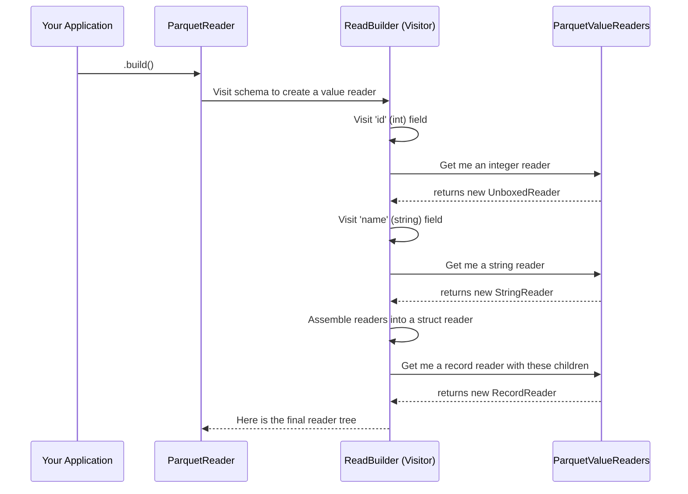

# Chapter 6: ParquetValueReader

In the [previous chapter](05_parquetvaluewriter_.md), we saw how the `ParquetValueWriter` acts like an assembly line, taking a complete record and carefully disassembling it into separate Parquet columns. Now, we'll explore the reverse process. How does the library take those scattered columns and perfectly reassemble them back into structured records?

This chapter introduces the core of the read path: the **`ParquetValueReader`**. It's the counterpart to the writer, responsible for reading data from a Parquet file and reconstructing it into Iceberg's in-memory data model.

### The Problem: Rebuilding a Record from Columns

Imagine a Parquet file stores the data for a user record, but in a columnar format. The data isn't stored together; it's spread out across different parts of the file:

*   **`id` column data:** `[..., 101, ...]`
*   **`name` column data:** `[..., "Alice", ...]`
*   **`colors` column data:** `[..., "blue", "green", ...]`

How do we read this and turn it back into a single, cohesive `Record` object in Java memory?

```java
// How do we get this...
Record userRecord = new Record(101, "Alice", ["blue", "green"]);

// ...from this?
// [column data for id]
// [column data for name]
// [column data for colors]
```

This is the job of the `ParquetValueReader`. Think of it as a customs agent at a destination port. It looks at all the incoming cargo (the raw Parquet column data), reads the manifest (the repetition and definition levels), and carefully re-packages everything into the format expected by the destination country (Iceberg's `Record` objects).

### The Solution: A Mirrored Assembly Line of Readers

Just like the write path, the read path doesn't use one giant, do-it-all reader. It uses a tree of small, specialized readers that perfectly mirrors the schema and the writer tree.

*   A reader that *only* knows how to read integers (`UnboxedReader`).
*   A reader that *only* knows how to read strings (`StringReader`).
*   A reader for lists (`ListReader`) and one for entire records (`RecordReader`).

This tree of readers works together to reconstruct a record. A top-level `RecordReader` acts as a manager:
1.  To get the next record, it first asks its child `UnboxedReader` to read the next integer (`101`).
2.  Then, it asks its child `StringReader` to read the next string (`"Alice"`).
3.  Finally, it asks its child `ListReader` to read the next list of colors.

The `ListReader` itself is a manager. It asks *its* child `StringReader` to read values ("blue", then "green") until it's told that the list for this record is complete.

### Interpreting the "Manifest": Repetition and Definition Levels

How does the `ListReader` know when to stop reading colors for Alice's record? It reads the "manifest"—the **repetition and definition levels** that the `ParquetValueWriter` carefully wrote.

1.  **Definition Level (DL):** This tells the reader if a value is `null`. When a reader encounters a low DL, it knows the value is missing. It doesn't try to read from the data column; it simply produces a `null` and moves on. This is how optional fields are handled efficiently.

2.  **Repetition Level (RL):** This tells the reader about list boundaries. The `ListReader` will continue asking its child reader for more elements as long as the repetition level stays high. When the RL drops, it signals "end of list for this record," and the `ListReader` returns the complete list it has assembled.

These two numbers are the low-level signals that allow `ParquetValueReader` to perfectly reconstruct complex, nested data structures.

### Under the Hood: Building the Reader Tree

This tree of readers doesn't appear out of thin air. It is constructed by a [Schema Traversal (Visitor)](04_schema_traversal__visitors__.md) called `ReadBuilder`. When you build a `ParquetReader`, this visitor walks the schema of the file and, for each field, creates the appropriate `ParquetValueReader`.

The process looks like this:



The `ReadBuilder` uses a factory class, `ParquetValueReaders`, to get the specialized readers and then assembles them into a final composite `RecordReader`.

Let's look at the code that powers this process.

#### The `ParquetValueReader` Interface

First, the core interface is simple. The main method is `read()`, which is called to get the next value from the file.

```java
// In src/main/java/org/apache/iceberg/parquet/ParquetValueReader.java
public interface ParquetValueReader<T> {
  T read(T reuse);
  // ... other methods ...
}
```
The `reuse` parameter is an optimization that allows the reader to re-use an old object instead of allocating a new one for every value.

#### The `ParquetValueReaders` Factory

This class is a collection of static methods for building all the different kinds of specialized readers. The `ReadBuilder` visitor uses this factory to get the right reader for each type in the schema.

```java
// In src/main/java/org/apache/iceberg/parquet/ParquetValueReaders.java
public class ParquetValueReaders {
  public static ParquetValueReader<Integer> unboxed(ColumnDescriptor desc) {
    return new UnboxedReader<>(desc);
  }

  public static ParquetValueReader<String> strings(ColumnDescriptor desc) {
    return new StringReader(desc);
  }
  // ... many other factory methods ...
}
```
Here you can see the factory methods that create an `UnboxedReader` for primitive types like integers and a `StringReader` for strings.

#### A Primitive Reader Example: `StringReader`

A primitive reader is the simplest type. It has one job: read a single value from a column. The `StringReader`'s `read` method just gets the next value from its column and converts it to a Java `String`.

```java
// Simplified from ParquetValueReaders.java
public static class StringReader extends PrimitiveReader<String> {
  // ... constructor ...
  @Override
  public String read(String reuse) {
    // Get the next binary value and convert it to a string
    return column.nextBinary().toStringUsingUTF8();
  }
}
```

#### A Composite Reader Example: `RecordReader`

A composite reader, like `RecordReader` (which extends `StructReader`), manages other readers. Its `read` method doesn't read from a column itself. Instead, it calls `read` on each of its children in order and assembles the results into a final `Record`.

```java
// Simplified from ParquetValueReaders.java
public abstract static class StructReader<T, I> implements ParquetValueReader<T> {
  private final ParquetValueReader<?>[] readers;
  // ... constructor ...

  @Override
  public final T read(T reuse) {
    I intermediate = newStructData(reuse);
    // For each field in the struct...
    for (int i = 0; i < readers.length; i += 1) {
      // ...tell the child reader for that field to read its value.
      Object value = readers[i].read(get(intermediate, i));
      // Set the value in our new struct.
      set(intermediate, i, value);
    }
    return buildStruct(intermediate);
  }
  // ... helper methods ...
}
```
This code demonstrates the "manager" pattern perfectly. The `StructReader` loops through its `readers` array, delegates the work, and builds the final object. This recursive design is what allows the library to handle schemas of any depth or complexity.

### Conclusion

The `ParquetValueReader` is the workhorse of the read path, elegantly reassembling structured data from its columnar storage format.

-   It's the direct **counterpart** to the `ParquetValueWriter`.
-   It's not a single object, but a **tree of specialized readers** that mirrors the schema.
-   Composite readers like `RecordReader` and `ListReader` manage child readers to build complex objects.
-   It relies on **repetition and definition levels** to correctly reconstruct lists and handle `null` values.

This entire reader tree depends on a lower-level component that actually iterates through the raw column data—the values, definition levels, and repetition levels. What is that component?

Next up: [Triple Iterator](07_triple_iterator_.md)

---

Generated by [AI Codebase Knowledge Builder](https://github.com/The-Pocket/Tutorial-Codebase-Knowledge)