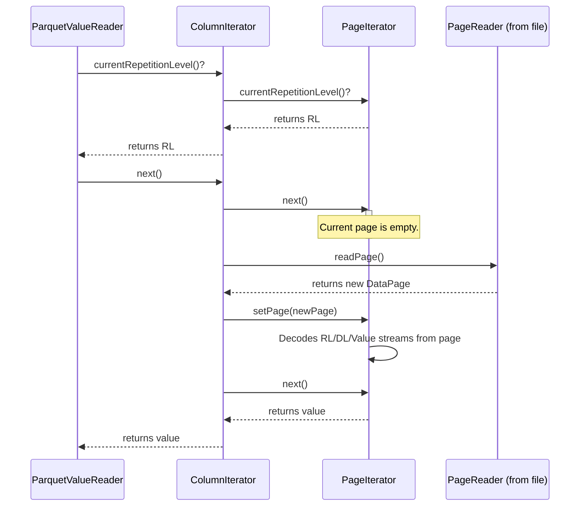

# Chapter 7: Triple Iterator

In the [previous chapter](06_parquetvaluereader_.md), we learned how the `ParquetValueReader` works like a master assembler, taking column data and expertly rebuilding it into structured records. But we left one question unanswered: where does the `ParquetValueReader` get its raw materials? How does it read the low-level values, null indicators, and list boundaries from the file?

This chapter introduces the fundamental data access layer that powers the entire read process: the **Triple Iterator**.

### The Problem: Speaking Parquet's Native Language

At its core, a Parquet file doesn't store neat rows or objects. It stores columns as a highly compressed stream of raw signals. To reconstruct a complex data structure like a list of optional strings, Parquet uses a special system.

Imagine you're receiving a message in Morse code. You don't get complete words. You get a stream of dots and dashes. You must listen to each signal and interpret it to form letters, then words, then sentences.

Parquet's data stream is similar. For every potential value in a column, it stores a "triple" of information:
1.  **A Repetition Level (RL):** A number that signals list structure. A value of `0` means the value belongs to a new record. A value greater than `0` means the value is another item in the list of the *current* record.
2.  **A Definition Level (DL):** A number that signals whether a value is present or null. A high value means the data is defined. A lower value means the data is `null` at some level of nesting.
3.  **A Value:** The actual data (e.g., the integer `42` or the string `"hello"`). This is only present if the definition level says it is!

The `ParquetValueReader` needs a "telegraph operator" that can read this raw stream of RLs, DLs, and values. That operator is the `TripleIterator`.

### The Solution: Consuming a Stream of Triples

The `TripleIterator` is a low-level iterator that provides access to this raw stream. Its job is to move through a column's data one triple at a time, exposing the current RL, DL, and value to its consumer, the `ParquetValueReader`.

Let's see how a `ParquetValueReader` for a list of strings would use it. Imagine the data for `["a", "b"]` is stored in the file. The `TripleIterator` would present the following stream:

1.  **First Triple:** `RL=0`, `DL=2`, `value="a"`.
    *   The `ListReader` sees `RL=0`: "Start of a new list for a new record."
    *   It sees `DL=2` (the max for this field): "The value is defined."
    *   It calls `next()` to get `"a"` and adds it to its internal list.
2.  **Second Triple:** `RL=1`, `DL=2`, `value="b"`.
    *   The `ListReader` sees `RL=1`: "This is another item in the *same* list."
    *   It sees `DL=2`: "The value is defined."
    *   It calls `next()` to get `"b"` and adds it to its internal list.

When the `ListReader` encounters a triple with a repetition level of `0` again, it knows the current list is finished and it can return `["a", "b"]`. The `TripleIterator` handles all the complexity of reading from the file; the `ParquetValueReader` just interprets the signals.

### Under the Hood: From Pages to Triples

The `TripleIterator` isn't a single class but a chain of iterators that work together. The `ParquetValueReader` only interacts with the top of this chain.

1.  **`ParquetValueReader`:** The high-level consumer. Wants to build a record.
2.  **`ColumnIterator`:** The main implementation of `TripleIterator`. It iterates over an entire column chunk, which may be composed of many "pages" of data. Its job is to read one page after another.
3.  **`PageIterator`:** Iterates over the triples *within a single page*. It decodes the raw bytes for RLs, DLs, and values.
4.  **`PageReader`:** A Parquet utility that reads physical data pages from the file.

Here is a simplified diagram of how a `ParquetValueReader` gets the next value:



Let's look at the key pieces of code that make this happen.

#### The `TripleIterator` Interface

This interface, found in `src/main/java/org/apache/iceberg/parquet/TripleIterator.java`, defines the contract. It's a standard Java `Iterator` with two extra methods for getting the levels.

```java
// In TripleIterator.java
interface TripleIterator<T> extends Iterator<T> {
  // Returns the definition level for the current position.
  int currentDefinitionLevel();

  // Returns the repetition level for the current position.
  int currentRepetitionLevel();

  // ... plus specialized next...() methods like nextInt(), nextBoolean(), etc.
}
```
This simple interface hides all the complexity of file I/O from the `ParquetValueReader`.

#### The `ColumnIterator`

The `ColumnIterator` is the primary implementation of `TripleIterator`. It manages iterating over all the pages in a column. Its main job is to delegate to a `PageIterator` and load new pages when necessary.

You can see this delegation in `src/main/java/org/apache/iceberg/parquet/ColumnIterator.java`:

```java
// In ColumnIterator.java
public abstract class ColumnIterator<T> ... implements TripleIterator<T> {
  private final PageIterator<T> pageIterator;

  @Override
  public int currentDefinitionLevel() {
    advance(); // Make sure the pageIterator has data
    return pageIterator.currentDefinitionLevel();
  }

  // ... other methods delegate similarly
}
```
The `advance()` method is where the magic happens. It checks if the current page has been fully consumed and, if so, asks the `PageReader` for the next one.

#### The `PageIterator`

The `PageIterator` is the real workhorse. It lives in `src/main/java/org/apache/iceberg/parquet/PageIterator.java`. When it's given a new `DataPage`, it decodes the raw, compressed bytes into separate iterators for repetition levels, definition levels, and values.

Its `advance()` method reads the next RL and DL from their respective streams.

```java
// Simplified from PageIterator.java
private void advance() {
  if (triplesRead < triplesCount) {
    // Read the next signal from the decoded streams
    this.currentDL = definitionLevels.nextInt();
    this.currentRL = repetitionLevels.nextInt();
    this.triplesRead += 1;
  }
  // ...
}
```
When `nextInteger()` is called, it simply reads from the decoded `values` stream:

```java
// Simplified from PageIterator.java
@Override
public int nextInteger() {
  advance(); // Read the RL/DL for this value
  return values.readInteger();
}
```
This class is the "telegraph operator" that translates the raw page bytes into the RL, DL, and value signals that the rest of the system understands.

### Conclusion

The `TripleIterator` is a critical low-level abstraction that decouples the high-level logic of record assembly from the low-level details of file I/O.

-   It exposes Parquet's raw data stream as a series of **triples**: (Repetition Level, Definition Level, Value).
-   It acts like a "telegraph operator," reading the raw signals from the file.
-   Higher-level abstractions like [ParquetValueReader](06_parquetvaluereader_.md) consume this stream to translate the signals into meaningful data structures like records and lists.
-   It is implemented as a chain of iterators (`ColumnIterator` and `PageIterator`) that handle moving from page to page within a file.

Understanding the `TripleIterator` gives you a fundamental insight into how Parquet data is processed from the ground up. So far, we've focused on standard types like integers and strings. But what about more exotic types?

Next up: [Variant Type Handling](08_variant_type_handling_.md)

---

Generated by [AI Codebase Knowledge Builder](https://github.com/The-Pocket/Tutorial-Codebase-Knowledge)