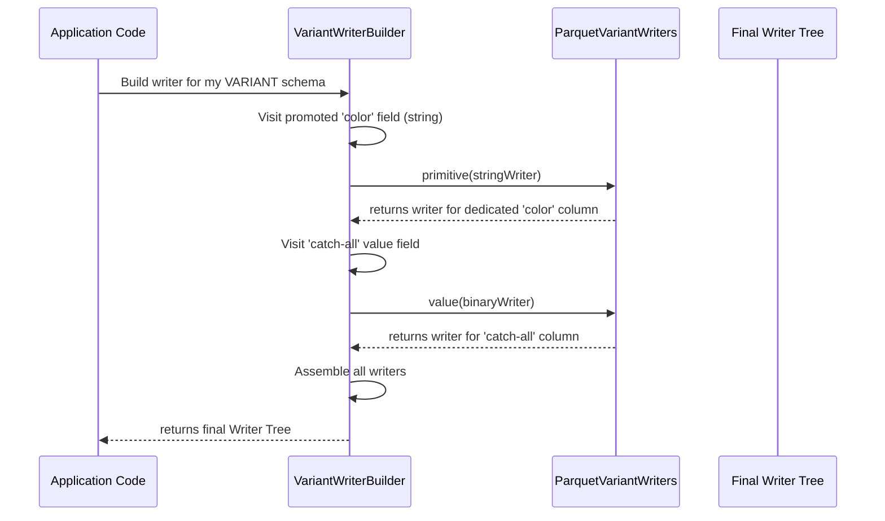

# Chapter 8: Variant Type Handling

In our [previous chapter](07_triple_iterator_.md), we explored the `TripleIterator`, the low-level component that reads the raw data stream from a Parquet file. We've seen how the library handles structured data like integers, strings, and lists with precision. But what happens when your data isn't perfectly structured? What about flexible, JSON-like data?

This chapter introduces a specialized set of abstractions for handling one of Iceberg's most powerful features: the semi-structured `VARIANT` type.

### The Problem: Efficiently Storing Messy Data

Imagine you need to store product information. Some fields are always present, like `product_id` (an integer) and `price` (a decimal). But other information, stored in a `details` field, is unpredictable. One product might have `{"color": "red", "weight_kg": 0.5}`, while another might have `{"dimensions": {"w": 10, "h": 20}, "material": "cotton"}`.

How can you store this `details` field in a columnar format?

1.  **Store it as a single big string:** This is simple, but very inefficient. If you want to find all products where `details.color = 'red'`, you have to read the entire string for every single row and parse the JSON. This completely defeats the purpose of a columnar database.

2.  **Define a column for every possible field:** This would lead to a table with thousands of mostly-empty columns (`color`, `weight_kg`, `dimensions_w`, `dimensions_h`, `material`, etc.). This is wasteful and unmanageable.

Iceberg's `VARIANT` type provides a clever hybrid solution to this problem.

### The Solution: Shredding with a "Filing System"

The library's approach to handling `VARIANT` data is called **shredding**. Think of it like a smart filing system for mixed-media documents.

*   **Dedicated Folders (Promoted Columns):** You know that some information, like the `author` and `publish_date`, appears on almost every document. To make finding these fast, you create dedicated folders for them. In our `VARIANT` type, you can "promote" frequently accessed, well-typed fields (like `details.color`) into their own dedicated Parquet columns. Querying for `details.color = 'red'` becomes a lightning-fast column scan.

*   **The "Catch-All" Box (Serialized Column):** For all the other miscellaneous, unpredictable information in the `details` field, you don't create a hundred different folders. You just put it all into a single, well-organized "catch-all" box. In `VARIANT`, the remaining data is serialized into a compact binary format and stored in a single `value` column.

This "shredding" gives you the best of both worlds: high performance for common query patterns and the flexibility to store any JSON-like structure.

### How it Works: The `ParquetVariantVisitor`

To implement this complex filing system, the library uses a specialized version of the [Schema Traversal (Visitor)](04_schema_traversal__visitors__.md) pattern. The `ParquetVariantVisitor` is an expert "tour guide" that knows how to navigate the complex schema of a shredded `VARIANT` column.

It defines a "tour" with stops for each part of the variant structure:
*   `variant()`: The root of the variant column.
*   `primitive()`: A promoted, well-typed field (e.g., the dedicated `color` column).
*   `object()`: A shredded JSON object.
*   `array()`: A shredded JSON array.
*   `serialized()`: The "catch-all" binary data.

Two key components implement this visitor to build the machinery for reading and writing.

1.  **`VariantWriterBuilder`:** Builds the tree of [ParquetValueWriter](05_parquetvaluewriter_.md)s needed to write variant data.
2.  **`VariantReaderBuilder`:** Builds the tree of [ParquetValueReader](06_parquetvaluereader_.md)s needed to read and reassemble variant data.

### Writing Shredded Data: `VariantWriterBuilder`

The `VariantWriterBuilder` is the architect of our filing system. It walks the `VARIANT` schema and constructs the appropriate writer for each part.



Let's peek at `src/main/java/org/apache/iceberg/parquet/VariantWriterBuilder.java` to see how it makes these decisions.

When the visitor encounters a promoted primitive field, it builds a specialized writer for it.

```java
// Simplified from VariantWriterBuilder.java
@Override
public ParquetValueWriter<?> primitive(PrimitiveType primitive) {
  ColumnDescriptor desc = schema.getColumnDescription(currentPath());
  switch (primitive.getPrimitiveTypeName()) {
    case BINARY: // e.g., for a promoted 'color' string
      return ParquetVariantWriters.primitive(
          ParquetValueWriters.strings(desc), PhysicalType.STRING);
    // ... other types ...
    case INT32:
      return ParquetVariantWriters.primitive(
          ParquetValueWriters.ints(desc), PhysicalType.INT32);
  }
  // ...
}
```
This code creates a writer that will direct string values for the `color` field into its own dedicated Parquet column.

When it encounters the "catch-all" part of the schema, it creates a simple binary writer.

```java
// Simplified from VariantWriterBuilder.java
@Override
public ParquetValueWriter<?> serialized(PrimitiveType value) {
  ColumnDescriptor desc = schema.getColumnDescription(currentPath());
  return ParquetVariantWriters.value(ParquetValueWriters.byteBuffers(desc));
}
```
This writer will take any remaining fields, serialize them, and put them in the "catch-all" box.

The real magic happens in the manager writers created by `ParquetVariantWriters`. The `ShreddedObjectWriter` is responsible for routing the data.

```java
// Simplified from ParquetVariantWriters.java's ShreddedObjectWriter
@Override
public void write(int repetitionLevel, VariantValue value) {
  VariantObject object = value.asObject();
  ShreddedObject shredded = Variants.object(object); // A copy for the "catch-all"

  // For each promoted field...
  for (String fieldName : promotedFieldNames) {
    if (object.has(fieldName)) {
      // It's a promoted field! Route it to the dedicated writer.
      dedicatedWriters.get(fieldName).write(repetitionLevel, object.get(fieldName));
      shredded.remove(fieldName); // Remove it from the "catch-all" version.
    }
  }

  // Write what's left to the "catch-all" binary column.
  catchAllWriter.write(repetitionLevel, shredded);
}
```
This is the filing system in action! It checks each field: if it's a "photo" (`promotedField`), it goes to the photo album (`dedicatedWriters`); otherwise, it stays in the miscellaneous box (`shredded`) to be serialized.

### Reading Shredded Data: `VariantReaderBuilder`

Reading is the reverse process: reassembling the document from all the different folders. The `VariantReaderBuilder` constructs a tree of readers that knows how to do this.

Its job is to build a `ShreddedObjectReader` that can:
1.  Read a value from a dedicated, promoted column (e.g., `color`).
2.  Read the binary data from the "catch-all" column and deserialize it.
3.  Merge them back together into a single, complete `Variant` object.

Let's look at the `ShreddedObjectReader` from `src/main/java/org/apache/iceberg/parquet/ParquetVariantReaders.java`.

```java
// Simplified from ParquetVariantReaders.java's ShreddedObjectReader
@Override
public VariantValue read(VariantMetadata metadata) {
  // 1. Read the "catch-all" part first, if it exists.
  VariantValue catchAllValue = catchAllReader.read(metadata);
  ShreddedObject object = Variants.object(metadata, (VariantObject) catchAllValue);

  // 2. Read from each dedicated field reader.
  for (String fieldName : promotedFieldNames) {
    // Read the value from the dedicated column.
    VariantValue fieldValue = dedicatedFieldReaders.get(fieldName).read(metadata);
    if (fieldValue != null) {
      // 3. Merge it back into our final object.
      object.put(fieldName, fieldValue);
    }
  }

  return object;
}
```
This reader perfectly reconstructs the original JSON-like object by pulling information from both the high-performance dedicated columns and the flexible "catch-all" column.

### Conclusion

Variant Type Handling is a sophisticated solution to a difficult problem: balancing performance and flexibility for semi-structured data.

-   The **`VARIANT`** type allows you to store JSON-like data efficiently.
-   **Shredding** is the key strategy: it **promotes** common fields to dedicated columns for speed, while storing the rest in a serialized **"catch-all"** column for flexibility.
-   The **`ParquetVariantVisitor`** pattern provides the foundation for this complex logic.
-   **`VariantWriterBuilder`** and **`VariantReaderBuilder`** implement this visitor to construct the read/write machinery that powers the shredding process.

This concludes our deep dive into the core components of the `parquet` library. You've journeyed from the high-level [Parquet I/O Facade](01_parquet_i_o_facade_.md) to the nitty-gritty of the [Triple Iterator](07_triple_iterator_.md) and advanced variant handling. You now have the foundational knowledge to understand, use, and contribute to this powerful data storage library.

---

Generated by [AI Codebase Knowledge Builder](https://github.com/The-Pocket/Tutorial-Codebase-Knowledge)