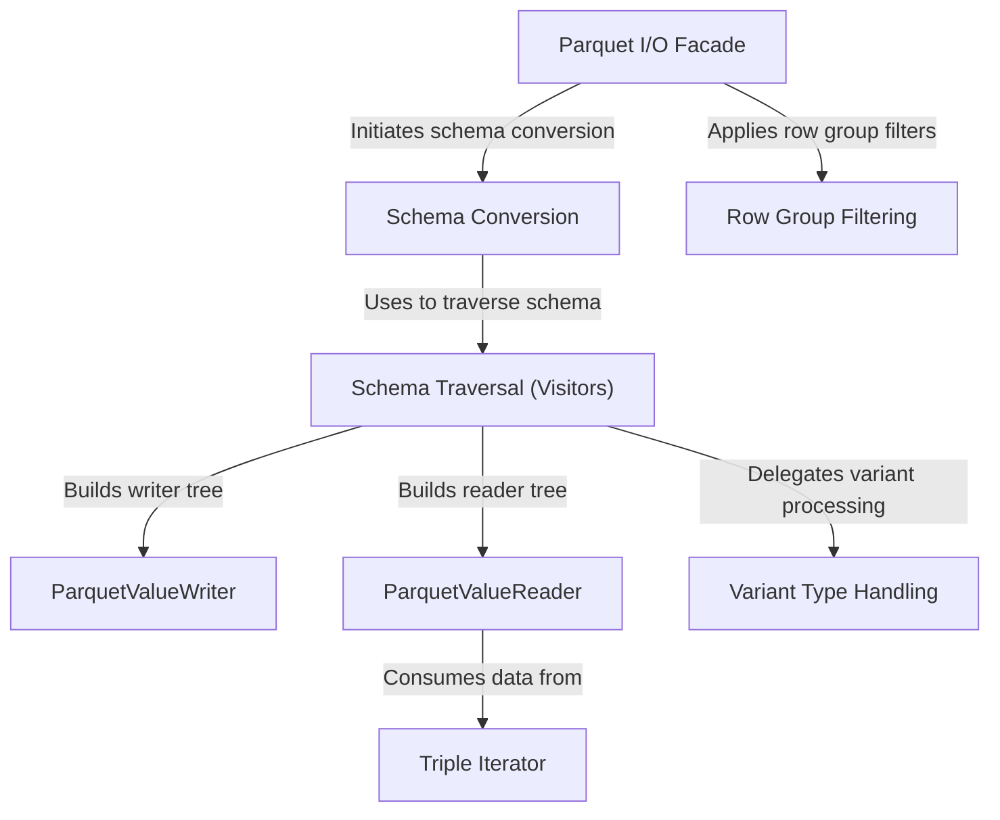

# Tutorial: parquet

The `parquet` project provides the core engine for reading from and writing to **Apache Parquet files** within the *Apache Iceberg* ecosystem. It acts as a sophisticated translator, converting Iceberg's tables and data types into the efficient, columnar Parquet format. This involves not just writing the data, but also handling complex *schema conversions*, managing nested structures, and implementing powerful performance optimizations like *row group filtering* to speed up data access.

**Source Repository:** [None](None)

## Chapters

1. [Parquet I/O Facade
](01_parquet_i_o_facade_.md)
2. [Schema Conversion
](02_schema_conversion_.md)
3. [Row Group Filtering
](03_row_group_filtering_.md)
4. [Schema Traversal (Visitors)
](04_schema_traversal__visitors__.md)
5. [ParquetValueWriter
](05_parquetvaluewriter_.md)
6. [ParquetValueReader
](06_parquetvaluereader_.md)
7. [Triple Iterator
](07_triple_iterator_.md)
8. [Variant Type Handling
](08_variant_type_handling_.md)

---

Generated by [AI Codebase Knowledge Builder](https://github.com/The-Pocket/Tutorial-Codebase-Knowledge)