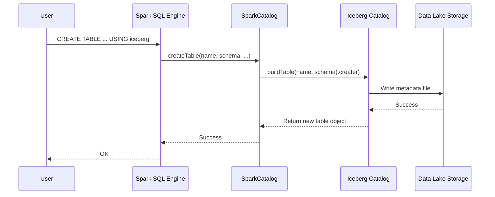

# Chapter 1: Spark Catalog

Welcome to your journey into Apache Iceberg's Spark integration! In this first chapter, we'll explore one of the most fundamental concepts: the `SparkCatalog`.

### The Librarian for Your Data

Imagine you walk into a massive library (your data lakehouse) and want to find a specific book (a data table). You wouldn't wander aimlessly through the aisles. Instead, you'd go to the main desk and ask the librarian.

The `SparkCatalog` is that librarian for Apache Spark.

When you write a simple SQL query like `SELECT * FROM my_table`, you're asking a question. Spark needs someone to ask, "Hey, where can I find `my_table`?" The `SparkCatalog` is the one who answers. It knows where all your Iceberg tables are, how they are structured, and how to access them. It's the primary bridge connecting Spark's powerful SQL engine to your Iceberg tables.

### Getting Started: Creating and Using a Table

Let's start with a simple goal: we want to create a table to store employee information, add a few records, and then count them.

Without a catalog, Spark wouldn't know how to handle these requests for an Iceberg table. But once you've configured Spark to use an Iceberg `SparkCatalog`, you can use standard SQL commands.

First, let's create our table. This SQL command tells Spark to create a new Iceberg table named `employees` with two columns, `id` and `data`.

```sql
CREATE TABLE main.default.employees (id bigint, data string) USING iceberg
```

Next, let's add some data.

```sql
INSERT INTO main.default.employees VALUES (1, 'a'), (2, 'b'), (3, 'c')
```

Finally, let's ask a question about our data. How many employees are in the table?

```sql
SELECT COUNT(*) FROM main.default.employees
```

Spark will run this query and give you the answer: `3`.

These operations feel just like using any other database or data warehouse. This seamless experience is made possible by the `SparkCatalog` working diligently behind the scenes. It took your `CREATE`, `INSERT`, and `SELECT` commands and translated them into actions on your Iceberg table.

### Under the Hood: How Does it Work?

So, what exactly happened when you ran that `CREATE TABLE` command? Let's trace the journey of your request.

1.  **You** write the SQL command.
2.  **Spark's SQL Engine** receives and parses your command. It sees `USING iceberg` and understands this is a job for its configured Iceberg catalog.
3.  **SparkCatalog** gets the call. It receives the table name, schema, and other details from Spark.
4.  The `SparkCatalog` then talks to the underlying **Iceberg Catalog** (which might be a system like Hive Metastore, or just files on HDFS) to perform the actual work of creating the table's first metadata file.
5.  This metadata is written to your **Data Lake Storage** (like Amazon S3 or HDFS).

Here is a simplified diagram of that interaction:



### A Peek at the Code

The `SparkCatalog` is a Java class that implements Spark's `TableCatalog` interface. This interface defines methods that Spark calls for catalog operations, like `createTable`, `loadTable`, and `dropTable`.

Let's look at a simplified version of the `createTable` method inside `SparkCatalog.java`.

```java
// File: spark/src/main/java/org/apache/iceberg/spark/SparkCatalog.java

@Override
public Table createTable(
    Identifier ident, StructType schema, Transform[] transforms, Map<String, String> properties) {
  
  // 1. Convert Spark's schema to Iceberg's schema
  Schema icebergSchema = SparkSchemaUtil.convert(schema);
  
  // 2. Get a builder for a new Iceberg table
  Catalog.TableBuilder builder = icebergCatalog.buildTable(buildIdentifier(ident), icebergSchema);

  // 3. Create the table and its metadata
  org.apache.iceberg.Table icebergTable = builder.create();

  // 4. Return a Spark-compatible table object
  return new SparkTable(icebergTable, !cacheEnabled);
}
```

Let's break down what this code does:

1.  **Convert Schema:** Spark and Iceberg have their own ways of defining a table's structure. This first step translates the schema from Spark's format to Iceberg's format. We'll learn more about this in the [Schema and Data Type Conversion](07_schema_and_data_type_conversion_.md) chapter.
2.  **Get Builder:** It asks the underlying Iceberg catalog for a "builder," a helper object for constructing a new table.
3.  **Create:** The `builder.create()` call is where the magic happens. The catalog creates the initial table metadata and saves it to your storage.
4.  **Return:** Finally, it wraps the newly created Iceberg table in a `SparkTable` object, which Spark can understand and use for future operations. We'll explore this object in our very next chapter!

### Playing Nicely with Others: Non-Iceberg Tables

What if not all your tables are Iceberg tables? No problem! A special version, the `SparkSessionCatalog`, can act as a smart dispatcher.

When you ask for a table, it first checks if it's an Iceberg table. If so, it handles it. If not, it passes the request along to Spark's built-in catalog. This allows you to work with both Iceberg and non-Iceberg (like Parquet or Avro) tables in the same Spark session without any extra effort.

Here’s a glimpse of how `SparkSessionCatalog.java` does this:

```java
// File: spark/src/main/java/org/apache/iceberg/spark/SparkSessionCatalog.java

@Override
public Table loadTable(Identifier ident) throws NoSuchTableException {
  try {
    // First, try to load it as an Iceberg table.
    return icebergCatalog.loadTable(ident);
  } catch (NoSuchTableException e) {
    // If that fails, ask Spark's regular catalog.
    return getSessionCatalog().loadTable(ident);
  }
}
```

This simple `try...catch` logic makes the `SparkSessionCatalog` incredibly flexible, providing a unified view of all your tables, regardless of their format.

### Conclusion

You've just met the `SparkCatalog`, the indispensable librarian of your data lakehouse. It's the central component that makes using Iceberg in Spark feel so natural and simple. It translates your familiar SQL commands into the powerful metadata operations that define Iceberg tables.

Now that we understand how Spark finds and manages our tables with the catalog, let's dive deeper into the object it works with. In the next chapter, we'll explore the [Spark Table](02_spark_table_.md), which represents a single Iceberg table within Spark.

---

Generated by [AI Codebase Knowledge Builder](https://github.com/The-Pocket/Tutorial-Codebase-Knowledge)