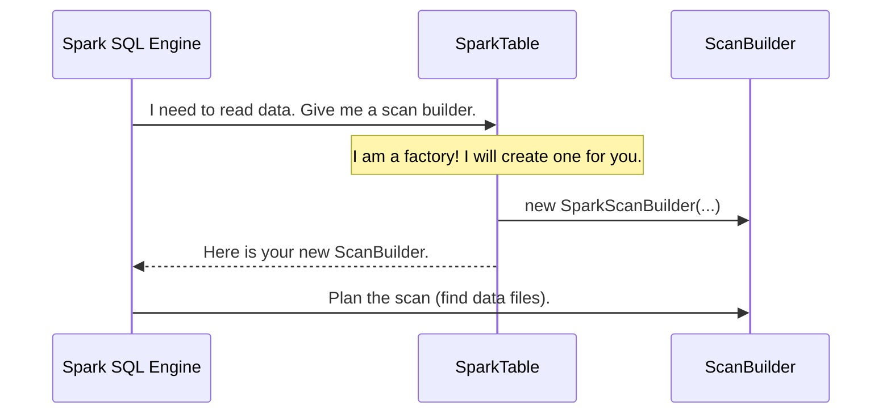

# Chapter 2: Spark Table

In the [previous chapter](01_spark_catalog_.md), we met the `SparkCatalog`, our data librarian. When we asked it to find the `employees` table, it did its job perfectly. But what exactly did it hand back to Spark? It didn't give Spark the raw data files; instead, it returned a `SparkTable` object.

### The Passport for Your Table

Think of `SparkTable` as the official passport an Iceberg table uses to enter the Spark ecosystem.

When you travel to a new country, you show your passport. An immigration officer doesn't need to know your entire life story. They just need to see key information from your passport: your name, your photo, and your permissions (e.g., a visa).

The `SparkTable` does the same thing for Spark. When Spark's query planner needs to understand a table, it looks at this `SparkTable` object. This object is a concise summary that tells Spark everything it needs to know to start working with the table.

### What's in the Passport?

A `SparkTable` presents a few critical pieces of information to Spark:

*   **Name (`name()`):** The unique name of the table, like `main.default.employees`.
*   **Schema (`schema()`):** The table's structure—its columns and their data types (e.g., `id` is a `bigint`, `data` is a `string`). This is like the "physical description" section of a passport.
*   **Partitioning (`partitioning()`):** The rules for how the data is physically organized on disk. This helps Spark read the data more efficiently.
*   **Capabilities (`capabilities()`):** A list of things the table can do. It's like the "visas" in a passport, telling Spark, "I support fast batch reading," "You can write new data to me," or "You can overwrite my data."

Let's imagine Spark is a data chef. The `SparkCatalog` gives the chef a recipe card (`SparkTable`) for our `employees` table.


This recipe card tells the chef the ingredients needed (`schema`), how they are organized in the pantry (`partitioning`), and what cooking methods are allowed (`capabilities`).

### The Table as a Factory

Beyond just describing itself, the `SparkTable` has one more crucial job: it acts as a factory.

When Spark decides it's time to actually cook—to read or write data—it asks the `SparkTable` to create the right tools for the job.

*   To **read data**, Spark asks, "Can you give me something to plan the scan?" The `SparkTable` says, "Of course, here is a `ScanBuilder`."
*   To **write data**, Spark asks, "I have some new data. How should I write it?" The `SparkTable` replies, "I can help. Here is a `WriteBuilder`."

The `SparkTable` itself doesn't contain any data. It's a lightweight object that knows *about* the data and knows how to create the specialized objects (`ScanBuilder`, `WriteBuilder`) that perform the heavy lifting. We will explore these builders in detail in later chapters.

### Under the Hood: A Query's Journey

Let's trace what happens when you run `SELECT * FROM main.default.employees`.

1.  **Spark's SQL Engine** asks the `SparkCatalog`, "Please load the table `main.default.employees`."
2.  The `SparkCatalog` finds the table's metadata and creates a `SparkTable` object representing it. It returns this object to Spark.
3.  Now Spark has the table's "passport." It sees from the `capabilities` that the table supports batch reading.
4.  Spark's planner says, "Great, I need to read from this table. `SparkTable`, give me a tool to plan this read."
5.  The `SparkTable` object executes its `newScanBuilder()` method and returns a new `SparkScanBuilder` instance.
6.  Spark then uses this `ScanBuilder` to figure out which data files it needs to read to answer your query.

Here is a simplified diagram of that interaction:



### A Peek at the Code

The `SparkTable` class implements several interfaces from Spark, which is how it plugs so seamlessly into the query engine. Let's look at a few simplified methods from the real source code.

This first snippet shows how the `SparkTable` reports its capabilities. It's simply returning a pre-defined set of supported actions.

```java
// File: spark/src/main/java/org/apache/iceberg/spark/source/SparkTable.java

private static final Set<TableCapability> CAPABILITIES =
    ImmutableSet.of(
        TableCapability.BATCH_READ,
        TableCapability.BATCH_WRITE,
        TableCapability.STREAMING_WRITE);

@Override
public Set<TableCapability> capabilities() {
  return capabilities;
}
```
Here, `BATCH_READ` and `BATCH_WRITE` tell Spark that you can run standard `SELECT` and `INSERT` queries on this table.

Next, let's see how `SparkTable` provides the schema. It converts Iceberg's own schema definition into a `StructType` that Spark can understand.

```java
// File: spark/src/main/java/org/apache/iceberg/spark/source/SparkTable.java

@Override
public StructType schema() {
  if (lazyTableSchema == null) {
    // Convert Iceberg's schema into Spark's format
    this.lazyTableSchema = SparkSchemaUtil.convert(icebergTable.schema());
  }
  return lazyTableSchema;
}
```
This conversion is a key part of the integration, which we'll cover in the [Schema and Data Type Conversion](07_schema_and_data_type_conversion_.md) chapter.

Finally, here is the factory method in action. When Spark wants to read data, it calls `newScanBuilder()`. The `SparkTable` creates and returns a `SparkScanBuilder` object, passing along all the necessary context.

```java
// File: spark/src/main/java/org/apache/iceberg/spark/source/SparkTable.java

@Override
public ScanBuilder newScanBuilder(CaseInsensitiveStringMap options) {
  // Create a builder object to plan the read operation.
  // We will explore this in the Spark Scan Builder chapter.
  return new SparkScanBuilder(
      sparkSession(), icebergTable, snapshotSchema(), options);
}
```
This handoff is fundamental. The `SparkTable` has done its job of representing the table, and now it passes the responsibility for planning the read to the `SparkScanBuilder`.

### Conclusion

You've now learned about the `SparkTable`—the essential passport that allows an Iceberg table to be understood and used by Spark. It's a lightweight adapter that:

1.  **Describes** the table's structure, partitioning, and capabilities to Spark.
2.  **Acts as a factory**, creating the `ScanBuilder` and `WriteBuilder` objects that Spark uses to interact with the table's data.

The `SparkTable` forms the critical link between the catalog (which finds tables) and the builders (which read and write data).

So far, we've focused on standard reading and writing. But what about other table management tasks, like expiring old snapshots or migrating data? In the next chapter, we'll look at [Spark Actions & Procedures](03_spark_actions___procedures_.md), which provide powerful tools for managing your Iceberg tables directly within Spark.

---

Generated by [AI Codebase Knowledge Builder](https://github.com/The-Pocket/Tutorial-Codebase-Knowledge)