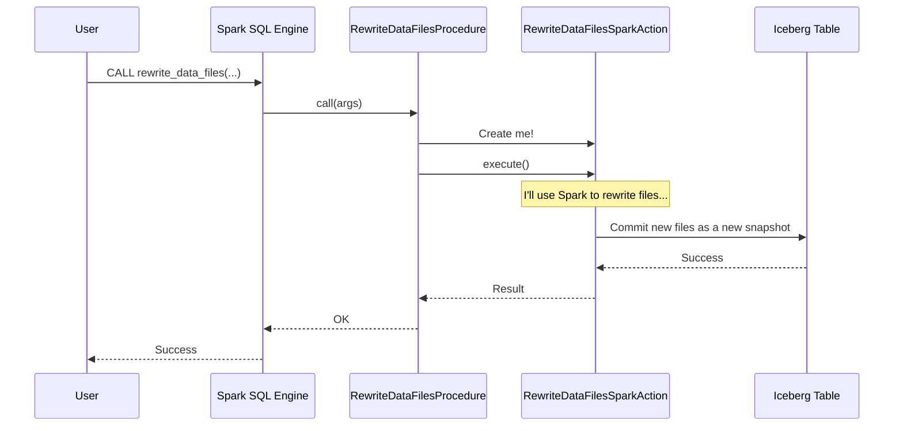

# Chapter 3: Spark Actions & Procedures

In the previous chapters, we learned how the [Spark Catalog](01_spark_catalog_.md) acts as a librarian to find our tables, and how a [Spark Table](02_spark_table_.md) object serves as a "passport" to introduce that table to Spark. We've used standard SQL like `SELECT` and `INSERT` to read and write data.

But what happens over time? Imagine our `employees` table gets thousands of small updates every hour. Soon, it will be made of a huge number of tiny files. This is like trying to read a book that has been torn into thousands of confetti-sized pieces—it's slow and inefficient!

This is where table maintenance comes in. Just like a car needs a regular tune-up, an Iceberg table needs maintenance to perform at its best.

### The Specialized Maintenance Crew

Think of **Spark Actions and Procedures** as the specialized maintenance crew for your Iceberg tables. While normal SQL handles the day-to-day work, this crew handles essential upkeep tasks like optimizing file layouts, cleaning up old data, and managing table history.

You access this crew by making a `CALL` in Spark SQL. This is different from `SELECT` or `INSERT`; it's a command to *do something* to the table itself, not just its data.

### Use Case: Compacting Small Files

Let's solve our "too many small files" problem. We want to combine the small data files in our `employees` table into a few larger, more efficient ones. This process is called compaction.

We can ask our maintenance crew to do this with a single command:

```sql
CALL main.system.rewrite_data_files(table => 'main.default.employees')
```

When you run this, Spark doesn't return rows of data. Instead, it kicks off a background job that:
1.  Finds all the small files in your table.
2.  Reads their data.
3.  Writes that data into new, larger files.
4.  Updates the table's metadata to use these new files and ignore the old ones.

After the `CALL` is finished, your queries on the `employees` table will be faster, but the data you see will be exactly the same. The maintenance crew did its job without changing the contents of your book, just by neatly taping the confetti back into full pages.

Other common maintenance tasks include:
*   `expire_snapshots`: Cleans up old versions of your table to save space.
*   `remove_orphan_files`: Finds and deletes files in your table directory that are no longer tracked by Iceberg.

### The Two Parts: Procedures and Actions

Our maintenance crew has two roles: the front-desk clerk who takes your service request, and the mechanic who does the actual work.

1.  **Procedure (The Clerk):** This is what you interact with directly. When you use `CALL`, you are talking to a **Procedure**. Its job is to understand your request, parse the arguments (like the table name), and figure out which tool to use. It's the public-facing SQL interface.

2.  **Action (The Mechanic):** This is the engine that performs the heavy lifting. The Procedure hands your request off to a specific **Action**. The Action contains all the logic for the task and, crucially, uses Spark's distributed engine to perform the work efficiently across a potentially massive table.

This separation is powerful. The Procedure handles the simple SQL interface, while the Action contains the complex, reusable, and parallelized logic.

### Under the Hood: A Service Request's Journey

Let's trace what happens when you `CALL rewrite_data_files`.

1.  **You** submit the `CALL` command to Spark.
2.  **Spark's SQL Engine** recognizes this is a procedure call and finds the `rewrite_data_files` procedure provided by the Iceberg catalog.
3.  **The Procedure (`RewriteDataFilesProcedure`)** gets invoked. It takes your arguments (the table name) and prepares for the job.
4.  The Procedure asks the **`SparkActions`** factory, "I need an action that can rewrite data files for this table."
5.  `SparkActions` creates and returns a **`RewriteDataFilesSparkAction`** object. This is the specialized mechanic for our job.
6.  The Procedure tells the Action, "Execute!"
7.  The **Action** then uses Spark to find all the data files, group them for compaction, and run a distributed job to write the new, larger files.
8.  Once done, the Action commits the changes to the Iceberg table, creating a new snapshot.

Here is a simplified diagram of that flow:



### A Peek at the Code

Let's look at how the clerk (Procedure) and mechanic (Action) are implemented.

#### 1. The Procedure: The SQL Interface

A Procedure's main job is to define its parameters and then call the right Action.

```java
// File: spark/src/main/java/org/apache/iceberg/spark/procedures/RewriteDataFilesProcedure.java

class RewriteDataFilesProcedure extends BaseProcedure {

  // Defines the parameters you can use in SQL, like 'table' and 'strategy'.
  private static final ProcedureParameter[] PARAMETERS =
      new ProcedureParameter[] {
        ProcedureParameter.required("table", DataTypes.StringType),
        ProcedureParameter.optional("strategy", DataTypes.StringType),
        // ... other parameters ...
      };

  // This is called by Spark when you execute `CALL`.
  @Override
  public InternalRow[] call(InternalRow args) {
    // 1. Get the table identifier from the arguments.
    Identifier tableIdent = toIdentifier(args.getString(0), "table");
    
    return modifyIcebergTable(tableIdent, table -> {
      // 2. Get the correct Action from the SparkActions factory.
      RewriteDataFiles action = actions().rewriteDataFiles(table);

      // ... configure the action with other arguments ...
      
      // 3. Execute the action and get the result.
      RewriteDataFiles.Result result = action.execute();
      
      // 4. Return the result back to Spark.
      return toOutputRows(result);
    });
  }
}
```
This code does three main things:
1.  **Reads Arguments:** It pulls the table name and other options you provided in your `CALL` statement.
2.  **Gets an Action:** It calls `actions().rewriteDataFiles(table)` to get the specific "mechanic" needed for the job.
3.  **Executes:** It runs `action.execute()` to kick off the actual work.

#### 2. The Action Factory: The Dispatcher

`SparkActions` is a simple class that knows how to create all the different types of actions. The procedure calls this to get the right tool.

```java
// File: spark/src/main/java/org/apache/iceberg/spark/actions/SparkActions.java

public class SparkActions implements ActionsProvider {
  private final SparkSession spark;

  // ...

  @Override
  public RewriteDataFilesSparkAction rewriteDataFiles(Table table) {
    // Just creates a new instance of the action, passing in Spark and the table.
    return new RewriteDataFilesSparkAction(spark, table);
  }

  // ... other factory methods for expireSnapshots, etc. ...
}
```

#### 3. The Action: The Heavy Lifter

This is where the core logic lives. The `RewriteDataFilesSparkAction` uses Spark to do its work in parallel.

```java
// File: spark/src/main/java/org/apache/iceberg/spark/actions/RewriteDataFilesSparkAction.java

public class RewriteDataFilesSparkAction extends BaseSparkAction<RewriteDataFilesSparkAction> {
  
  // ...

  @Override
  public RewriteDataFiles.Result execute() {
    // 1. Find all data files that match our criteria.
    FileRewritePlan plan = planner.plan();
    
    // ...
    
    // 2. Create a thread pool to rewrite file groups in parallel.
    ExecutorService rewriteService = rewriteService();

    // 3. Submit tasks to Spark to rewrite the actual files.
    //    This is where the distributed processing happens!
    Tasks.foreach(plan.groups())
        .executeWith(rewriteService)
        .run(fileGroup -> {
          // 'rewriteFiles' will run a Spark job.
          rewrittenGroups.add(rewriteFiles(plan, fileGroup));
        });

    // 4. Commit the new files to the table in a new snapshot.
    commitManager.commitOrClean(rewrittenGroups);

    return result;
  }
}
```
The Action is much more complex, but its job is clear: plan the work, execute it using Spark's distributed power, and safely commit the results to the table.

### Conclusion

You've now met the maintenance crew for your Iceberg tables!
*   **Procedures** are the simple `CALL` commands you use in SQL.
*   **Actions** are the powerful, distributed engines that perform the actual maintenance.

Using these tools, you can keep your tables healthy and performant, ensuring your data lakehouse runs smoothly. We've seen how to handle common tasks like compacting small files, which is critical for good query performance.

So far, we have covered how to find, write to, and maintain tables. But how does Spark actually figure out *what* to read when you run a `SELECT` query? In the next chapter, we'll dive into the [Spark Scan Builder](04_spark_scan_builder_.md), the component responsible for planning efficient reads from your Iceberg tables.

---

Generated by [AI Codebase Knowledge Builder](https://github.com/The-Pocket/Tutorial-Codebase-Knowledge)