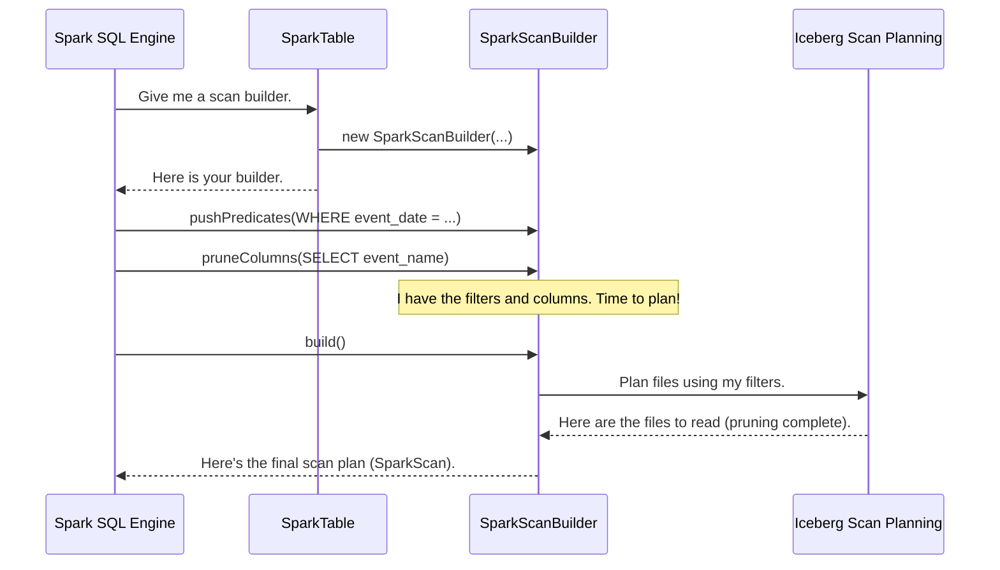

# Chapter 4: Spark Scan Builder

In the [previous chapter](03_spark_actions___procedures_.md), we learned about the specialized maintenance crew—the Actions and Procedures—that keep our Iceberg tables healthy. Now, let's switch gears from maintenance back to our primary goal: querying data. When you run a `SELECT` statement, how does Spark find the right data without wasting time?

### The Query Strategist

Imagine you're in a gigantic supermarket with a short shopping list: just milk and bread. Would you walk down every single aisle—from pet food to electronics—just to find those two items? Of course not! That would be incredibly inefficient. You'd look at the store directory, find the "Dairy" and "Bakery" aisles, and go directly there.

The `SparkScanBuilder` is that smart query strategist for your data.

When you run a query like `SELECT * FROM logs WHERE event_date = '2023-10-26'`, Spark doesn't want to read every data file from your `logs` table, which might contain years of data. Instead, it turns to the `SparkScanBuilder`. The builder's job is to create an efficient plan to read *only* the data necessary to answer your query.

### The Strategy: Pruning with Metadata

How does the `SparkScanBuilder` create this efficient plan? It uses Iceberg's superpower: its rich metadata. Iceberg stores statistics inside its metadata files, like the minimum and maximum values for columns within each data file.

Let's follow the builder's thought process for our query:

1.  **Get the Mission:** Spark tells the builder, "I need data from the `logs` table, but only where `event_date` is '2023-10-26'."

2.  **Consult the Directory:** The builder looks at the Iceberg table's manifest files (the store directory). It checks the `event_date` statistics for each data file.
    *   It sees a file with `min(event_date) = '2023-10-25'` and `max(event_date) = '2023-10-25'`. It thinks, "My target date '2023-10-26' is not in this range. I can skip this file."
    *   It sees another file with `min(event_date) = '2023-10-27'` and `max(event_date) = '2023-10-27'`. It thinks, "Skip this one too."
    *   Finally, it sees a file with `min(event_date) = '2023-10-26'` and `max(event_date) = '2023-10-26'`. It thinks, "Aha! The data I need *might* be in here. I must read this file."

3.  **Create the Plan:** After checking all the files, the builder hands a short, precise list of files back to Spark. "Here," it says, "just read these specific files. Ignore everything else."

This process of skipping files is called **file pruning**, and it's a massive performance win. The `SparkScanBuilder` is the component that makes it happen.

### Under the Hood: A Query's Journey to a Plan

You never call the `SparkScanBuilder` directly. It's part of a seamless, automated process that starts the moment you run a `SELECT` query.

1.  When you run a query, Spark consults the [Spark Catalog](01_spark_catalog_.md) to find your table.
2.  The catalog returns a [Spark Table](02_spark_table_.md) object.
3.  Spark's query planner asks the `SparkTable` object, "I need to read data. Give me a builder to help plan the scan." The `SparkTable` creates and returns a `SparkScanBuilder`.
4.  Spark's planner "pushes down" the query's `WHERE` clause (filters) and `SELECT` columns to the `SparkScanBuilder`.
5.  The `SparkScanBuilder` uses these filters to create a `SparkScan` object, which contains a list of tasks. Each task points to a specific data file that must be read.
6.  Spark's engine takes these tasks and distributes them to its executors to fetch the data.

Here is a simplified diagram of that interaction:



### A Peek at the Code

Let's look at how the `SparkScanBuilder` receives filters from Spark and uses them to create a scan.

#### 1. Translating Filters

First, Spark "pushes" its filters down to the builder. The `pushPredicates` method is responsible for translating Spark's filter objects into Iceberg's own `Expression` format.

```java
// File: spark/src/main/java/org/apache/iceberg/spark/source/SparkScanBuilder.java

@Override
public Predicate[] pushPredicates(Predicate[] predicates) {
  List<Expression> expressions = Lists.newArrayList();
  
  for (Predicate predicate : predicates) {
    // Convert a Spark filter into an Iceberg filter
    Expression expr = SparkV2Filters.convert(predicate);

    if (expr != null) {
      expressions.add(expr);
    }
  }

  // Store the translated Iceberg expressions
  this.filterExpressions = expressions;

  return predicates; // Returns unsupported predicates to Spark
}
```

This method iterates through the filters from your `WHERE` clause. It uses a helper class, `SparkV2Filters`, to do the translation. For example, a Spark filter for `event_date = '2023-10-26'` is converted into an Iceberg `equal` expression.

Here’s a simplified look at the `SparkV2Filters` helper that does this translation:

```java
// File: spark/src/main/java/org/apache/iceberg/spark/SparkV2Filters.java

public static Expression convert(Predicate predicate) {
  // Is the predicate name "="?
  if (predicate.name().equals("=")) {
    // Get the column name and the literal value
    String columnName = ...;
    Object value = ...;
    // Create an Iceberg "equal" expression
    return Expressions.equal(columnName, value);
  }
  // ... logic for other filter types like ">", "<", "IN" ...
  return null;
}
```

#### 2. Building the Scan

Once the filters are translated and stored, Spark calls the `build()` method. This is where the builder creates the final scan plan. It configures an Iceberg `BatchScan` object with the filters we just translated.

```java
// File: spark/src/main/java/org/apache/iceberg/spark/source/SparkScanBuilder.java

private org.apache.iceberg.Scan buildIcebergBatchScan(...) {
  BatchScan scan = newBatchScan()
      .caseSensitive(caseSensitive)
      // 1. Give the translated filters to the Iceberg scan
      .filter(filterExpression())
      // 2. Tell the scan which columns we need
      .project(expectedSchema);

  // ... other configurations ...

  return scan;
}
```

The most important lines are `.filter(filterExpression())` and `.project(expectedSchema)`. This is where the `SparkScanBuilder` hands off the "shopping list" (the filters and required columns) to Iceberg's core planning logic. Iceberg takes it from there, using its metadata to perform the pruning and return a list of files to read.

#### 3. Advanced: Distributing the Planning Itself

For tables with *millions* of files, even reading the metadata can be a bottleneck. For these extreme cases, Iceberg has a `SparkDistributedDataScan`. This special scan uses Spark itself to parallelize the metadata scanning.

```java
// File: spark/src/main/java/org/apache/iceberg/SparkDistributedDataScan.java

private Iterable<CloseableIterable<DataFile>> doPlanDataRemotely(...) {
  // Turn the list of manifest files into a Spark RDD
  JavaRDD<DataFile> dataFileRDD =
      sparkContext
          // Distribute the manifest scanning across the cluster
          .parallelize(toBeans(dataManifests), dataManifests.size())
          // Each worker will read its manifests and apply filters
          .flatMap(new ReadDataManifest(tableBroadcast(), context(), ...));

  // Collect the final list of data files to read
  List<List<DataFile>> dataFileGroups = collectPartitions(dataFileRDD);
  // ...
  return ...;
}
```
This is an advanced feature, but it shows how deeply Iceberg integrates with Spark. It not only uses Spark to read the *data* but can even use Spark to plan the read *itself*.

### Conclusion

You've just met the `SparkScanBuilder`, the quiet but powerful query strategist. It's the key to Iceberg's impressive query performance in Spark. By acting as the bridge between Spark's query planner and Iceberg's metadata, it ensures that your queries are executed as efficiently as possible.

To recap, the `SparkScanBuilder`:
*   Receives filters and column requirements from Spark.
*   Translates them into Iceberg's native format.
*   Initiates an Iceberg scan, which uses metadata to **prune** data files, dramatically reducing the amount of data that needs to be read.
*   Finally, produces a `SparkScan` object, which is the executable plan Spark uses to fetch data.

We've now seen how Spark efficiently reads data. But what about writing it? In the next chapter, we'll explore the other side of the coin with the [Spark Write Builder](05_spark_write_builder_.md).

---

Generated by [AI Codebase Knowledge Builder](https://github.com/The-Pocket/Tutorial-Codebase-Knowledge)