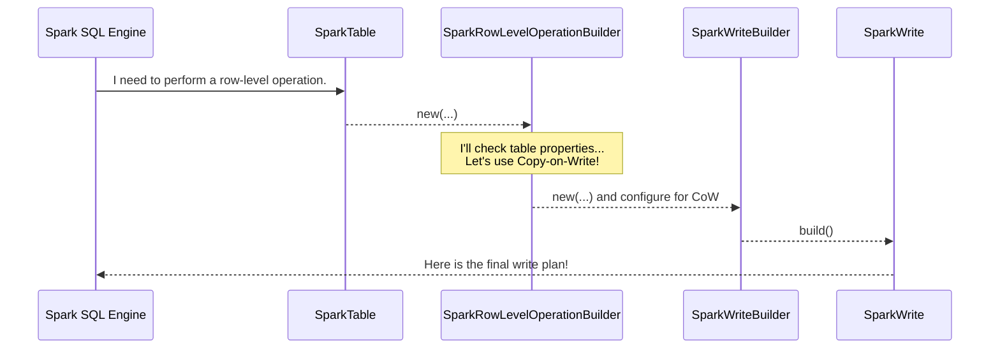

# Chapter 5: Spark Write Builder

In the [previous chapter](04_spark_scan_builder_.md), we met the `SparkScanBuilder`, the smart strategist that plans how to *read* data efficiently. Now, we'll look at the other side of the coin: how does Spark intelligently *write* data to your Iceberg tables?

### The Architect for Your Data

Imagine you're building a new room onto your house. You don't just start hammering nails and putting up walls. You hire an architect to draw up a detailed blueprint. The architect decides *how* the new room will be built: Will it be a simple extension? Will you need to demolish an old wall first? How will the plumbing and electrical connect to the rest of the house?

The `SparkWriteBuilder` is that architect for writing data into your Iceberg table.

When you execute a command like `INSERT`, `UPDATE`, or `MERGE`, Spark doesn't just blindly dump new data. It consults the `SparkWriteBuilder` to create a smart, efficient plan for the write operation. The builder is responsible for answering critical questions before any data is written.

### The Architect's Big Decisions

The `SparkWriteBuilder` makes two main types of decisions to create its blueprint:

#### 1. What is the Write Strategy?

Not all writes are the same. The builder figures out the correct strategy based on your SQL command and table settings.

*   **Append (`INSERT INTO`):** This is the simplest strategy. The architect's plan is just "add new data files" without touching any existing data.
*   **Overwrite (`INSERT OVERWRITE`):** This is more involved. The plan is to "replace existing data." The builder determines if you are replacing the whole table or just specific partitions (dynamic overwrite).
*   **Row-Level Operations (`UPDATE`, `DELETE`, `MERGE`):** These are the most complex plans. The architect must choose between two primary methods for changing individual rows:
    *   **Copy-on-Write (CoW):** "To update a few records in a data file, we will make a copy of the *entire* file, apply the changes in the new copy, and then replace the old file with the new one." This is straightforward but can involve rewriting a lot of data for a small change.
    *   **Merge-on-Read (MoR):** "To update a few records, we will leave the original data file untouched and write a *new, small delete file* that says 'ignore these specific rows in the old file'. The new data will be written in another new file." This is very fast to write, but requires readers to combine the data and delete files at query time.

The builder chooses the right strategy by looking at your table's properties, ensuring the write is performed according to your desired performance and consistency trade-offs.

#### 2. How Should the Data Be Laid Out?

Once the strategy is chosen, the architect must plan the physical layout of the new data.

*   **Distribution:** "Should we shuffle the incoming data so all records for the same partition (e.g., the same `event_date`) are gathered on one worker before writing?"
*   **Sorting:** "Should we sort the data by a specific column (e.g., `event_timestamp`) within each file to make future reads faster?"

By pre-processing the data this way, the builder ensures that the new data files are created in an optimal, well-organized fashion that matches the table's defined layout.

### Under the Hood: A Write Request's Journey

You never interact with the `SparkWriteBuilder` directly. It's an internal component that works behind the scenes. Let's trace what happens when you run an `UPDATE` statement.

1.  **Spark SQL Engine** receives your `UPDATE` command. It understands this is a row-level operation.
2.  Spark asks the [Spark Table](02_spark_table_.md), "I need to perform a row-level operation. Give me a builder for that."
3.  The table returns a `SparkRowLevelOperationBuilder`. This builder checks the table properties and decides on the strategy: Copy-on-Write or Merge-on-Read.
4.  Let's say it chooses Copy-on-Write. The `SparkRowLevelOperationBuilder` then creates a `SparkWriteBuilder` and configures it for a "copy-on-write" operation.
5.  The `SparkWriteBuilder` creates the final `SparkWrite` object—the executable blueprint.
6.  This blueprint tells Spark's execution engine exactly how to process the data (e.g., "rewrite these specific files").

Here is a simplified diagram of that flow:



### A Peek at the Code

Let's see how the architect designs its blueprints in the source code.

#### 1. Choosing the Row-Level Strategy

For an `UPDATE`, `MERGE`, or `DELETE`, Spark first uses a `SparkRowLevelOperationBuilder`. Its `build()` method is a clear decision point based on table properties.

```java
// File: spark/src/main/java/org/apache/iceberg/spark/source/SparkRowLevelOperationBuilder.java

@Override
public RowLevelOperation build() {
  // Read the write mode from the table properties.
  // The 'mode' is either COPY_ON_WRITE or MERGE_ON_READ.
  switch (mode) {
    case COPY_ON_WRITE:
      // If Copy-on-Write, create an operation that rewrites whole files.
      return new SparkCopyOnWriteOperation(spark, table, ...);
    case MERGE_ON_READ:
      // If Merge-on-Read, create an operation that writes delete files.
      return new SparkPositionDeltaOperation(spark, table, ...);
    default:
      throw new IllegalArgumentException("Unsupported mode: " + mode);
  }
}
```
This is the first big decision. The builder reads a table property (like `update.mode`) and chooses the entire strategy for the operation.

#### 2. Building the General Write Plan

Once the high-level strategy is set, the `SparkWriteBuilder` takes over. Its main job is to take all the configurations and produce the final, executable `SparkWrite` object.

```java
// File: spark/src/main/java/org/apache/iceberg/spark/source/SparkWriteBuilder.java

@Override
public Write build() {
  // 1. Get all configurations (from options, session, and table).
  //    This uses a helper we'll see in the next chapter.
  SparkWriteConf writeConf = new SparkWriteConf(spark, table, ...);

  // 2. Validate that the incoming data schema is compatible with the table.
  Schema writeSchema = validateOrMergeWriteSchema(table, dsSchema, writeConf);

  // 3. Create the final "blueprint" object.
  return new SparkWrite(spark, table, writeConf, ...);
}
```
This builder acts as a final checkpoint, validating the request and packaging everything into a `SparkWrite` object.

#### 3. Creating the Specific Batch Write

The `SparkWrite` object created by the builder contains the logic to create different kinds of batch writes depending on the configuration.

```java
// File: spark/src/main/java/org/apache/iceberg/spark/source/SparkWrite.java

@Override
public BatchWrite toBatch() {
  // The builder configured these boolean flags based on the SQL command.
  if (overwriteByFilter) {
    return asOverwriteByFilter(overwriteExpr);
  } else if (overwriteDynamic) {
    return asDynamicOverwrite();
  } else if (overwriteFiles) {
    // This is the path for our Copy-on-Write example.
    return asCopyOnWriteOperation(...);
  } else {
    // This is the path for a simple INSERT INTO append.
    return asBatchAppend();
  }
}
```
Here, you can see the result of the architect's work. The flags set by the `SparkWriteBuilder` (like `overwriteDynamic` or `overwriteFiles`) direct the `SparkWrite` object to return the correct final implementation (`asDynamicOverwrite`, `asCopyOnWriteOperation`, etc.) for Spark to execute.

### Conclusion

You've now met the `SparkWriteBuilder`, the master architect for all data-writing operations in Iceberg. It plays a crucial, behind-the-scenes role to ensure data is written efficiently and correctly.

To summarize, the `SparkWriteBuilder`:
*   Receives write requests from Spark for `INSERT`, `UPDATE`, `DELETE`, and `MERGE`.
*   Determines the **write strategy**, such as append, overwrite, copy-on-write, or merge-on-read.
*   Determines the **data layout**, planning how data should be distributed and sorted.
*   Produces a final, executable `SparkWrite` plan for Spark's engine.

We saw that the builder's decisions are heavily influenced by various settings. But how do you, the user, control these settings? In the next chapter, we'll explore [Configuration Management](06_configuration_management_.md) to learn how you can tune these write behaviors to fit your exact needs.

---

Generated by [AI Codebase Knowledge Builder](https://github.com/The-Pocket/Tutorial-Codebase-Knowledge)