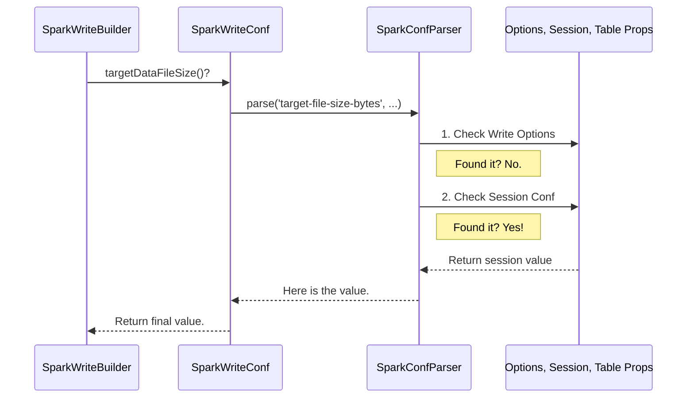

# Chapter 6: Configuration Management

In the [previous chapter](05_spark_write_builder_.md), we met the `SparkWriteBuilder`, the architect that designs blueprints for writing data. We learned that its decisions, like choosing a "copy-on-write" strategy or sorting data, are guided by various settings. But where do these settings come from, and how can you control them?

Welcome to the central control panel for your Iceberg operations.

### The Problem: Too Many Settings Knobs

Imagine you're setting up a new smart home. You can set the lights to turn on at 7 PM from the main wall panel. But you can also set them to turn on at 7:15 PM from the app on your phone. And a specific light bulb might have its own "factory default" setting. If you have all three, which one does the light obey?

You face a similar situation with Iceberg in Spark. You might want to tune a setting, like the target size for new data files. You can configure this in multiple places:
*   As an option directly in your write command.
*   As a general setting for your entire Spark session.
*   As a permanent property of the table itself.

Without a clear rule, it would be chaotic. You'd never be sure which setting was actually being used.

### The Solution: A Clear Order of Precedence

Iceberg solves this with a simple, predictable hierarchy. When looking for a configuration value, it checks these places in order, stopping as soon as it finds one:

1.  **Write/Read Options:** Settings you provide *directly* in your code for a single operation. This is the most specific and has the **highest priority**.
2.  **Spark Session Configuration:** Settings you configure on your Spark session. These apply to all operations within that session unless overridden by a write/read option.
3.  **Table Properties:** Settings stored in the table's metadata. These are the "defaults" for the table and have the **lowest priority**.

This hierarchy ensures there's never any confusion. A setting for a specific job always wins over a general session setting, which in turn wins over the table's default.

### Use Case: Tuning Your File Size

Let's go back to our `employees` table. By default, Iceberg might try to create 128MB data files. But for our system, we know that 256MB files are more efficient. How can we tell the [Spark Write Builder](05_spark_write_builder_.md) to aim for this larger size?

We can use the `target-file-size-bytes` option. Let's see how the precedence works.

#### Level 1: Using a Write Option (Highest Priority)

You can provide the setting directly when you write your data. This is perfect for a one-time adjustment.

```python
# Create some new employee data
new_employees_df = spark.createDataFrame([(4, 'd'), (5, 'e')], ["id", "data"])

# Write to the table, providing a specific option for this write only
(new_employees_df.write
  .format("iceberg")
  .option("target-file-size-bytes", "268435456") # 256 MB
  .mode("append")
  .save("main.default.employees"))
```

In this case, Iceberg will *unquestionably* use 256MB for this specific write operation, ignoring any other settings.

#### Level 2: Using Spark Session Configuration (Medium Priority)

If you want all write operations in your current Spark session to use 256MB files, you can set a session-level configuration.

```sql
-- This setting applies to all subsequent writes in this session
SET spark.sql.iceberg.write.target-file-size-bytes = 268435456
```

Now, any `INSERT` or `MERGE` statement you run will use 256MB as the target file size, unless you override it with a write option like in the first example.

#### Level 3: Using Table Properties (Lowest Priority)

To make 256MB the permanent default for the `employees` table, you can store it in the table's properties.

```sql
ALTER TABLE main.default.employees SET TBLPROPERTIES (
  'write.target_file_size_bytes' = '268435456'
)
```

Now, anyone who writes to this table will use 256MB files by default, without needing to set any special configurations. This is the baseline setting.

### Under the Hood: The `SparkReadConf` and `SparkWriteConf` Classes

So how does Iceberg implement this hierarchy? It's all managed by two key classes: `SparkReadConf` for read operations and `SparkWriteConf` for write operations.

When a builder (like `SparkWriteBuilder`) needs a configuration value, it doesn't look for it itself. Instead, it asks `SparkWriteConf` for it. `SparkWriteConf` then consults the three sources in the correct order of precedence and returns the single, correct value.

The journey of a configuration request looks like this:

1.  The `SparkWriteBuilder` asks, "What's the target file size?"
2.  The `SparkWriteConf` object receives the request.
3.  It internally uses a helper called `SparkConfParser` to do the search.
4.  `SparkConfParser` checks:
    *   Do the write options have `target-file-size-bytes`? If yes, return it.
    *   If not, does the Spark session have `spark.sql.iceberg.write.target-file-size-bytes`? If yes, return it.
    *   If not, does the table's properties have `write.target_file_size_bytes`? If yes, return it.
    *   If none of the above, return the hard-coded default value (e.g., 128MB).
5.  `SparkWriteConf` hands the final, definitive value back to the builder.

Here is a simplified diagram of that logic:



### A Peek at the Code

Let's look at how this is implemented. The real workhorse is the `SparkConfParser`.

#### 1. The Configuration Request

First, a class like `SparkWriteConf` defines a method to get a specific setting. Notice how it uses a "builder" pattern to tell the parser where to look.

```java
// File: spark/src/main/java/org/apache/iceberg/spark/SparkWriteConf.java

public long targetDataFileSize() {
  return confParser
      .longConf()
      // 1. Look for 'target-file-size-bytes' in the write options
      .option(SparkWriteOptions.TARGET_FILE_SIZE_BYTES)
      // 2. If not found, look for 'write.target_file_size_bytes' in table properties
      .tableProperty(TableProperties.WRITE_TARGET_FILE_SIZE_BYTES)
      // 3. If still not found, use this default
      .defaultValue(TableProperties.WRITE_TARGET_FILE_SIZE_BYTES_DEFAULT)
      .parse();
}
```
This code neatly declares the order of precedence for `targetDataFileSize`. It will check the write option first, then the table property, and finally fall back to a default.

#### 2. The Parser's Logic

The `.parse()` call triggers the `SparkConfParser`. Inside, a method follows the hierarchy we've discussed. Here's a simplified version of its logic:

```java
// File: spark/src/main/java/org/apache/iceberg/spark/SparkConfParser.java

// Simplified logic of the ConfParser's `parse` method
protected T parse(Function<String, T> conversion, T defaultValue) {
  // 1. Check write/read options first (highest priority)
  String optionValue = options.get(optionName);
  if (optionValue != null) {
    return conversion.apply(optionValue);
  }

  // 2. If not in options, check Spark session config
  String sessionConfValue = sessionConf.get(sessionConfName, null);
  if (sessionConfValue != null) {
    return conversion.apply(sessionConfValue);
  }

  // 3. If not found yet, check table properties
  String propertyValue = properties.get(tablePropertyName);
  if (propertyValue != null) {
    return conversion.apply(propertyValue);
  }

  // 4. If nothing is set, use the default value
  return defaultValue;
}
```
This simple but powerful logic is the heart of Iceberg's configuration management in Spark. It guarantees that settings are resolved in a predictable way, every single time.

### Conclusion

You've just learned how Iceberg expertly manages configuration from multiple sources. `SparkReadConf` and `SparkWriteConf` act as central control panels that provide a unified and predictable way to tune Iceberg's behavior.

The key takeaway is the **order of precedence**:
1.  **Write/Read Options** (most specific)
2.  **Spark Session Configuration**
3.  **Table Properties** (least specific)

By understanding this hierarchy, you can confidently control everything from file sizes and compression codecs to write strategies and validation, tailoring Iceberg to your exact needs.

So far, we've talked a lot about tables, schemas, and data types, but how does Iceberg translate between its own type system and Spark's? In the final chapter, we'll explore [Schema and Data Type Conversion](07_schema_and_data_type_conversion_.md) to see how this critical translation happens.

---

Generated by [AI Codebase Knowledge Builder](https://github.com/The-Pocket/Tutorial-Codebase-Knowledge)