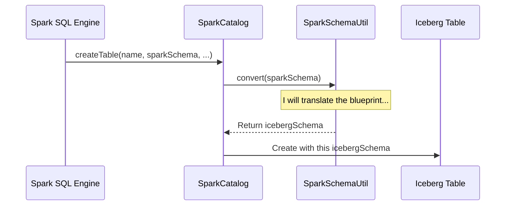

# Chapter 7: Schema and Data Type Conversion

In the [previous chapter](06_configuration_management_.md), we explored the central control panel for Iceberg, learning how to tune its behavior using a clear hierarchy of settings. Now, we'll dive into one of the most fundamental, under-the-hood concepts that makes the entire Spark-Iceberg integration possible.

### The Universal Translator

Imagine two brilliant engineers who want to collaborate on a project. One speaks only German, and the other speaks only Japanese. They can't work together directly. They need a universal translator who can fluently convert ideas back and forth between German and Japanese.

This is exactly the situation between Spark and Iceberg.

*   **Spark** has its own language for defining table structures (`StructType`) and data types (`IntegerType`, `TimestampType`).
*   **Iceberg** has its own, slightly different language for the same concepts (`Schema`, `Types.IntegerType`, `Types.TimestampType`).

For Spark to create an Iceberg table or write data into it, someone needs to translate between these two "languages." This is the job of Iceberg's schema and data type conversion utilities.

### The Two Translators

There are two main translators working tirelessly behind the scenes:

1.  **The Blueprint Translator (`SparkSchemaUtil`):** This utility translates the *structure* or *blueprint* of a table. When you tell Spark to create a table with certain columns and types, `SparkSchemaUtil` translates that blueprint into a format Iceberg can understand. It's like translating an architect's building plan from one measurement system (imperial) to another (metric).

2.  **The Content Translator (`SparkValueConverter`):** This utility translates the *actual data* that you insert into the table. Spark represents values like dates and timestamps in its own internal format. `SparkValueConverter` takes those Spark values and converts them into the specific format that Iceberg expects to store on disk, and vice-versa when you read data.

### A Translation in Action

Let's see these translators at work with a simple example. Suppose you run the following SQL command:

```sql
CREATE TABLE main.default.logs (id INT, event_time TIMESTAMP) USING iceberg
```

1.  **Spark** parses this and creates its own blueprint: a `StructType` with an `IntegerType` and a `TimestampType`.
2.  To create the Iceberg table, Spark calls the [Spark Catalog](01_spark_catalog_.md).
3.  The catalog knows it needs an Iceberg `Schema`. It calls the **`SparkSchemaUtil`** translator, which takes Spark's `StructType` and converts it into a valid Iceberg `Schema`.
4.  The Iceberg table is created with this translated schema.

Now, let's insert a record:

```sql
INSERT INTO main.default.logs VALUES (1, '2023-10-27 10:00:00')
```

1.  **Spark** processes this row. It represents the timestamp internally, perhaps as a `java.time.Instant` object or a specific number of microseconds from an epoch.
2.  When writing this data to the Iceberg table, Spark's write engine uses the **`SparkValueConverter`** translator.
3.  `SparkValueConverter` takes Spark's internal timestamp representation and converts it into a `long` value representing microseconds, which is what Iceberg stores in the data files.

Without these two translators, Spark and Iceberg wouldn't be able to communicate, and none of the operations we've learned about would work.

### Under the Hood: How the Translation Works

Let's look at the implementation details to see how this magic happens.

#### 1. Schema Translation: From Spark to Iceberg

When you create a table, the `SparkCatalog` needs to convert the Spark schema. This process relies on a "visitor" pattern that walks through the Spark schema and builds an equivalent Iceberg one.

The journey looks like this:



Let's peek at the code that performs this translation. The `SparkTypeToType` class is a visitor that walks through each field in a Spark `StructType`.

```java
// File: spark/src/main/java/org/apache/iceberg/spark/SparkTypeToType.java

class SparkTypeToType extends SparkTypeVisitor<Type> {
  // ...

  @Override
  public Type atomic(DataType atomic) {
    // A big switch statement to map types
    if (atomic instanceof IntegerType) {
      return Types.IntegerType.get();
    } else if (atomic instanceof TimestampType) {
      return Types.TimestampType.withZone();
    } else if (atomic instanceof StringType) {
      return Types.StringType.get();
    }
    // ... and so on for all other types
    throw new UnsupportedOperationException("Not a supported type: " + atomic);
  }
}
```
This simplified snippet shows the core logic: for each Spark data type it encounters (like `IntegerType` or `TimestampType`), it returns the corresponding Iceberg `Type`.

#### 2. Schema Translation: From Iceberg to Spark

The reverse happens when you load an existing Iceberg table. The [Spark Table](02_spark_table_.md) object needs to present the table's schema to Spark in a format Spark understands (`StructType`). It uses a different visitor, `TypeToSparkType`, for this.

```java
// File: spark/src/main/java/org/apache/iceberg/spark/TypeToSparkType.java

class TypeToSparkType extends TypeUtil.SchemaVisitor<DataType> {
  // ...
  
  @Override
  public DataType primitive(Type.PrimitiveType primitive) {
    switch (primitive.typeId()) {
      case INTEGER:
        return IntegerType$.MODULE$;
      case TIMESTAMP:
        return TimestampType$.MODULE$;
      case STRING:
        return StringType$.MODULE$;
      // ... and so on for all other types
      default:
        throw new UnsupportedOperationException("Cannot convert to Spark: " + primitive);
    }
  }
}
```
This is the mirror image of the previous code. It takes an Iceberg `Type` and returns the corresponding Spark `DataType`. This is how you can run `DESCRIBE my_iceberg_table` and see the schema in a familiar Spark format.

#### 3. Data Value Translation

Now for the data itself. When writing data, the `SparkValueConverter` is used to translate each value in a `Row`.

```java
// File: spark/src/main/java/org/apache/iceberg/spark/SparkValueConverter.java

public class SparkValueConverter {
  
  public static Object convert(Type type, Object object) {
    if (object == null) {
      return null;
    }

    switch (type.typeId()) {
      case DATE:
        // Spark gives us a Java date object, Iceberg wants days since epoch.
        return DateTimeUtils.anyToDays(object);
      case TIMESTAMP:
        // Spark gives a time object, Iceberg wants microseconds since epoch.
        return DateTimeUtils.anyToMicros(s);
      case STRUCT:
        return convert(type.asStructType(), (Row) object);
      // ... other types ...
      default:
        return object; // For simple types like int, long, etc.
    }
  }
}
```
This code takes a value from a Spark `Row` and its corresponding Iceberg type. For a `DATE`, it uses a Spark utility (`DateTimeUtils`) to convert Spark's internal date object into a simple integer representing the number of days since 1970-01-01, which is how Iceberg stores dates. It does something similar for timestamps. This ensures the data written to Parquet or ORC files is in a standard, portable format.

### Conclusion: The Glue of Integration

Congratulations! You've reached the end of our journey through Iceberg's Spark integration.

In this chapter, you've met the unsung heroes of the integration: `SparkSchemaUtil` and `SparkValueConverter`. These universal translators work seamlessly in the background to bridge the gap between Spark's world and Iceberg's world.
*   `SparkSchemaUtil` translates the **schemas**, or blueprints, of your tables.
*   `SparkValueConverter` translates the **actual data values** within your rows.

Together, they are the essential glue that makes everything else possible.

Over the course of these chapters, we've gone from a high-level view of the [Spark Catalog](01_spark_catalog_.md) as a data librarian, all the way down to the nitty-gritty details of data type conversion. You've seen how Spark finds, reads from, writes to, and maintains Iceberg tables. You now have a solid, foundational understanding of how these two powerful technologies work together to create a robust and reliable data lakehouse.

---

Generated by [AI Codebase Knowledge Builder](https://github.com/The-Pocket/Tutorial-Codebase-Knowledge)