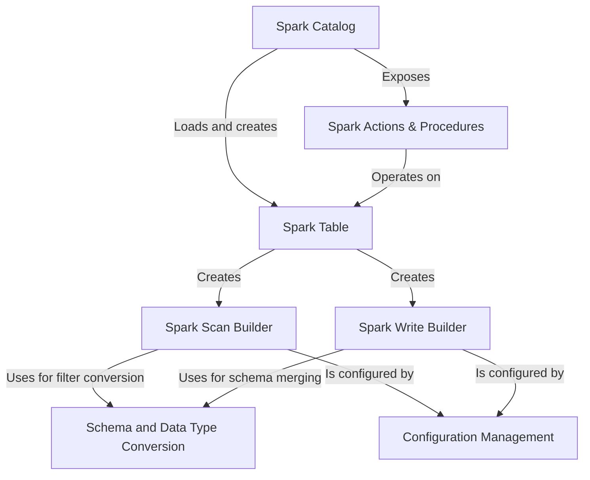

# Tutorial: v4.0

This project is the official **Spark integration** for *Apache Iceberg*, a modern table format designed for massive analytic datasets. It acts as a powerful *bridge*, allowing you to use standard Spark SQL commands like `SELECT`, `INSERT`, `UPDATE`, and `MERGE` to work with Iceberg tables. The integration leverages Spark's distributed engine to efficiently read and write data, while also providing specialized `CALL` procedures for essential maintenance tasks like optimizing table layout and cleaning up old data.

**Source Repository:** [None](None)

## Chapters

1. [Spark Catalog
](01_spark_catalog_.md)
2. [Spark Table
](02_spark_table_.md)
3. [Spark Actions & Procedures
](03_spark_actions___procedures_.md)
4. [Spark Scan Builder
](04_spark_scan_builder_.md)
5. [Spark Write Builder
](05_spark_write_builder_.md)
6. [Configuration Management
](06_configuration_management_.md)
7. [Schema and Data Type Conversion
](07_schema_and_data_type_conversion_.md)

---

Generated by [AI Codebase Knowledge Builder](https://github.com/The-Pocket/Tutorial-Codebase-Knowledge)