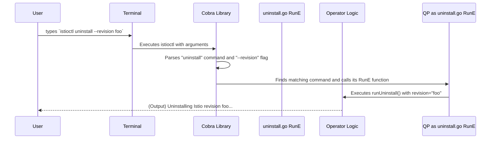

# Chapter 1: CLI Command Structure

Welcome to the Istio Operator deep dive! This series will take you from a curious beginner to someone who understands the inner workings of Istio's installation engine. Let's start with the very first thing you see as a user: the command line.

Imagine you want to install Istio. How do you tell the operator to do it? You use a command-line tool, `istioctl`. You might type something like this:

```sh
istioctl install --set profile=demo -y
```

This simple line of text is packed with instructions:
- `istioctl`: The program to run.
- `install`: The specific action to perform.
- `--set profile=demo`: A configuration detail (use the "demo" profile).
- `-y`: An option to skip the confirmation prompt.

But how does the program understand this? How is this user-friendly interface connected to the powerful installation logic deep inside the operator? That's what this chapter is all about.

We'll use a simple analogy: think of `istioctl` as the dashboard of a car. Each command is a button (`install`, `uninstall`), and each flag is a dial or switch (`--revision`, `--set`). This chapter explores the wiring behind that dashboard, which is powered by a popular Go library called **Cobra**.

### What is Cobra?

Cobra is a library for creating powerful and modern Command-Line Interface (CLI) applications in Go. It makes it easy for developers to create a clean structure of commands, sub-commands, and flags, just like the `istioctl install` example we saw.

The basic idea is to define each command as a separate piece of code. Let's look at how the `uninstall` command is defined.

### Anatomy of a Command

Every command in `istioctl`, like `install`, `uninstall`, or `manifest generate`, lives in its own file. This keeps the code organized and easy to navigate. Let's peek into a simplified version of the `uninstall` command definition.

```go
// File: cmd/mesh/uninstall.go

func UninstallCmd(ctx cli.Context) *cobra.Command {
	uicmd := &cobra.Command{
		Use:   "uninstall",
		Short: "Uninstall Istio from a cluster",
		Long:  "The uninstall command uninstalls Istio from a cluster",
		// This is the function that runs when you type `istioctl uninstall`
		RunE: func(cmd *cobra.Command, args []string) error {
			// It calls the main logic function
			return runUninstall(...)
		},
	}
	// ... flags are added to the command here ...
	return uicmd
}
```

This snippet creates a new command object. Let's break it down:
- `Use: "uninstall"`: This is the keyword the user types in the terminal.
- `Short: "..."`: A brief description shown in the help menu (`istioctl --help`).
- `RunE: func(...)`: This is the most important part! It's the "engine" of the command. When a user runs `istioctl uninstall`, the code inside this function gets executed. `E` stands for `Error`, meaning this function can return an error if something goes wrong.

### Adding Flags: The Dials and Switches

Commands are actions, but flags provide the configuration for those actions. How do we define a flag like `--revision` or its shorthand `-r`?

Cobra makes this simple. A dedicated function adds all the necessary flags to the command.

```go
// File: cmd/mesh/uninstall.go

func addUninstallFlags(cmd *cobra.Command, args *uninstallArgs) {
	// Defines the "-y" or "--skip-confirmation" flag.
	cmd.PersistentFlags().BoolVarP(&args.skipConfirmation,
		"skip-confirmation", "y", false, "Help message...")

	// Defines the "-r" or "--revision" flag.
	cmd.PersistentFlags().StringVarP(&args.revision,
		"revision", "r", "", "Help message...")
}
```

- `BoolVarP`: This creates a flag that accepts a boolean (`true`/`false`) value. The `P` at the end means it also defines a shorthand version (`-y`).
- `StringVarP`: This creates a flag that accepts a string value, like a revision name.
- The `&args.skipConfirmation` and `&args.revision` parts are crucial. They tell Cobra: "When you see this flag, store its value in this specific variable." This way, the `RunE` function can easily access what the user provided.

### Nesting Commands

Some commands are groups for other commands. For example, `istioctl manifest` doesn't do anything by itself. Instead, it has sub-commands like `generate` and `install`.

This is also handled elegantly by Cobra.

```go
// File: cmd/mesh/manifest.go

func ManifestCmd(ctx cli.Context) *cobra.Command {
	// 1. Define the parent command `manifest`
	mc := &cobra.Command{
		Use:   "manifest",
		Short: "Commands related to Istio manifests",
	}

	// 2. Define the subcommand `generate`
	mgc := ManifestGenerateCmd(...)

	// 3. Add `generate` as a child of `manifest`
	mc.AddCommand(mgc)
	return mc
}
```

The line `mc.AddCommand(mgc)` creates the nested structure, allowing users to run `istioctl manifest generate`.

### Under the Hood: From Keystroke to Action

Now let's trace the journey of a command from the user's terminal to the operator's logic.



1.  **User Input**: You type `istioctl uninstall --revision foo` and hit Enter.
2.  **Parsing**: The `istioctl` program starts. The Cobra library immediately parses the words you typed. It recognizes `uninstall` as a known command and `--revision` as one of its flags with the value `foo`.
3.  **Execution**: Cobra finds the `cobra.Command` struct that was defined with `Use: "uninstall"`.
4.  **Calling `RunE`**: It then calls the `RunE` function associated with that command. The value `foo` from the `--revision` flag is now available inside that function.
5.  **Running Logic**: The `RunE` function kicks off the actual uninstallation logic, now fully aware of the specific revision it needs to target.

This clean separation is what makes the system so powerful. The Cobra code in the `cmd/` directory is just the "dashboard." It's responsible for user interaction, parsing input, and showing help text. The actual "engine" logic for installing, generating manifests, or uninstalling lives elsewhere and is simply called by the `RunE` function.

### Conclusion

You've just learned about the fundamental structure of `istioctl`'s command-line interface. You now know that:

-   `istioctl` is built using the **Cobra** library.
-   Each command (`install`, `uninstall`) is defined in its own file with a `Use`, `Short`, and `RunE` field.
-   Flags (`--set`, `-f`) are the configurable "dials" that pass user input to the command's logic.
-   This structure provides a clean separation between the user-facing CLI "dashboard" and the internal operator "engine".

We've seen *how* a user communicates their intent to the operator. But what are they actually configuring? The most common way is by providing an `IstioOperator` configuration file. In the next chapter, we'll dive into the structure of this crucial resource.

Next up: [The IstioOperator API](02_istiooperator_api_.md)

---

Generated by [AI Codebase Knowledge Builder](https://github.com/The-Pocket/Tutorial-Codebase-Knowledge)