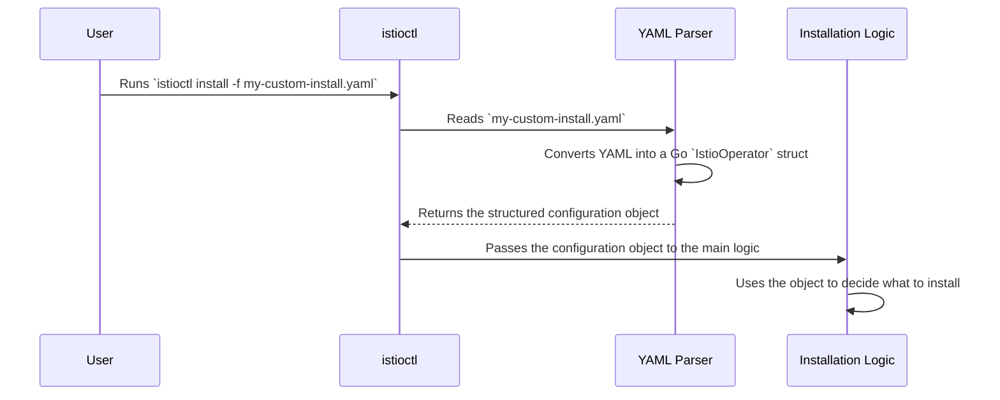

# Chapter 2: The IstioOperator API

In the [previous chapter](01_cli_command_structure_.md), we saw how `istioctl` acts as the dashboard for the installation engine, using commands and flags to receive instructions. But what is the most powerful way to give `istioctl` those instructions? Instead of a dozen command-line flags, you can provide a single, detailed configuration file. This file is written using the **IstioOperator API**.

### The Ultimate Order Form

Imagine you're ordering a custom computer. You don't just say "give me a computer." You fill out a detailed form specifying the CPU, memory, storage, and so on. The `IstioOperator` API is exactly that: a detailed order form for your Istio service mesh.

You create a YAML file that describes your desired Istio installation. This file is your blueprint. The operator's job is to read this blueprint and build an Istio installation that matches it perfectly.

Let's look at a simple use case: **"I want to install a minimal version of Istio to save resources."**

The simplest `IstioOperator` file for this would be:

```yaml
# my-minimal-install.yaml
apiVersion: install.istio.io/v1alpha1
kind: IstioOperator
spec:
  profile: minimal
```

This tiny file is a complete set of instructions:
*   `apiVersion` and `kind`: This tells Kubernetes and `istioctl` that this is an `IstioOperator` resource, our special order form.
*   `spec`: This is where the actual configuration, or the "order details," goes.
*   `profile: minimal`: This is the most important line here. It tells the operator to use the "minimal" installation profile as a starting point, which only includes the core components of the control plane.

You would then hand this "order form" to the operator using the `install` command we learned about:

```sh
istioctl install -f my-minimal-install.yaml
```

The operator reads your file, understands you want the `minimal` profile, and proceeds to install just the necessary components.

### Customizing Your Order

What if the "minimal" combo meal is almost perfect, but you want to make one small change? Let's say you want to give the Pilot component more memory. The `IstioOperator` API makes this easy.

You can expand your order form to include specific customizations:

```yaml
# my-custom-install.yaml
apiVersion: install.istio.io/v1alpha1
kind: IstioOperator
spec:
  profile: minimal
  components:
    pilot:
      k8s:
        resources:
          requests:
            memory: "2048Mi"
```

Here's what we added:
*   `components`: This section lets you tweak individual Istio components.
*   `pilot`: We're targeting the Pilot component.
*   `k8s`: This field is for customizing Kubernetes-specific settings, like resource limits.
*   `resources`: We're overriding the default CPU/memory requests.

Now, when you run `istioctl install -f my-custom-install.yaml`, the operator starts with the `minimal` profile and then *overlays* your specific customizations on top, resulting in a minimal Istio installation with a more powerful Pilot.

### How the Operator Reads Your Order

So, what happens under the hood when you provide this YAML file? How does a text file become a running service mesh?

The process is straightforward: the operator parses your YAML file and loads it into a structured Go object that the rest of the code can easily understand.



1.  **Read the File**: `istioctl` opens and reads the YAML file you provided with the `-f` flag.
2.  **Parse and Structure**: The raw YAML text is parsed and mapped onto a Go struct. A "struct" is just a custom data type that holds related information together, like a structured form in a program.
3.  **Validate**: Before proceeding, the operator validates your configuration. Did you misspell a field? Did you provide an invalid value? This catches errors early.
4.  **Pass to Logic**: This structured, validated configuration object is then passed to the core installation logic, which now has a clear blueprint of what to build.

### A Peek at the Go Struct

For every field in your YAML file, there is a corresponding field in a Go struct inside the operator's code. This direct mapping makes the system predictable and easy to develop.

The definition for our `IstioOperator` "form" lives in `pkg/apis/types.go`. Here's a simplified view of the Go structs that represent our YAML:

```go
// File: pkg/apis/types.go

// IstioOperator is the top-level object.
type IstioOperator struct {
	// ... metadata fields ...
	Spec IstioOperatorSpec `json:"spec,omitempty"`
}

// IstioOperatorSpec contains the actual configuration.
type IstioOperatorSpec struct {
	// Corresponds to the `profile:` field in YAML.
	Profile string `json:"profile,omitempty"`

	// Corresponds to the `components:` section in YAML.
	Components *IstioComponentSpec `json:"components,omitempty"`

	// ... other fields like hub, tag, meshConfig ...
}
```

- `IstioOperator`: This is the main container, corresponding to the `kind: IstioOperator`.
- `IstioOperatorSpec`: This struct holds all the fields you can set inside the `spec:` block of your YAML, like `profile` and `components`.

This structured approach is key. It turns your human-readable YAML into a machine-readable format that the operator can use to make decisions.

### Validating the Blueprint

A critical step is ensuring your "order form" is filled out correctly. The operator has built-in validation logic to check your `IstioOperator` spec before it tries to apply it.

This logic lives in `pkg/apis/validation/validation.go`. For example, there's a function to ensure that if you specify a `revision`, it's a valid name.

```go
// File: pkg/apis/validation/validation.go

func validateRevision(revision string) error {
	if revision == "" {
		return nil // It's okay to have no revision
	}
	// labels.IsDNS1123Label checks if the name is valid for Kubernetes.
	if !labels.IsDNS1123Label(revision) {
		return fmt.Errorf("invalid revision specified: %s", revision)
	}
	return nil
}
```
This simple check prevents you from providing an invalid revision name that would later cause Kubernetes to reject your installation. Every part of the `IstioOperator` spec goes through similar checks.

### Conclusion

You've now learned about the most important configuration concept in the Istio operator: the `IstioOperator` API. You know that:

-   It's a declarative API, meaning you describe the **what**, and the operator handles the **how**.
-   It acts like a detailed **order form** (a YAML file) for your Istio installation.
-   You start with a `profile` and can override specific settings under `components`, `meshConfig`, and other fields.
-   Under the hood, the operator parses this YAML into a structured Go object and validates it before acting.

We've talked about customizing `components` like Pilot, but what exactly *is* a component in the operator's eyes? How does it know what "Pilot" or "ingressGateway" means? We'll explore that next.

Next up: [Component Abstraction](03_component_abstraction_.md)

---

Generated by [AI Codebase Knowledge Builder](https://github.com/The-Pocket/Tutorial-Codebase-Knowledge)