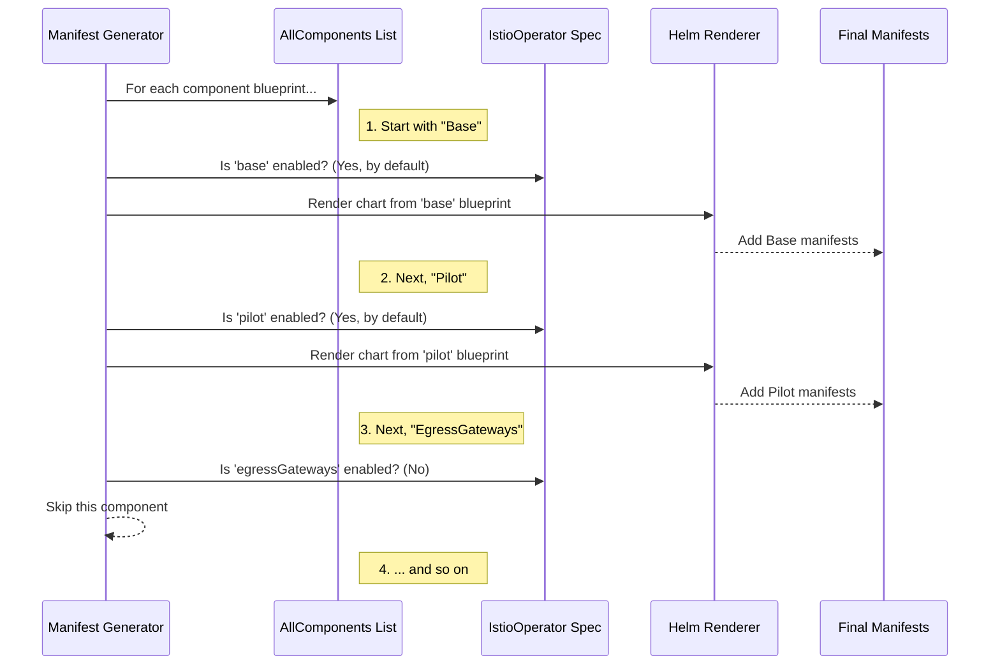

# Chapter 3: Component Abstraction

In the [previous chapter](02_istiooperator_api_.md), we learned about the `IstioOperator` API, our "order form" for an Istio installation. We saw how you can enable, disable, or customize different parts of Istio under the `components:` section.

You might have wondered: how does the operator know what "pilot" or "ingressGateways" means? How can it handle each one so consistently? The answer lies in a simple but powerful design pattern: **Component Abstraction**.

### The Assembly Line and its Blueprints

Imagine building a car on an assembly line. The car is made of many distinct parts: the engine, the chassis, the wheels. The assembly line doesn't need to know the intricate details of how to build an engine from scratch. Instead, it works with standardized blueprints. It picks up the "engine blueprint," follows a consistent set of steps (get parts, assemble, test), and moves on to the next blueprint for the "chassis."

The Istio operator works the same way. It views an Istio installation not as one giant monolith, but as a collection of distinct, manageable **components**.

*   **Base**: The foundational resources like CRDs and cluster roles.
*   **Pilot**: The core control plane for traffic management.
*   **CNI**: The component for managing network traffic at the pod level.
*   **IngressGateways**: Gateways for traffic entering the mesh.

For each of these components, the operator has a "blueprint." This blueprint tells the main "assembly line" logic everything it needs to know to manage that component.

### The Anatomy of a Component Blueprint

This "blueprint" is defined in the operator's code as a Go struct. It's a small package of metadata that describes a component. Let's look at a simplified definition for the **Pilot** component.

```go
// File: pkg/component/component.go

var AllComponents = []Component{
	// ...
	{
		UserFacingName: "Pilot",
		SpecName:       "pilot",
		HelmSubdir:     "istio-control/istio-discovery",
		ResourceName:   "istiod",
	},
	// ... other components
}
```

This tiny block of code is incredibly important. Let's break it down:

*   `UserFacingName: "Pilot"`: The friendly name shown to users in logs and status messages.
*   `SpecName: "pilot"`: The exact key you use in your `IstioOperator` YAML file (e.g., `spec.components.pilot`).
*   `HelmSubdir: "..."`: The location of the Helm chart used to generate the Kubernetes manifests for this component.
*   `ResourceName: "istiod"`: The name of the main Kubernetes resource (like a Deployment) created by this component. This is useful for status checks.

Every single component, from CNI to Gateways, has a similar definition. This creates a standardized, predictable contract. The core logic doesn't need to have special `if component == "pilot"` code. It just loops through the list of `AllComponents` and processes each one using the information from its blueprint.

### From `IstioOperator` to Installation: A Walkthrough

Let's see how this abstraction works in practice. Imagine you provide this `IstioOperator` spec to `istioctl`:

```yaml
# my-install.yaml
apiVersion: install.istio.io/v1alpha1
kind: IstioOperator
spec:
  profile: default
  components:
    # We want to disable the egress gateway
    egressGateways:
      enabled: false
```

The operator's manifest generation logic will start its "assembly line."



1.  **Start the Loop**: The process begins by iterating through the predefined `AllComponents` list.
2.  **Process "Base"**: The first component is `Base`. The code looks at your `IstioOperator` spec. Since you didn't explicitly disable it, it's enabled by default. The operator uses the `HelmSubdir` from the `Base` blueprint to render its manifests.
3.  **Process "Pilot"**: Next is `Pilot`. It's also enabled. Its manifests are rendered.
4.  **Process "EgressGateways"**: Now it gets to the `EgressGateways` component. It checks your `IstioOperator` spec and sees `enabled: false`. The assembly line simply skips this blueprint and moves on.
5.  **Finish**: This continues for all components. The final result is a complete set of Kubernetes manifests for your desired Istio installation, with the egress gateway correctly excluded.

### A Look at the Core Logic

The real code that performs this loop lives in `pkg/render/manifest.go`. Here is a heavily simplified version of that logic:

```go
// File: pkg/render/manifest.go

func GenerateManifest(...) {
	// ... (IOP spec is loaded first) ...

	// Loop through every known component blueprint.
	for _, comp := range component.AllComponents {
		// Get component settings from the user's IstioOperator spec.
		// This will be empty if the component is disabled.
		specs, _ := comp.Get(mergedIstioOperatorSpec)

		// If specs is not empty, it means the component is enabled.
		for _, spec := range specs {
			// Render the Helm chart for this component
			rendered, _, _ := helm.Render(..., comp.HelmSubdir, ...)

			// Add the result to our list of all manifests.
			allManifests[comp.UserFacingName] = rendered
		}
	}
	return allManifests
}
```

This generic loop is the heart of the operator's installation engine. By abstracting each part of Istio into a `Component` "blueprint," the core logic becomes simple, repeatable, and easy to extend. To add a new component to Istio, developers just need to create a new Helm chart and add a new blueprint to the `AllComponents` list. The "assembly line" will automatically know how to handle it.

### Conclusion

You've now uncovered one of the most fundamental concepts in the Istio operator: Component Abstraction. You've learned that:

-   The operator sees an Istio installation as a collection of modular **components** (Base, Pilot, etc.).
-   Each component is defined by a "blueprint" (a `Component` struct) containing metadata like its name and Helm chart location.
-   The core installation logic is a generic **loop** that processes each component's blueprint, checking if it's enabled in the [IstioOperator API](02_istiooperator_api_.md) before acting on it.
-   This design makes the system clean, consistent, and easily extensible.

We've seen that the main job of this loop is to render a Helm chart for each enabled component. But what does that rendering process actually involve? How does the operator combine the user's values with the chart templates to produce the final YAML? We'll explore that in the next chapter.

Next up: [Manifest Generation & Rendering](04_manifest_generation___rendering_.md)

---

Generated by [AI Codebase Knowledge Builder](https://github.com/The-Pocket/Tutorial-Codebase-Knowledge)