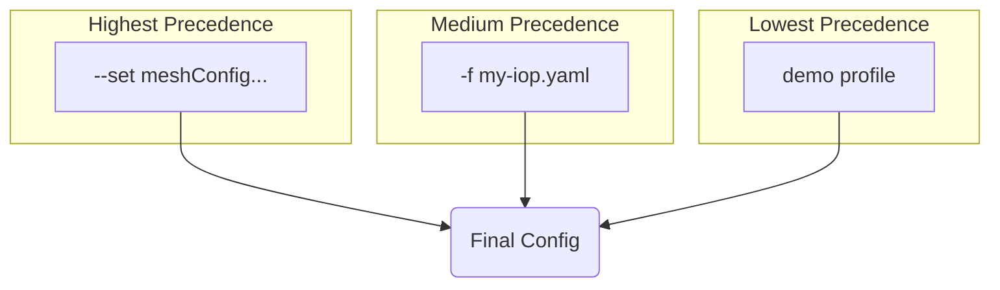
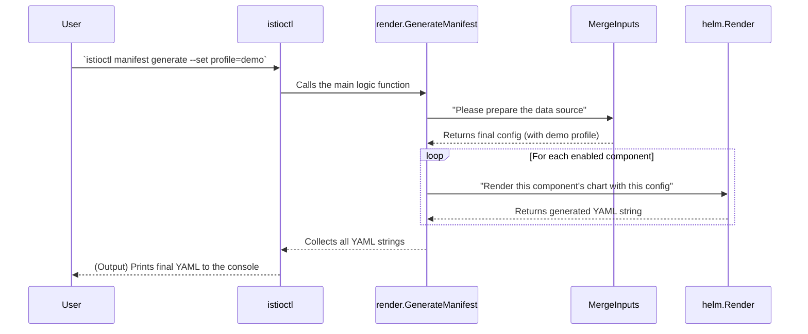

# Chapter 4: Manifest Generation & Rendering

In the [previous chapter](03_component_abstraction_.md), we learned how the operator sees an Istio installation as an assembly line, processing a series of standardized "blueprints" for each [Component Abstraction](03_component_abstraction_.md). The main job of this assembly line is to take each blueprint and produce the final Kubernetes YAML manifests.

But how does it do that? How does the operator combine your specific requests from the `IstioOperator` file with the generic templates for a component like Pilot? This chapter dives into the heart of the operator: the process of turning configuration into reality.

### The Ultimate Mail Merge

The best way to understand manifest generation is to think of it as a **mail merge**.

In a mail merge, you have two things:
1.  **A Template**: A document with placeholders, like `Dear {{name}},`.
2.  **A Data Source**: A list of values, like a spreadsheet with names and addresses.

You run the mail merge, and it combines the template with the data to produce personalized documents: "Dear Alice," "Dear Bob," etc.

The Istio operator's manifest generation works *exactly* the same way:
1.  **The Templates**: These are Istio's built-in **Helm charts**. Each component has its own set of templates with placeholders for things like image names, resource limits, and replica counts.
2.  **The Data Source**: This is your final, consolidated **`IstioOperator` configuration**.

The operator's job is to run this "mail merge" for every enabled component, feeding your configuration into the Helm templates to generate the final Kubernetes YAML.

This process happens in two main steps: first, preparing the single, authoritative "data source," and second, running the "mail merge" engine.

### Step 1: Preparing the Data (Merging Inputs)

Before rendering, the operator needs to create a single, definitive configuration. A user can provide configuration in many ways, and the operator must merge them in the correct order of precedence.

Imagine you're building a configuration layer by layer:
1.  **Base Layer (Lowest Precedence)**: The operator starts with a built-in profile, like `default` or `demo`.
2.  **File Layer**: It then overlays any configuration from YAML files you provide with `-f my-config.yaml`.
3.  **Override Layer (Highest Precedence)**: Finally, it applies any specific values from the command line, like `--set meshConfig.accessLogFile=/dev/stdout`.

The function responsible for this is `MergeInputs` in `pkg/render/manifest.go`. It reads all these sources and combines them into one final configuration object, which becomes our "data source."



### Step 2: Running the Engine (Rendering with Helm)

With the final configuration ready, the operator begins the "assembly line" loop we saw in the [previous chapter](03_component_abstraction_.md). For each enabled component, it calls the rendering engine.

This engine is powered by Go libraries from Helm, the standard templating tool for Kubernetes. The operator feeds two things into this engine:
1.  The final merged configuration from Step 1.
2.  The path to the component's Helm chart templates (from its "blueprint").

The Helm engine does the "mail merge," replacing all the placeholders in the templates with the values from your configuration. The output is a string of pure, ready-to-deploy Kubernetes YAML.

### The Full Journey: From Command to YAML

Let's trace the entire flow when you run `istioctl manifest generate --set profile=demo`.



### Under the Hood: A Look at the Code

Let's peek at the simplified code that powers this process.

It all starts in `cmd/mesh/manifest-generate.go`, where your command line action is handled. The `RunE` function simply calls the core logic.

```go
// File: cmd/mesh/manifest-generate.go

func ManifestGenerate(...) error {
    // ...
	// This is the main entry point to our logic
	manifests, _, err := render.GenerateManifest(
        mgArgs.InFilenames, setFlags, ...)
	// ...
	// Print the final YAML manifests
	for _, manifest := range manifests {
		l.Print(manifest + YAMLSeparator)
	}
	return nil
}
```
This function acts as a simple bridge from the user's command to the powerful rendering engine.

The real work happens inside `render.GenerateManifest` in `pkg/render/manifest.go`.

```go
// File: pkg/render/manifest.go

func GenerateManifest(...) ([]manifest.ManifestSet, values.Map, error) {
	// Step 1: Prepare the "data source" by merging all inputs.
	mergedConfig, err := MergeInputs(files, setFlags, client)
	// ... (validation happens here) ...

	allManifests := map[component.Name]manifest.ManifestSet{}
	// Loop through each component blueprint.
	for _, comp := range component.AllComponents {
		// ... (check if component is enabled) ...

		// Step 2: Run the "mail merge" for the component.
		renderedYAML, _, err := helm.Render(
            "istio", spec.Namespace, comp.HelmSubdir, mergedConfig, ...)

		// Add the result to our collection.
		allManifests[comp.UserFacingName] = renderedYAML
	}
	return allManifests, mergedConfig, nil
}
```
This function perfectly illustrates our two-step process:
1.  It first calls `MergeInputs` to get the final `mergedConfig`.
2.  Then, inside the component loop, it calls `helm.Render` to generate the YAML for each part of Istio.

Finally, `helm.Render` in `pkg/helm/helm.go` is a thin wrapper around the official Helm Go libraries, completing the "mail merge."

```go
// File: pkg/helm/helm.go

func Render(releaseName, namespace string, chartPath string, config values.Map, ...) (...) {
	// Load the Helm chart templates from the filesystem.
	chart, err := loadChart(..., chartPath)
	// ...

	// Use Helm's engine to render the chart with the user's config.
	renderedFiles, err := engine.Render(chart, config)
	// ...

	// Parse the raw string output into structured manifest objects.
	manifests, err := manifest.Parse(renderedFiles)
	return manifests, ...
}
```
This is the lowest level of the process, where the templates and data finally meet to produce the raw Kubernetes manifests.

### Conclusion

You have now learned about the core engine of the Istio operator. This is how user intent, expressed in an `IstioOperator` file, is translated into concrete Kubernetes resources.

You know that:
-   The process is like a **mail merge**: it combines Helm chart **templates** with your `IstioOperator` **data**.
-   It starts by **merging all inputs** (profiles, files, flags) into a single, definitive configuration.
-   It then **loops through each component** and uses a Helm rendering engine to generate the final YAML manifests.
-   This two-step process of **merging then rendering** is the fundamental workflow for generating any Istio installation manifest.

We've seen how the manifests are *generated*. But what happens next? How does the operator take this list of generated manifests and apply it to a live Kubernetes cluster, intelligently adding, updating, and removing resources as needed? We'll explore that powerful logic in the next chapter.

Next up: [Installation & Pruning Logic](05_installation___pruning_logic_.md)

---

Generated by [AI Codebase Knowledge Builder](https://github.com/The-Pocket/Tutorial-Codebase-Knowledge)