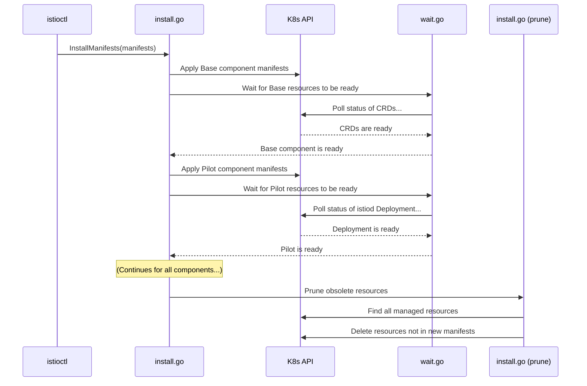

# Chapter 5: Installation & Pruning Logic

In the [previous chapter](04_manifest_generation___rendering_.md), we saw how the operator acts like a "mail merge" engine, combining Helm templates and your `IstioOperator` configuration to produce a complete set of Kubernetes YAML manifests. We now have our blueprint and our raw materials.

But what happens next? How do we take this pile of YAML and safely build a working Istio service mesh on a live cluster? Just running `kubectl apply` on everything at once can be risky. Some components need to be ready before others can start, and what about cleaning up old resources during an upgrade?

This is where the operator's **Installation & Pruning Logic** comes in. It's not just an installer; it's a smart deployment manager.

### The Smart Home Installer Analogy

Imagine you hired someone to install a new smart home system.
- A **basic installer** would just plug everything in randomly and leave. The Wi-Fi router might not work because the modem wasn't turned on first.
- A **smart installer**, however, follows a careful procedure:
    1.  **Install in Order**: They install the modem first, then the router, then the smart speakers. They know the dependencies.
    2.  **Verify Each Step**: After plugging in the modem, they wait for the "online" light to turn green before even touching the router.
    3.  **Clean Up**: If you're upgrading your router, they don't just add the new one; they unplug and remove the old one so it doesn't clutter your network.

The operator's installer works exactly like this smart installer. It applies manifests in a specific dependency order, waits for resources to become ready, and prunes obsolete components to keep your cluster clean.

### The Three Key Phases

The installation process can be broken down into three main phases:

#### 1. Ordered Application

The operator knows that some Istio components depend on others. For example, you must install the `Base` component, which contains Istio's Custom Resource Definitions (CRDs), *before* you can install the `Pilot` component, which uses those CRDs.

The installer follows a hardcoded dependency graph to ensure resources are created in the correct sequence.

```mermaid
graph TD
    A[Base Component (CRDs)] --> B[Pilot Component (istiod)];
    B --> C[Ingress Gateways];
    B --> D[Egress Gateways];
```

This prevents race conditions and ensures a smooth, predictable installation.

#### 2. Waiting for Readiness

After applying a component's manifests, the operator doesn't just move on. It actively monitors the resources it just created and waits for them to become "ready."

What does "ready" mean?
- For a **Deployment**, it means the desired number of pods are running and available.
- For a **CustomResourceDefinition**, it means the API server has recognized it and is ready to accept custom resources of that type.

This "wait and verify" step is crucial. If a core component like Pilot fails to start, the installer will stop and report an error, rather than continuing with a broken installation.

#### 3. Intelligent Pruning

This is the cleanup phase, and it's what makes upgrades and reconfigurations so clean. Let's say your initial installation included an egress gateway. Later, you decide you don't need it and update your `IstioOperator` file:

```yaml
spec:
  components:
    egressGateways:
      # We are disabling the egress gateway
      enabled: false
```

When you re-run `istioctl install`, the operator will:
1.  Generate new manifests that *do not* include the egress gateway resources.
2.  Apply the new configuration.
3.  **Prune**: It then looks at the cluster and asks, "Are there any Istio resources running that I manage, but which are not in my new set of manifests?" It sees the old egress gateway Deployment and Service, recognizes they are no longer needed, and deletes them.

How does it know which resources it "manages"? It uses Kubernetes labels. Every resource the operator creates is stamped with labels that identify the revision and component it belongs to. This allows the pruner to safely identify and remove only the resources it's responsible for.

### Under the Hood: The Installation Journey

Let's trace the journey when you run `istioctl install`.



### A Peek at the Code

The logic for this smart installation process is primarily located in `pkg/install/install.go` and `pkg/install/wait.go`.

#### The Main Entrypoint

The process starts in `cmd/mesh/install.go`, which calls the main `Installer` logic.

```go
// File: cmd/mesh/install.go

func Install(...) error {
	// ... (manifests are generated first) ...

	i := install.Installer{
		Kube:        kubeClient,
		WaitTimeout: iArgs.ReadinessTimeout,
		// ... other settings
	}

	// This is the main call to our smart installer.
	if err := i.InstallManifests(manifests); err != nil {
		return fmt.Errorf("failed to install manifests: %v", err)
	}
	return nil
}
```
This snippet creates an `Installer` object and passes it the manifests we generated in the [previous chapter](04_manifest_generation___rendering_.md).

#### The Installer Loop

Inside `pkg/install/install.go`, the `install` function orchestrates the ordered application. It uses Go channels to manage the dependencies between components.

```go
// File: pkg/install/install.go

func (i Installer) install(manifests []manifest.ManifestSet) error {
	// A map of channels to signal when a component is done.
	dependencyWaitCh := dependenciesChannels()

	for _, mf := range manifests {
		go func(c component.Name, ms []manifest.Manifest) {
			// Wait for components we depend on.
			if s := dependencyWaitCh[c]; s != nil {
				<-s
			}

			// Apply the manifests for this component.
			i.applyManifestSet(...)

			// Signal components that depend on us.
			for _, ch := range componentDependencies[c] {
				dependencyWaitCh[ch] <- struct{}{}
			}
		}(mf.Component, mf.Manifests)
	}
	// ... (waits for all goroutines to finish) ...
}
```
You can think of `dependencyWaitCh` like a series of gates. A component can only start its work after the components it depends on have opened their gates.

#### The Waiting Game

The `applyManifestSet` function calls `WaitForResources` after applying the YAML. This function, in `pkg/install/wait.go`, is a polling loop that repeatedly checks the Kubernetes API.

```go
// File: pkg/install/wait.go

func WaitForResources(...) error {
	// PollUntilContextTimeout is a helper that runs a function
	// every few seconds until it returns true, or a timeout is reached.
	errPoll := wait.PollUntilContextTimeout(context.Background(),
		2*time.Second, waitTimeout, false,
		func(context.Context) (bool, error) {
			// This function checks if all Deployments, etc. are ready.
			isReady, _, _, err := waitForResources(objects, client, l)
			return isReady, err
		})
	// ...
	return errPoll
}
```
This is the "wait for the green light" step. It patiently polls the cluster status until everything is healthy before allowing the installation to proceed.

#### The Pruning Logic

Finally, after all components are successfully installed and ready, the `prune` function is called from `pkg/install/install.go`.

```go
// File: pkg/install/install.go

func (i Installer) prune(manifests []manifest.ManifestSet) error {
	// 1. Build a set of all resources that SHOULD exist.
	resourcesToKeep := map[component.Name]sets.String{}
	for _, mfs := range manifests {
		for _, m := range mfs.Manifests {
			resourcesToKeep[mfs.Component].Insert(m.Hash())
		}
	}

	// 2. Get all resources from the cluster that we manage.
	// ... (code to list resources with operator labels) ...

	// 3. If a resource from the cluster is not in our "keep" set, delete it.
	for _, obj := range objs.Items {
		if !resourcesToKeep.Contains(manifest.ObjectHash(&obj)) {
			uninstall.DeleteResource(...)
		}
	}
	return nil
}
```
This logic is a simple but powerful set comparison: `(Resources in Cluster) - (Resources in New Manifests) = Resources to Delete`.

### Conclusion

You've now learned how the operator safely and robustly manages the lifecycle of an Istio installation. It's much more than a simple `kubectl apply`. You know that:

-   Installation happens in a specific **dependency order** to prevent race conditions.
-   The installer **waits for resources to become ready**, ensuring each step succeeds before starting the next.
-   The **pruning logic** intelligently removes obsolete resources during updates, keeping the cluster state clean.
-   This entire process is designed to make Istio installations reliable, predictable, and easy to manage.

Throughout this and previous chapters, we've talked about the "final merged configuration" that drives both manifest generation and installation. But what does this configuration object look like inside the operator? How is this complex data passed between different parts of the system? In the next chapter, we'll explore the data structure that holds it all together.

Next up: [Configuration Values (`values.Map`)](06_configuration_values___values_map___.md)

---

Generated by [AI Codebase Knowledge Builder](https://github.com/The-Pocket/Tutorial-Codebase-Knowledge)