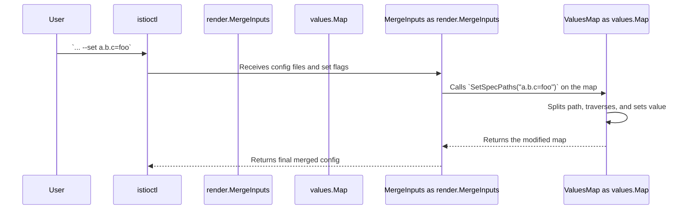

# Chapter 6: Configuration Values (`values.Map`)

In the [previous chapter](05_installation___pruning_logic_.md), we saw how the operator intelligently installs, waits for, and prunes Istio components. We've repeatedly mentioned that this entire process is driven by a "final merged configuration." This configuration is the master blueprint, assembled from profiles, your YAML files, and command-line flags.

But what does this blueprint actually look like inside the operator's code? How can it be flexible enough to handle both the structured `IstioOperator` spec and the free-form world of Helm values? This chapter introduces the unsung hero that makes it all possible: the `values.Map`.

### The Universal Currency of Configuration

Imagine you're traveling through several countries. You could carry a separate wallet for each country's currency, which would be cumbersome. Or, you could carry a universally accepted currency that can be easily used or exchanged anywhere.

In the Istio operator, configuration flows through many different stages: merging, validation, Helm rendering, and post-processing. Each stage might need to look at or change the configuration. Instead of converting the data between different complex Go structs at every step, the operator uses a "universal currency": the `values.Map`.

A `values.Map` is essentially a standard Go map (`map[string]any`) with superpowers. It's designed to hold unstructured data, just like a Helm `values.yaml` file. Its key feature is the ability to easily read and write values using simple dot-separated paths, like `components.pilot.k8s.replicaCount`.

Let's see why this is so important.

### The Problem: Handling Dynamic Overrides

A core feature of `istioctl` is the `--set` flag, which lets you override any configuration value from the command line.

```sh
istioctl install --set profile=demo --set components.pilot.k8s.replicaCount=3
```

How does the operator take the string `components.pilot.k8s.replicaCount=3` and apply it to the configuration? If the configuration were a rigid, pre-defined Go struct, this would be a nightmare. You would need complex reflection code to find the right field based on a string path.

This is the exact problem `values.Map` is designed to solve.

### The `values.Map` Solution

The `values.Map` treats configuration like a simple tree of key-value pairs. The dot-separated path is just a way to navigate that tree.

Let's look at the type definition. It's surprisingly simple.

```go
// File: pkg/values/map.go

// Map is a wrapper around an untyped map.
type Map map[string]any
```

- `map[string]any`: This means it's a map where keys are strings, and values can be of `any` type (a string, a number, a boolean, or even another map). This is what gives it its flexibility.

The real power comes from its helper methods, like `SetPath`.

```go
// File: pkg/values/map.go

// SetPath applies values from a path like `key.subkey`.
func (m Map) SetPath(path string, value any) error {
	// ... logic to split the path and traverse the map ...
}
```

When the operator sees `--set components.pilot.k8s.replicaCount=3`, it simply calls:
`myConfig.SetPath("components.pilot.k8s.replicaCount", 3)`

The `SetPath` method will:
1.  Split the path into `["components", "pilot", "k8s", "replicaCount"]`.
2.  Walk down the map, creating nested maps if they don't exist.
3.  Set the final value.

The resulting `values.Map` would look like this (in JSON form):

```json
{
  "components": {
    "pilot": {
      "k8s": {
        "replicaCount": 3
      }
    }
  }
}
```

This simple, dynamic structure is used everywhere. The [Manifest Generation & Rendering](04_manifest_generation___rendering_.md) engine receives a `values.Map`, and the Helm libraries it uses understand this structure natively.

### Under the Hood: The Journey of a `--set` Flag

Let's trace how a `--set` flag travels through the system and modifies the configuration.



1.  **User Input**: You provide a `--set` flag to `istioctl`.
2.  **Merging**: The `MergeInputs` function, which we saw in the [manifest generation chapter](04_manifest_generation___rendering_.md), is responsible for creating the single master configuration. It receives your `--set` flag as a string.
3.  **Calling `SetPath`**: It iterates through all `--set` flags and calls the `SetPath` method on the `values.Map` for each one.
4.  **Modification**: The `SetPath` method navigates the nested map structure. If the path `components.pilot` doesn't exist, it creates an empty map there and continues. It does this until it reaches the final key, where it sets the value.
5.  **Final Blueprint**: The result is an updated `values.Map` that now includes your override. This map is then passed along to the rest of the installation process.

### A Peek at the Code

Let's look at a simplified version of the recursive logic inside `SetPath`. This is the core of how it traverses the map.

```go
// File: pkg/values/map.go (Simplified)

func setPathRecurse(base map[string]any, paths []string, value any) error {
	// Get the current segment of the path (e.g., "components")
	segment := paths[0]
	isLastSegment := len(paths) == 1

	if isLastSegment {
		// We're at the end of the path, so set the value.
		base[segment] = value
		return nil
	}

	// If the next level doesn't exist, create it.
	if _, found := base[segment]; !found {
		base[segment] = make(map[string]any)
	}

	// Continue to the next level.
	return setPathRecurse(base[segment].(map[string]any), paths[1:], value)
}
```
This elegant recursive function is all it takes to handle arbitrarily deep paths. It either sets a value (if it's at the end of the path) or ensures the next level of the map exists and then calls itself for the rest of the path.

Reading a value with `GetPath` works in a similar way, traversing the map but returning early if any key along the path is not found.

### Conclusion

You've now learned about the data structure that underpins the entire configuration system of the Istio operator. You know that:

-   `values.Map` is the **universal currency** for configuration, providing a flexible wrapper around a standard Go map.
-   It solves the problem of handling **unstructured and dynamic** configuration, especially from sources like Helm values and `--set` flags.
-   Its key feature is the ability to get and set values using simple **dot-separated paths**.
-   This avoids the need for rigid structs and complex reflection, making the code that handles configuration surprisingly simple and powerful.

We've now seen how the final manifests are generated and how the configuration that drives that process is structured. But sometimes, the Helm templates aren't quite enough. What if you need to make a very specific, surgical change to a generated manifest *after* it's been rendered? We'll explore that powerful feature next.

Next up: [Post-Processing & Overlays](07_post_processing___overlays_.md)

---

Generated by [AI Codebase Knowledge Builder](https://github.com/The-Pocket/Tutorial-Codebase-Knowledge)