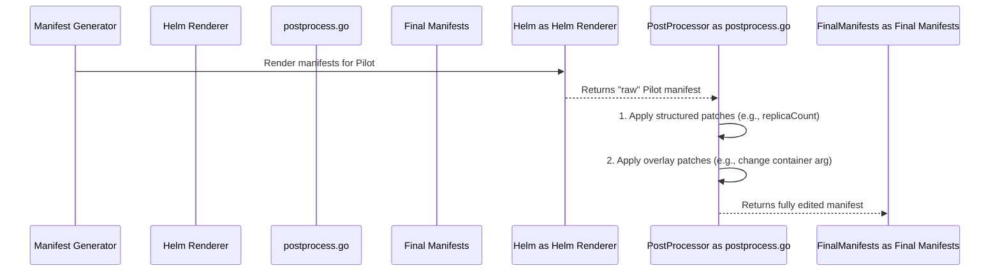

# Chapter 7: Post-Processing & Overlays

Welcome to the final chapter of our Istio Operator deep dive! In the [previous chapter](06_configuration_values___values_map__.md), we explored the `values.Map`, the universal currency of configuration that holds the master blueprint for our Istio installation. We've seen how this blueprint is used to render the final manifests.

But what happens if the blueprint options aren't enough? What if you need to make a tiny, specific change to a generated manifest that isn't exposed as a standard option in the `IstioOperator` API? This is where the operator's powerful "post-production" features come into play.

### The Film Editing Room Analogy

Think of the manifest generation process we've learned about so far as shooting a film. You have your script (`IstioOperator` spec) and your actors and sets (Helm charts). You run the rendering engine, and it produces the "raw footage"—the initial Kubernetes YAML manifests.

This raw footage is usually great, but sometimes it needs a little editing to be perfect. This editing phase is **Post-Processing**. The operator provides two levels of editing:

1.  **Color Correction (Structured Settings)**: These are broad, common adjustments that apply to the whole scene. In operator terms, these are the structured fields under the `k8s:` block, like `replicaCount` or `resources`. They're easy to use and safe.
2.  **CGI (Overlays)**: This is for making very specific, surgical changes. Need to change the color of a single button on an actor's costume? That's CGI. Need to modify a single command-line argument in a container that isn't exposed anywhere else? That's an **overlay**. It's an "escape hatch" for deep, precise customizations.

### Tier 1: Structured Post-Processing ("Color Correction")

We've actually seen this tier before! Whenever you use the `k8s:` block in your `IstioOperator` spec, you're using the first level of post-processing.

```yaml
# my-install.yaml
apiVersion: install.istio.io/v1alpha1
kind: IstioOperator
spec:
  components:
    pilot:
      k8s:
        # This is a structured post-processing setting
        replicaCount: 3
```

When the operator processes this, it first renders the Pilot deployment using the standard Helm chart, which might default to 1 replica. Then, in a post-processing step, it applies your `replicaCount: 3` setting, patching the final manifest before it's applied to the cluster. This is simple, safe, and covers most common customization needs.

### Tier 2: Overlays ("The CGI Escape Hatch")

Now for the advanced tool. Let's say you need to change the default `discovery` container's log rotation duration argument from `30m` to `60m`. There is no `logRotationDuration` field in the `IstioOperator` API. How can you change it?

This is the perfect job for an overlay. You can tell the operator: "After you generate the manifest for the `istio-pilot` Deployment, I want you to find this exact field and change its value."

Here’s what that looks like in your `IstioOperator` file:

```yaml
# pilot-advanced-override.yaml
apiVersion: install.istio.io/v1alpha1
kind: IstioOperator
spec:
  components:
    pilot:
      k8s:
        overlays:
        - kind: Deployment
          name: istio-pilot
          patches:
          - path: spec.template.spec.containers.[name:discovery].args.[30m]
            value: "60m"
```

Let's break down this powerful `overlays` block:
- `overlays:`: This signals you're using the advanced "CGI" feature.
- `kind: Deployment` & `name: istio-pilot`: This is the **target**. You're telling the operator to find the specific manifest for the Kubernetes Deployment named `istio-pilot`.
- `patches:`: This is a list of surgical changes to make to that manifest.
- `path:`: This is the magic. It's the precise "GPS coordinate" to the field you want to change.
    - `spec.template.spec.containers`: We're navigating down the YAML structure.
    - `[name:discovery]`: This is a special selector. It means "in the `containers` list, find the item where the `name` key has the value `discovery`."
    - `args.[30m]`: This means "in the `args` list of that container, find the item that has the exact value `30m`."
- `value: "60m"`: And this is the new value you want to set.

When you run `istioctl install` with this file, the operator will generate the standard Pilot deployment and then, like a CGI artist, find that exact argument and replace "30m" with "60m".

### Under the Hood: The Post-Processing Pipeline

So how does the operator perform this editing magic after rendering the manifests?

The process happens inside the `postProcess` function in `pkg/render/postprocess.go`. It receives the "raw footage" (the rendered manifests) and your `IstioOperator` spec.



1.  **Rendering**: First, the standard Helm rendering process creates the initial manifests.
2.  **Structured Patches**: The `postProcess` function first handles the "color correction." It looks at fields like `replicaCount`, `affinity`, etc., in your `k8s:` block and applies them using a standard Kubernetes method called a "strategic merge patch."
3.  **Overlay Patches**: Next, it moves to the "CGI" step. It iterates through the `overlays` list. For each one, it finds the target manifest and then applies the path-based patches.

### The Magic of `tpath`

How does the operator follow a string path like `spec.template.spec.containers.[name:discovery]` to find the right spot in the YAML? It uses a special internal utility located in `pkg/tpath/tree.go`. You can think of `tpath` (tree path) as a GPS navigation system for YAML trees.

The `applyPatches` function uses `tpath` to perform the surgical edit. Here's a highly simplified look at the logic in `pkg/render/postprocess.go`:

```go
// File: pkg/render/postprocess.go (Simplified)

func applyPatches(baseManifest manifest.Manifest, patches []apis.Patch) (manifest.Manifest, error) {
	// 1. Parse the base manifest YAML into a Go map structure.
	manifestMap := parseYAML(baseManifest.Content)

	// 2. Loop through each patch from the user's overlay.
	for _, patch := range patches {
		// 3. Use tpath to find the exact location specified by the path.
		targetNode, _, _ := tpath.GetPathContext(manifestMap, patch.Path, true)

		// 4. Use tpath to write the new value at that location.
		tpath.WritePathContext(targetNode, patch.Value)
	}

	// 5. Convert the modified Go map back into a YAML string.
	return toYAML(manifestMap)
}
```
This is the heart of the overlay system. It converts the YAML to a data structure, uses `tpath` to navigate to a precise location, writes the new value, and then converts it back to YAML.

### Conclusion

You have now reached the end of our journey and learned about the operator's powerful "escape hatch." You know that:

-   **Post-processing** allows you to modify manifests *after* they have been rendered by Helm.
-   It comes in two tiers: structured `k8s:` settings for common changes (like color correction) and powerful `overlays` for surgical, deep customizations (like CGI).
-   Overlays use a `path` syntax to target any field in a manifest, providing ultimate flexibility.
-   Under the hood, this is powered by structured patching for the simple settings and a special `tpath` utility for the complex overlay paths.

### A Look Back at Our Journey

Congratulations! You've made it through the entire Istio Operator deep dive. Let's quickly recap everything you've learned:

1.  We started at the [CLI Command Structure](01_cli_command_structure_.md), seeing how user intent is captured.
2.  We explored the [IstioOperator API](02_istiooperator_api_.md), the declarative "order form" for your service mesh.
3.  We learned about [Component Abstraction](03_component_abstraction_.md), the modular "blueprints" that define each part of Istio.
4.  We dove into [Manifest Generation & Rendering](04_manifest_generation___rendering_.md), the "mail merge" engine that creates the YAML.
5.  We saw the [Installation & Pruning Logic](05_installation___pruning_logic_.md), the smart installer that manages the lifecycle on your cluster.
6.  We uncovered the [Configuration Values (`values.Map`)](06_configuration_values___values_map__.md), the flexible data structure that holds it all together.
7.  And finally, we've just seen **Post-Processing & Overlays**, the ultimate customization tool.

You now have a complete, end-to-end understanding of how `istioctl install` transforms a simple command into a fully running, customized Istio service mesh. We hope this series has demystified the operator and empowered you to use, troubleshoot, and even contribute to Istio with confidence. Thank you for following along

---

Generated by [AI Codebase Knowledge Builder](https://github.com/The-Pocket/Tutorial-Codebase-Knowledge)