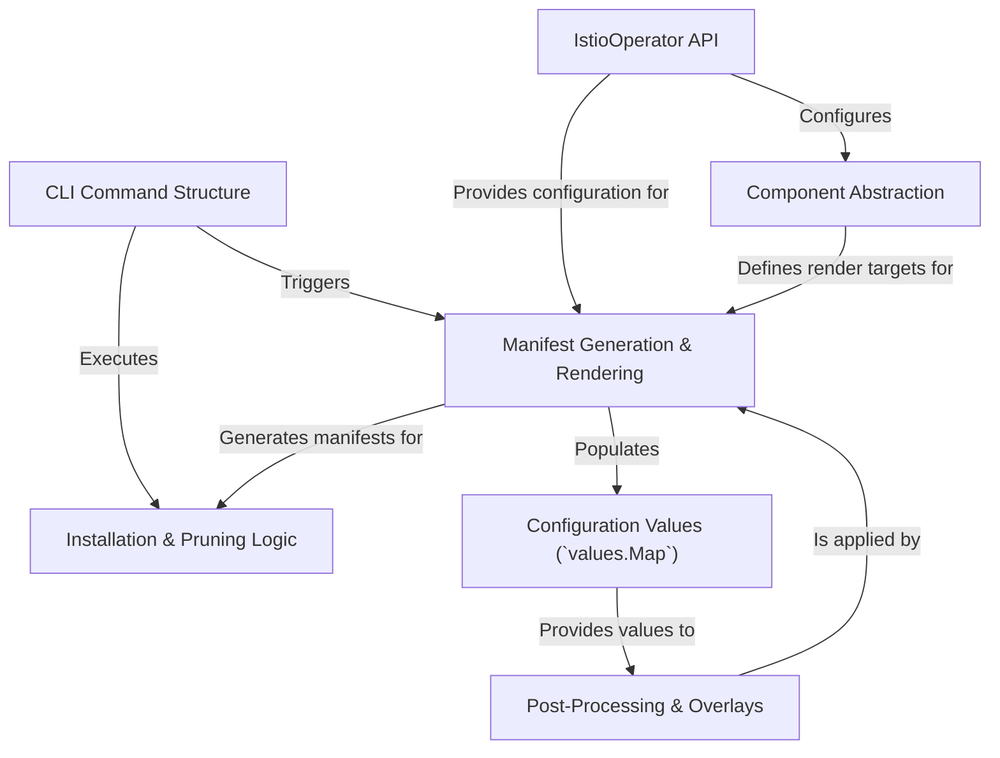

# Tutorial: operator

The `istio/operator` project provides a powerful command-line tool, **`istioctl`**, to simplify the installation and management of an Istio service mesh. Users define their desired setup using a high-level configuration object called the **`IstioOperator` API**. The tool processes this configuration, uses *Helm charts* as templates to generate all the necessary Kubernetes YAML *manifests*, and can then apply them directly to a cluster. It intelligently handles installing components in the correct order, waiting for them to be ready, and even *pruning* obsolete resources during upgrades.

**Source Repository:** [None](None)

## Chapters

1. [CLI Command Structure
](01_cli_command_structure_.md)
2. [IstioOperator API
](02_istiooperator_api_.md)
3. [Component Abstraction
](03_component_abstraction_.md)
4. [Manifest Generation & Rendering
](04_manifest_generation___rendering_.md)
5. [Installation & Pruning Logic
](05_installation___pruning_logic_.md)
6. [Configuration Values (`values.Map`)
](06_configuration_values___values_map___.md)
7. [Post-Processing & Overlays
](07_post_processing___overlays_.md)

---

Generated by [AI Codebase Knowledge Builder](https://github.com/The-Pocket/Tutorial-Codebase-Knowledge)