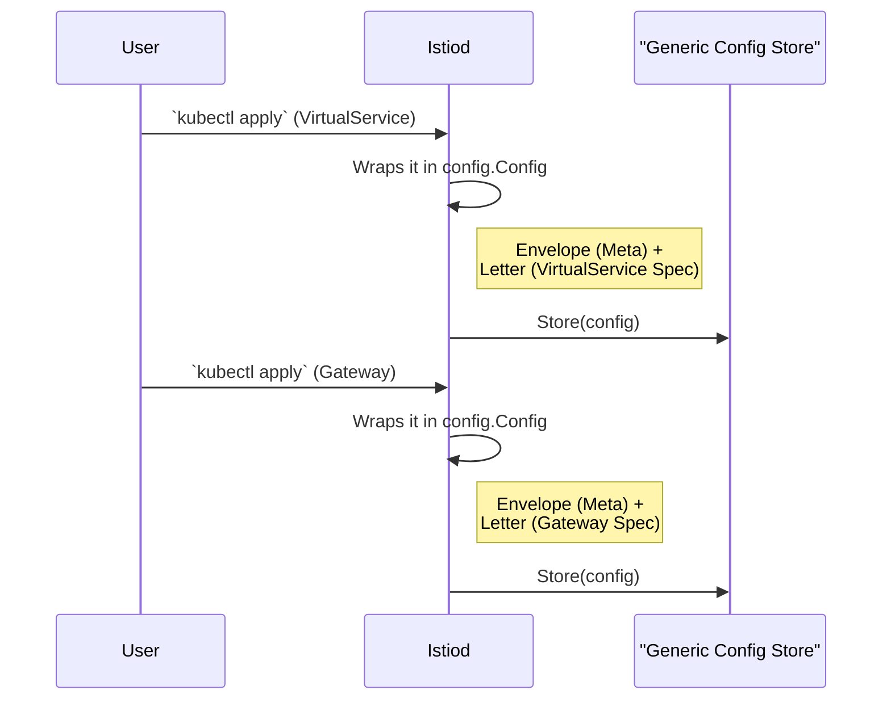

# Chapter 1: Configuration Model (`config.Config`)

Welcome to our journey through the core concepts of Istio's `pkg` library! In this series, we'll explore the fundamental building blocks that power Istio. We're starting with the most central concept of all: how Istio represents configuration.

Imagine you're managing a service mesh. You'll be working with many different kinds of configuration: `VirtualService` to control traffic routing, `Gateway` to manage ingress traffic, `AuthorizationPolicy` to handle security, and more.

How can the Istio control plane, Istiod, handle all these different types of configuration without having to write special code for every single one? The answer lies in a clever, universal data structure: `config.Config`.

### The Envelope and Letter Analogy

The best way to understand `config.Config` is with a simple analogy: sending a letter.

Every piece of mail has two parts:
1.  **The Envelope:** This contains metadata—who it's for (name/namespace), a return address, a timestamp, and a tracking number. This information is standardized.
2.  **The Letter:** This is the actual content, the message you want to send. The content of a birthday card is very different from the content of a utility bill.

The `config.Config` struct works exactly the same way.

*   `Meta`: This is the **envelope**. It holds standard information like the configuration's name, namespace, labels, and resource version.
*   `Spec`: This is the **letter**. It contains the specific details for that type of configuration. The `Spec` for a `VirtualService` is completely different from the `Spec` for a `Gateway`.

This standardized "envelope" (`Meta`) wrapping a specific "letter" (`Spec`) allows Istio to handle any configuration in a generic way. It can store, retrieve, and track updates for any resource just by looking at the envelope, without needing to understand the letter inside.

### A Practical Example: The `VirtualService`

Let's look at a common Istio resource you might write in YAML, a `VirtualService`.

```yaml
apiVersion: networking.istio.io/v1beta1
kind: VirtualService
metadata:
  name: reviews-route
  namespace: default
spec:
  hosts:
  - reviews
  http:
  - route:
    - destination:
        host: reviews
        subset: v1
```

When Istio reads this YAML file, it converts it into its internal `config.Config` representation. The `metadata` block becomes the `Meta` (envelope), and the `spec` block becomes the `Spec` (letter).

### Dissecting the `config.Config` Structure

Let's peek at the Go code that defines this structure. Don't worry if you're not a Go expert; we'll break it down piece by piece.

```go
// From: config/model.go

// Config is a configuration unit consisting of the type, key, and content.
type Config struct {
	Meta

	// Spec holds the configuration object
	Spec Spec

	// Status holds long-running status.
	Status Status
}
```

*   **`Meta`**: As we discussed, this is our envelope. It's not just one field, but a whole collection of metadata embedded directly inside the `Config` struct.
*   **`Spec`**: This is our letter. The type `Spec` is just an alias for `any`, meaning it can hold any kind of configuration data.
*   **`Status`**: Think of this as a "delivery receipt." It's where the system can report back on the state of the configuration (e.g., "This route has been successfully applied").

### Meet the `Meta`: The Standardized Envelope

The `Meta` struct contains all the information Istio needs to manage a resource. Here are the most important fields:

```go
// From: config/model.go

// Meta is metadata attached to each configuration unit.
type Meta struct {
	// A short name like "VirtualService"
	GroupVersionKind GroupVersionKind

	// A unique name in a namespace, e.g., "reviews-route"
	Name string

	// The namespace, e.g., "default"
	Namespace string

	// An opaque identifier for tracking updates
	ResourceVersion string

	// ... other fields like Labels, Annotations, etc.
}
```

Looking at our `VirtualService` YAML again, you can see the direct mapping:
*   `kind: VirtualService` maps to `Meta.GroupVersionKind`.
*   `metadata.name: reviews-route` maps to `Meta.Name`.
*   `metadata.namespace: default` maps to `Meta.Namespace`.

### The `Spec`: The Configuration's Core Message

The `Spec` field is where the real magic happens. It holds the content of the `spec:` block from your YAML. For our `VirtualService`, the `Spec` would contain the routing rules for the `reviews` service.

If we were looking at an Istio `Gateway` instead, the `Spec` would contain a completely different set of fields, like `selector` and `servers`.

The key takeaway is that `config.Config` provides a consistent container, while the `Spec` inside is flexible and specific to the resource `Kind`.

### Under the Hood: Why is This So Useful?

This generic model dramatically simplifies Istio's internal architecture. Imagine a component whose job is to store all configurations. Thanks to `config.Config`, its logic is incredibly simple.

Let's visualize the process when you apply two different types of configurations.



As you can see, the `Generic Config Store` doesn't need to know anything about `VirtualServices` or `Gateways`. It just receives a `config.Config` object. It uses the `Meta` (the envelope) to figure out the object's unique key (`name` + `namespace` + `kind`) and stores the `Spec` (the letter) alongside it.

This design principle is used throughout Istio, allowing components to be decoupled and reusable.

### Conclusion

You've just learned about the most fundamental data structure in Istio's configuration system: `config.Config`.

*   It acts as a **universal wrapper** for any type of configuration.
*   It uses the **"envelope and letter"** analogy, separating standardized metadata (`Meta`) from the specific configuration details (`Spec`).
*   This design enables **generic processing**, making the entire system simpler, more robust, and easier to extend.

But a question remains: if `config.Config` can hold *anything*, how does Istio know what a *valid* `VirtualService` or `Gateway` is supposed to look like? How does it know which fields are required or what data types they should be?

That's where our next topic comes in. We'll explore how Istio defines the rules and structure for each configuration type.

Ready to continue? Let's dive into the blueprint for our configurations in the next chapter: [Configuration Schema (`resource.Schema`)](02_configuration_schema___resource_schema___.md).

---

Generated by [AI Codebase Knowledge Builder](https://github.com/The-Pocket/Tutorial-Codebase-Knowledge)