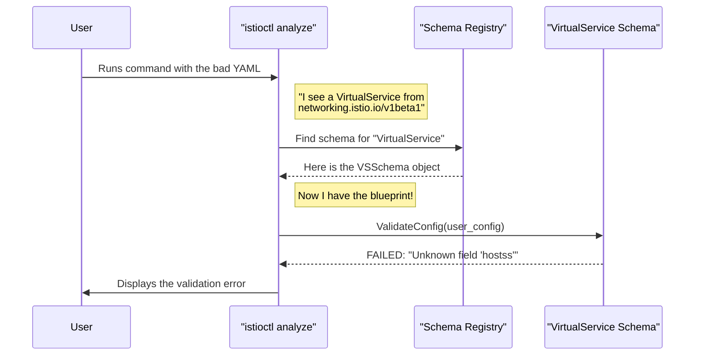

# Chapter 2: Configuration Schema (`resource.Schema`)

In the [previous chapter on the Configuration Model (`config.Config`)](01_configuration_model___config_config___.md), we learned how Istio uses a generic "envelope and letter" approach to handle any type of configuration. The `config.Config` struct acts as a universal wrapper, but it doesn't know anything about the "letter" inside—the `Spec`.

This raises a crucial question: If the `Spec` can be *anything*, how does Istio know what a *valid* `VirtualService` looks like? How can it tell you that you've misspelled a field or forgotten a required one?

The answer is the `resource.Schema`.

### The Blueprint for Your Configuration

Imagine you're building a house. You wouldn't just start mixing concrete and nailing boards together. You'd start with a **blueprint**. The blueprint defines everything: the number of rooms, the dimensions, where the doors and windows go, and the materials to be used.

The `resource.Schema` is the blueprint for an Istio configuration object.

For every single resource type—`VirtualService`, `Gateway`, `AuthorizationPolicy`, and so on—there is a corresponding `resource.Schema` that defines its:
*   **Identity:** Its unique name (`group`, `version`, `kind`).
*   **Structure:** The exact set of fields it can have (e.g., `hosts`, `http`, `tcp`).
*   **Validation Rules:** The logic to check if a user's configuration is correct.

This blueprint is the "source of truth" that powers tools like `istioctl analyze`, ensuring that your configurations are well-formed before they ever reach the control plane.

### The Source of Truth: `metadata.yaml`

So, where do these blueprints come from? While they are represented in Go code, their definitions start in a simple YAML file: `config/schema/metadata.yaml`. This file is a catalog of every resource type Istio knows about.

Let's look at the entry for `VirtualService`.

```yaml
# From: config/schema/metadata.yaml

- kind: "VirtualService"
  plural: "virtualservices"
  group: "networking.istio.io"
  version: "v1"
  proto: "istio.networking.v1alpha3.VirtualService"
  protoPackage: "istio.ioio/api/networking/v1alpha3"
```
This small snippet contains the core identity of a `VirtualService` blueprint:
*   `kind`, `group`, `version`: This defines the unique `GroupVersionKind` (GVK) that you see in your YAML files (`apiVersion: networking.istio.io/v1`, `kind: VirtualService`).
*   `proto`: This points to the underlying Protobuf message that defines the actual fields (`hosts`, `http`, etc.). Think of this as the detailed structural drawing on the blueprint.

During the build process, Istio uses this metadata file to auto-generate Go code that creates `resource.Schema` objects for every defined type.

### How Istio Uses a Schema: A Practical Example

Let's say you write a `VirtualService` but make a typo, spelling `hosts` as `hostss`.

```yaml
apiVersion: networking.istio.io/v1beta1
kind: VirtualService
metadata:
  name: reviews-route
spec:
  hostss: # <-- TYPO!
  - reviews
  http:
  - route:
    - destination:
        host: reviews
```

When you run `istioctl analyze`, how does it catch this? Here's the step-by-step process, powered by `resource.Schema`.



1.  **Identify:** `istioctl` reads your YAML and sees its `apiVersion` and `kind`.
2.  **Lookup:** It consults an internal "Schema Registry" to find the `resource.Schema` that matches the `VirtualService` GVK.
3.  **Validate:** It calls the `ValidateConfig` method on the retrieved schema, passing in your configuration.
4.  **Report:** The schema's validation logic, which knows all the valid fields from the `proto` definition, immediately sees the unknown `hostss` field and reports an error back to you.

Without the schema, Istio would have no idea that `hostss` is a mistake. It provides the essential context and rules needed to understand configuration.

### Diving into the Code

Let's look at how these concepts are represented in Go.

#### The `resource.Schema` Interface

The blueprint itself is defined by an interface. It's a contract that guarantees every schema can provide its identity and perform validation.

```go
// From: config/schema/resource/schema.go

type Schema interface {
	// GroupVersionKind of the resource.
	GroupVersionKind() config.GroupVersionKind

	// ValidateConfig validates that the given config is valid.
	ValidateConfig(cfg config.Config) (validation.Warning, error)

	// ... other methods for getting metadata ...
}
```
This is a simplified view, but it shows the two most important jobs of a schema: telling you *what it is* (`GroupVersionKind`) and *if a config is valid* (`ValidateConfig`).

#### The Auto-Generated Schemas

As we mentioned, the `metadata.yaml` file is used to generate Go code. This generated code uses a `resource.Builder` to construct each schema object.

Here is the actual (simplified) generated code for our `VirtualService`.

```go
// From: config/schema/collections/collections.gen.go

var VirtualService = resource.Builder{
	Group:   "networking.istio.io",
	Kind:    "VirtualService",
	Version: "v1",
	Proto:   "istio.networking.v1alpha3.VirtualService",
	ValidateProto: validation.ValidateVirtualService,
}.MustBuild()
```
This code declaratively builds the `VirtualService` schema. Crucially, it wires up a specific validation function, `validation.ValidateVirtualService`, which contains the expert logic for checking routing rules, host formats, and more.

#### The Schema Registry

Finally, all these generated schemas are collected into a single registry, which makes looking them up easy.

```go
// From: config/schema/collections/collections.gen.go

// All contains all collections in the system.
var All = collection.NewSchemasBuilder().
	MustAdd(AuthorizationPolicy).
	MustAdd(DestinationRule).
	MustAdd(Gateway).
	MustAdd(VirtualService).
	// ... and all other resources
	Build()
```
When `istioctl` needs to find a schema, it just asks this `All` collection.

### Conclusion

You've now seen the "other half" of Istio's configuration system.

*   The [Configuration Model (`config.Config`)](01_configuration_model___config_config___.md) provides a generic **container** for any resource.
*   The **Configuration Schema (`resource.Schema`)** provides the **blueprint** that gives structure, meaning, and validation rules to the content inside that container.

Together, they create a powerful and flexible system. The generic container simplifies storage and transport, while the specific blueprints ensure correctness and enable powerful tooling.

But validation isn't just about checking fields within a single resource. What if your `VirtualService` points to a `DestinationRule` that doesn't exist? How does Istio analyze relationships *between* configurations? That's the job of a higher-level system that uses these schemas as its foundation.

Let's move on to the next chapter and explore how Istio performs this sophisticated cross-resource analysis with the [Configuration Analysis Framework (`analysis.Analyzer`)](03_configuration_analysis_framework___analysis_analyzer___.md).

---

Generated by [AI Codebase Knowledge Builder](https://github.com/The-Pocket/Tutorial-Codebase-Knowledge)