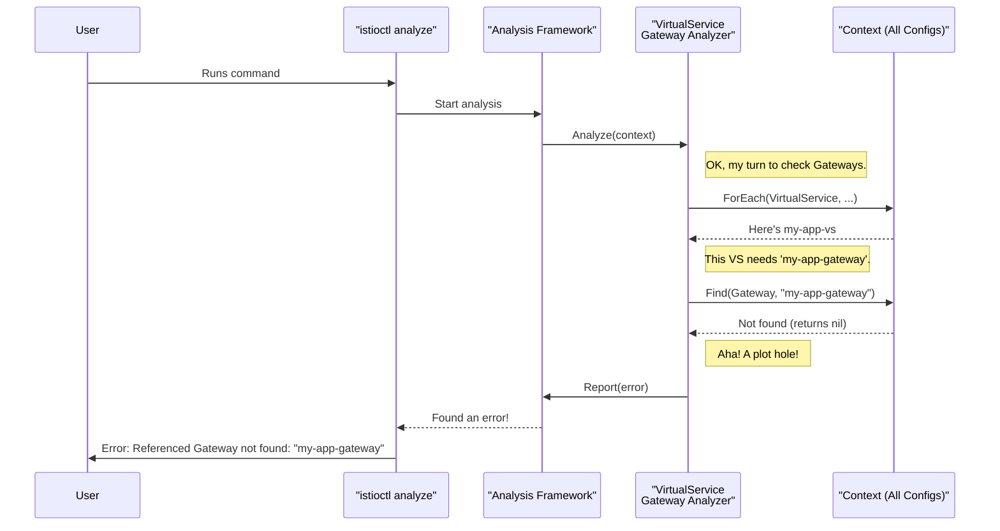

# Chapter 3: Configuration Analysis Framework (`analysis.Analyzer`)

In the [previous chapter on Configuration Schema (`resource.Schema`)](02_configuration_schema___resource_schema___.md), we learned how Istio uses a "blueprint" to validate the structure of a single YAML file. A schema can tell you if you've misspelled a field in your `VirtualService`, which is incredibly useful.

But what about problems that span *multiple* files?

Consider this scenario: You have a `VirtualService` that correctly routes traffic to an ingress `Gateway`.
```yaml
# virtualservice.yaml
apiVersion: networking.istio.io/v1
kind: VirtualService
metadata:
  name: my-app-vs
spec:
  hosts:
  - "myapp.example.com"
  gateways:
  - my-app-gateway  # <-- This gateway
  # ... routing rules ...
```
What happens if you forget to create the `my-app-gateway` resource? Or if you delete it later? The `VirtualService` YAML is still perfectly valid according to its schema, but your application will be broken. The schema has no way of knowing about other resources in your system.

This is where the Configuration Analysis Framework comes in. It's like a linter for your entire Istio configuration, capable of finding these complex, cross-resource issues.

### A Team of Specialist Proofreaders

The best way to think about the analysis framework is to imagine you're publishing a book. You wouldn't just rely on a spell-checker. You'd hire a team of editors:
*   One editor checks for grammar.
*   Another checks for spelling.
*   A third, crucial editor checks for **plot holes**—"Does the character mentioned in Chapter 5 actually exist?"

The `analysis.Analyzer` framework is this team of editors for your Istio configuration. It's made up of many small, highly-focused analyzers, each designed to find one specific type of "plot hole". For our example, there's an analyzer whose only job is to check if a `VirtualService` refers to a `Gateway` that actually exists.

### How an Analyzer Works: The `Analyzer` and the `Context`

The framework has two key components that work together:

1.  **The `Analyzer`**: This is the specialist editor. It's a piece of code that knows how to look for one specific problem.
2.  **The `Context`**: This is the library. It gives the `Analyzer` access to *all* the configuration resources in the system, not just the one it's currently looking at.

Let's look at the contract an `Analyzer` must fulfill. It's a simple Go interface.

```go
// From: config/analysis/analyzer.go

// Analyzer is an interface for analyzing configuration.
type Analyzer interface {
	Metadata() Metadata
	Analyze(c Context)
}
```
*   `Metadata()`: This is the analyzer introducing itself. It tells the framework its name and what types of resources it's interested in (e.g., "I'm the GatewayAnalyzer, and I need to look at `VirtualServices` and `Gateways`").
*   `Analyze(c Context)`: This is where the work happens. The framework gives the analyzer a `Context` (the full library of configurations), and the analyzer uses it to hunt for its specific problem.

The `Context` provides the tools for this hunt.

```go
// From: config/analysis/context.go

// Context is an analysis context passed to analyzers.
type Context interface {
	// ForEach iterates over all entries of a given collection.
	ForEach(c config.GroupVersionKind, fn IteratorFn)

	// Find a resource in the collection.
	Find(c config.GroupVersionKind, name resource.FullName) *resource.Instance

	// Report a diagnostic message.
	Report(c config.GroupVersionKind, t diag.Message)
}
```
*   `ForEach()`: "Let me read every `VirtualService` in the library."
*   `Find()`: "Now, for this `VirtualService`, please find me the `Gateway` named 'my-app-gateway'."
*   `Report()`: "I couldn't find it! Please report an error."

### Solving Our Use Case: The Missing Gateway

Let's trace how the system finds our missing gateway error when you run a command like `istioctl analyze`.



The process is simple and powerful:
1.  The framework activates the `VirtualServiceGatewayAnalyzer`.
2.  The analyzer iterates through every `VirtualService`.
3.  When it finds `my-app-vs`, it extracts the gateway name `my-app-gateway`.
4.  It uses the `Context` to ask, "Does a `Gateway` with this name exist?"
5.  The `Context`, which holds all known configurations, says "No."
6.  The analyzer calls `Report()` to flag the problem.

### The Team Roster: `analyzers/all.go`

Istio ships with dozens of these specialist analyzers. They are all gathered in a central file, ready to be deployed as a team.

```go
// From: config/analysis/analyzers/all.go

// All returns all analyzers
func All() []analysis.Analyzer {
	analyzers := []analysis.Analyzer{
		// ...
		&destinationrule.CaCertificateAnalyzer{},
		&gateway.CertificateAnalyzer{},
		&gateway.SecretAnalyzer{},
		&service.PortNameAnalyzer{},
		&virtualservice.DestinationHostAnalyzer{},
		&virtualservice.GatewayAnalyzer{}, // <-- Our hero!
		// ... and many more
	}
	return analyzers
}
```
This shows just a small sample. There are analyzers for checking security policies, destination rules, service ports, and much more. When you run `istioctl analyze`, you're unleashing this whole team on your configuration files.

### Standardized Error Messages

To make the user experience consistent, the framework uses a catalog of predefined error messages. Instead of just printing a raw string, an analyzer reports a typed error.

```go
// From: config/analysis/msg/messages.gen.go

var (
	// ReferencedResourceNotFound defines a message for when a
	// resource being referenced does not exist.
	ReferencedResourceNotFound = diag.NewMessageType(
		diag.Error, "IST0101", "Referenced %s not found: %q")
)

// NewReferencedResourceNotFound returns a new diag.Message
func NewReferencedResourceNotFound(r *resource.Instance, reftype string, refval string) diag.Message {
	return diag.NewMessage(ReferencedResourceNotFound, r, reftype, refval)
}
```
When our `virtualservice.GatewayAnalyzer` finds the problem, it calls `Report()` with `NewReferencedResourceNotFound(..., "Gateway", "my-app-gateway")`. This ensures that the final output to the user is clear, consistent, and includes a unique error code (`IST0101`) that they can search for.

### Conclusion

You've now seen how Istio goes beyond simple structural validation to find complex, logical errors in your service mesh configuration.

*   The **Analysis Framework** acts like a "linter" for your entire set of Istio YAMLs.
*   It's composed of many small, focused **`Analyzers`**, each looking for a specific problem.
*   Analyzers use a shared **`Context`** to query for other resources, enabling them to find cross-resource misconfigurations.
*   This system allows you to catch subtle but critical errors—like a `VirtualService` pointing to a non-existent `Gateway`—long before they cause problems in production.

So far, we've talked about Istio configuration as static YAML files that we can analyze. But in a real cluster, these configurations are live objects. How does Istio watch for changes to these objects and react to them?

Let's explore the engine that powers this dynamic behavior in the next chapter: [Kubernetes Declarative Controller Runtime (krt)](04_kubernetes_declarative_controller_runtime__krt__.md).

---

Generated by [AI Codebase Knowledge Builder](https://github.com/The-Pocket/Tutorial-Codebase-Knowledge)