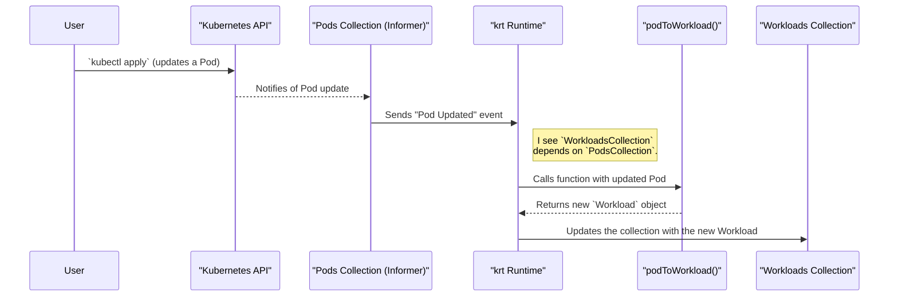

# Chapter 4: Kubernetes Declarative Controller Runtime (krt)

In the [previous chapter on the Configuration Analysis Framework](03_configuration_analysis_framework___analysis_analyzer___.md), we saw how Istio can analyze a static set of configuration files to find complex errors. This is perfect for catching problems before you apply them.

But what happens *after* you apply them? A Kubernetes cluster is a living, breathing system. Pods crash, Deployments are scaled, and Services are updated. How does Istio's control plane, Istiod, react to these changes in real-time to keep the service mesh configuration perfectly up-to-date?

The answer is a powerful engine called the **Kubernetes Declarative Controller Runtime**, or `krt`.

### The Spreadsheet Analogy

The best way to understand `krt` is to think of it as a spreadsheet, like Google Sheets or Microsoft Excel.

Imagine a spreadsheet with two columns:
*   **Column A:** A list of Pods running in your cluster.
*   **Column B:** A simplified view of those Pods, which we'll call "Workloads".

You want a simple rule: for every Pod in Column A, the corresponding cell in Column B should display that Pod's name. You would write a formula in cell B2 like `=A2.Name`.

Now, the magic happens:
*   When a new Pod is added to Column A, a new "Workload" automatically appears in Column B.
*   When a Pod's data changes in Column A, the corresponding "Workload" in Column B instantly updates.
*   If you delete a Pod from Column A, its "Workload" vanishes from Column B.

`krt` is the engine that makes this possible for Kubernetes controllers. You define "formulas" (transformation functions) that derive one set of resources from another, and `krt` handles all the complex wiring to automatically recalculate and keep everything consistent when things change.

### The Key Primitives of `krt`

`krt` is built on a few simple but powerful concepts:

1.  **`Collection`**: This is a "column" in our spreadsheet. It represents a collection of resources of the same type, like all `Pods` or all `Services` in the cluster.
2.  **Transformation Function**: This is the "formula" in a cell. It's a simple Go function you write that takes an item from one `Collection` as input and produces an item for another `Collection` as output.
3.  **Derived `Collection`**: This is a new "column" whose contents are automatically calculated by applying a transformation function to an existing `Collection`.

### A Practical Example: From `Pods` to `Workloads`

Let's build a simple controller to solve our spreadsheet problem. We want to take the collection of all Kubernetes `Pods` and create a derived collection of simplified `Workload` objects.

#### Step 1: Define our Output Type

First, we need to define what our simplified `Workload` object looks like. It's just a simple Go struct.

```go
// Our custom, simplified Workload object
type Workload struct {
	Name      string
	Namespace string
	// ... other simplified fields
}
```
This is the data structure for "Column B" in our spreadsheet.

#### Step 2: Get the Input `Collection` of Pods

`krt` provides helpers to easily create a `Collection` from a standard Kubernetes informer. An informer is a component that efficiently watches the Kubernetes API for changes to a specific resource type.

```go
// From: kube/krt/informer.go

// Create a collection of all Pods in the cluster.
// This is "Column A".
var Pods = NewInformer[corev1.Pod](client)
```
This single line gives us a live, auto-updating `Collection` of all `Pods`. Whenever a Pod is created, updated, or deleted in the cluster, this `Pods` collection will emit an event.

#### Step 3: Write the Transformation Function (The "Formula")

Now, we write our formula. It's a Go function that takes one `Pod` and transforms it into one `Workload`.

The function also receives a `HandlerContext`, which we'll talk more about later.

```go
// This is our formula: func(pod) -> *Workload
func podToWorkload(ctx krt.HandlerContext, pod *corev1.Pod) *Workload {
	// If the Pod is not running, we don't want a Workload.
	// Returning nil will delete any existing Workload.
	if pod.Status.Phase != "Running" {
		return nil
	}

	return &Workload{
		Name:      pod.Name,
		Namespace: pod.Namespace,
	}
}
```
This logic is beautifully simple: it takes a Pod, checks if it's running, and if so, returns a new `Workload` with the relevant information.

#### Step 4: Create the Derived `Collection`

Finally, we tell `krt` to create our new `Workloads` collection by wiring together our input (`Pods`) and our formula (`podToWorkload`).

```go
// From: kube/krt/collection.go

// Create "Column B" by applying our formula to "Column A".
var Workloads = krt.NewCollection[corev1.Pod, Workload](
	Pods,         // Input collection
	podToWorkload, // Transformation function
)
```
And that's it! We now have a `Workloads` collection that will always be perfectly in sync with the state of our `Pods` in the cluster. We didn't have to write any code for watching for events, queuing updates, or managing state. `krt` does it all for us.

### How it Works Under the Hood

When you create a derived collection, `krt` sets up a subscription. Let's see what happens when a user updates a Pod.



The runtime acts as the central coordinator. It knows that `WorkloadsCollection` is derived from `PodsCollection`, so whenever it gets an event from the `Pods` "column," it automatically re-runs the "formula" to update the `Workloads` "column."

### Advanced Formulas: Using `Fetch` for Dependencies

What if our formula needs to look at data in *other* columns? For example, what if our `Workload` needed to include the name of the `Service` that points to the Pod?

This is where the `HandlerContext` and the `krt.Fetch` function come in. `Fetch` allows your transformation function to look up resources from other collections.

Think of `krt.Fetch` as the `VLOOKUP` function in a spreadsheet.

Let's modify our `podToWorkload` function.

```go
// Assume we have a `Services` collection already defined.
var Services = krt.NewInformer[corev1.Service](client)

func podToWorkload(ctx krt.HandlerContext, pod *corev1.Pod) *Workload {
	// Fetch all Services in the same namespace as the Pod.
	servicesInNamespace := krt.Fetch(ctx, Services,
		krt.FilterNamespace(pod.Namespace))

	// ... logic to find the right Service for this Pod ...

	return &Workload{
		// ...
		ServiceName: "...", // Found from the fetched services
	}
}
```
The most powerful part of `krt.Fetch` is that it **automatically registers a dependency**. The `krt` runtime now knows: "This specific `Workload` (for this specific Pod) depends on the `Pods` collection *and* the `Services` collection."

If the Pod changes, the function re-runs. But now, if a `Service` in that namespace changes, `krt` is smart enough to re-run the function for all affected Pods too! It automatically keeps the dependency graph and ensures everything is recalculated correctly, just like a spreadsheet.

### Conclusion

You've just learned about `krt`, the declarative engine that powers Istio's real-time controllers.

*   It uses a **spreadsheet analogy**: `Collection`s are data columns, and transformation functions are formulas.
*   You write simple, stateless functions that transform one resource into another.
*   The `krt` runtime handles all the complexity of **event handling, dependency tracking, and state management**.
*   Using `krt.Fetch`, your transformations can depend on multiple collections, and `krt` will automatically recompute them when any dependency changes.

This declarative model dramatically simplifies writing robust and efficient Kubernetes controllers. Instead of worrying about queues and caches, developers can focus on the core logic: "Given this state, what should the derived state be?"

Now that we understand how Istio generates and reacts to configuration changes, let's look at how this configuration gets delivered to the components that need it, starting with the agent that runs alongside every application proxy.

Let's move on to our next topic: the [Istio Agent (`istioagent.Agent`)](05_istio_agent___istioagent_agent___.md).

---

Generated by [AI Codebase Knowledge Builder](https://github.com/The-Pocket/Tutorial-Codebase-Knowledge)