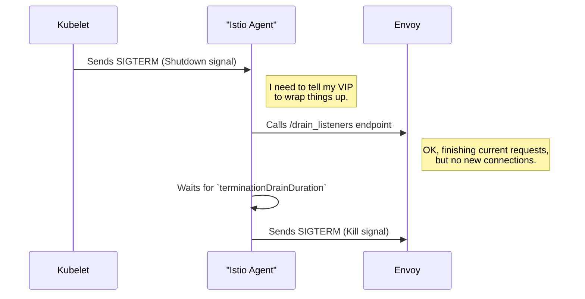

# Chapter 5: Istio Agent (`istioagent.Agent`)

In the [previous chapter on the Kubernetes Declarative Controller Runtime (krt)](04_kubernetes_declarative_controller_runtime__krt__.md), we saw the powerful engine Istiod uses to react to changes in the cluster and generate updated service mesh configurations.

But that raises a critical question: how does this configuration actually get from the control plane (Istiod) to the data plane—specifically, to the Envoy proxy running alongside your application? If your application pod is a car, and Envoy is its engine, who is the mechanic that installs the engine, turns the key, and handles its maintenance?

Meet the **Istio Agent**.

### The Personal Assistant for a VIP

The Envoy proxy is the VIP (Very Important Process) of the Istio data plane. Its only job is to handle traffic—a high-stakes, demanding role. It can't be bothered with administrative tasks.

The Istio Agent (`istioagent.Agent`) is a process that runs in the same pod as Envoy and acts as its dedicated personal assistant. It handles all the logistics and communication so that Envoy can focus on its main job.

The agent has three primary responsibilities:
1.  **Bootstrapping:** It prepares Envoy's initial configuration, telling it where to find its "boss" (Istiod) for further instructions.
2.  **Lifecycle Management:** It starts the Envoy process and, crucially, manages its graceful shutdown when the time comes.
3.  **Communications Proxy:** It acts as the middleman for all communication between Envoy and Istiod, handling requests for configuration (XDS) and security credentials (SDS).


Let's look at how this assistant helps its VIP throughout a typical day (the lifecycle of a pod).

### A Pod's Lifecycle with the Istio Agent

#### 1. The Kick-Off: Bootstrapping Envoy

When a pod with an Istio sidecar starts, the Istio Agent starts first. Its first job is to create a bootstrap configuration file for Envoy. This file is like a day-one briefing document for the VIP. It doesn't contain all the traffic routing rules, but it has the most critical piece of information: the address of the Istiod control plane.

```yaml
# A simplified view of the bootstrap config generated by the agent
admin:
  address:
    socket_address: { address: 127.0.0.1, port_value: 15000 }

dynamic_resources:
  # ...
  config_sources:
  - api_config_source:
      api_type: DELTA_GRPC
      transport_api_version: V3
      grpc_services:
      - envoy_grpc:
          # This tells Envoy where to get its configuration!
          cluster_name: xds-grpc
# ... more config ...
```
This tells Envoy, "Connect to the cluster named `xds-grpc` to get your dynamic configuration." (The agent defines this cluster elsewhere in the file to point to Istiod).

The agent gathers information from its environment—like the pod's name, namespace, and IP address—to generate this configuration. This logic lives inside the `bootstrap` package.

```go
// From: istio-agent/agent.go

func (a *Agent) initializeEnvoyAgent(_ context.Context) error {
	// 1. Gather all metadata about this pod and its environment.
	node, err := a.generateNodeMetadata()
	// ... error handling ...

	// 2. Use the metadata to create the bootstrap file.
	out, err := bootstrap.New(bootstrap.Config{
		Node: node,
		// ... other settings ...
	}).CreateFile()
	// ... error handling ...

	// 3. Store the path to the new bootstrap file.
	a.envoyOpts.ConfigPath = out
	// ...
	return nil
}
```
This code shows the agent's startup sequence: it gathers metadata and uses the `bootstrap.New().CreateFile()` function to write Envoy's initial config to disk.

#### 2. The Start-Up: Managing Envoy's Lifecycle

Once the bootstrap file is ready, the agent starts the Envoy process. But it doesn't just launch it and forget it. The agent becomes Envoy's process manager. This is handled by a small, dedicated component within the agent called `envoy.Agent`.

The most important part of this job is managing the shutdown. When a Kubernetes pod is terminated, you want to give it time to finish handling any in-flight requests. This is called "graceful termination."

The Istio Agent orchestrates this for Envoy.


This process ensures that user requests aren't abruptly cut off. The agent tells Envoy to "drain" its listeners, waits for a period, and only then terminates the process.

Let's peek at the code that handles this.

```go
// From: envoy/agent.go

// terminate starts exiting the process.
func (a *Agent) terminate() {
	log.Infof("Agent draining Proxy for termination")
	// Tell Envoy to start draining its listeners.
	e := a.proxy.Drain(false)
	if e != nil {
		log.Warnf("Error in invoking drain listeners endpoint: %v", e)
	}

	// Wait for the configured graceful termination period.
	select {
	case <-time.After(a.terminationDrainDuration):
		log.Infof("Graceful termination period complete...")
		// Now, it's time to actually stop the Envoy process.
		a.abortCh <- errAbort
	// ... other cases ...
	}
}
```
This `terminate` function is called when the agent receives a shutdown signal. It clearly shows the two-step process: `Drain`, then wait.

#### 3. The Go-Between: Proxying Communication

With Envoy up and running, it needs to get its detailed configuration from Istiod. As instructed by the bootstrap file, Envoy will try to connect to Istiod.

However, it doesn't connect to Istiod directly. Instead, it connects to a gRPC server running *within the Istio Agent* on a local Unix Domain Socket. The agent then proxies this connection to Istiod.

This might seem like an unnecessary extra step, but it's crucial. It allows the agent to:
*   **Manage Security:** The agent can attach the necessary security tokens (JWTs) and TLS certificates to the connection with Istiod.
*   **Intercept and Handle Agent-Specific Config:** The agent can look at the configuration coming from Istiod and handle special types that are meant for the agent itself, not for Envoy.
*   **Abstract Complexity:** It keeps Envoy's configuration simple. Envoy just needs to know "talk to my local agent," and the agent handles the rest.

This proxying is so important that it has its own dedicated component, which we will explore in detail in the very next chapter.

### Conclusion

You've now met the unsung hero of the Istio data plane: the **Istio Agent**.

*   It acts as a **personal assistant** to the Envoy proxy, running alongside it in the same pod.
*   It **bootstraps** Envoy with its initial configuration, telling it where to find Istiod.
*   It manages Envoy's **lifecycle**, ensuring a graceful shutdown to protect in-flight requests.
*   It **proxies** all communication to Istiod, handling security and abstracting complexity away from Envoy.

Without the agent, every Envoy proxy would need to contain complex logic for bootstrapping, lifecycle management, and secure communication. The agent centralizes this logic, keeping Envoy lean and focused on its primary mission: routing traffic.

Now that you understand the agent's overall role, let's zoom in on its most complex and powerful responsibility: acting as the communications hub between Envoy and Istiod.

Ready to see how that works? Let's dive into the [XDS Proxy (`istioagent.XdsProxy`)](06_xds_proxy___istioagent_xdsproxy___.md).

---

Generated by [AI Codebase Knowledge Builder](https://github.com/The-Pocket/Tutorial-Codebase-Knowledge)