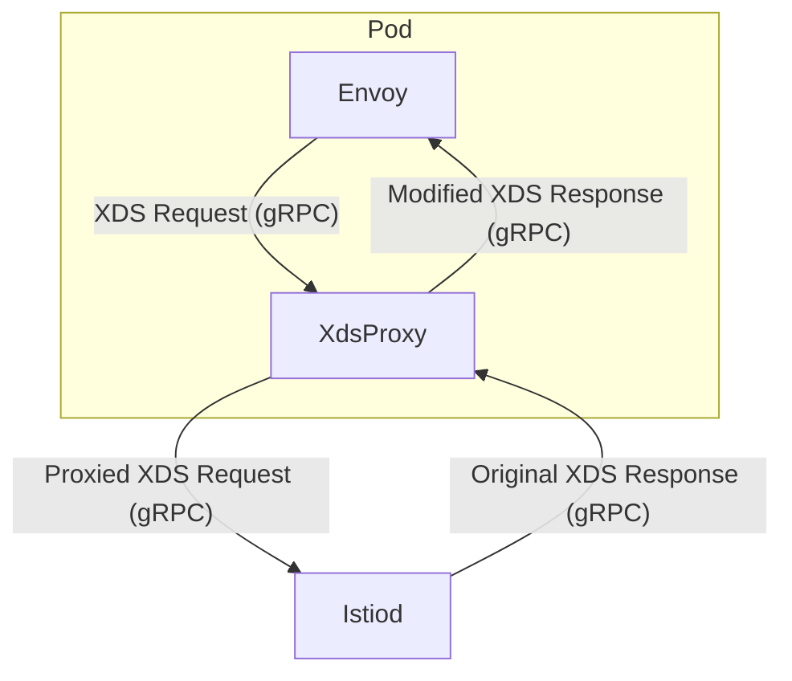
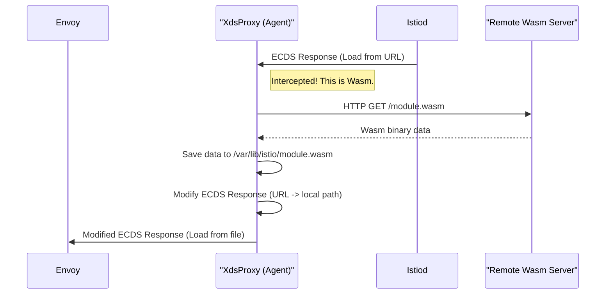

# Chapter 6: XDS Proxy (`istioagent.XdsProxy`)

In the [previous chapter on the Istio Agent](05_istio_agent___istioagent_agent___.md), we learned that the agent acts as a personal assistant to Envoy. One of its most important jobs is to proxy all communication between Envoy and the Istiod control plane.

But why do this? Why not let Envoy talk directly to Istiod? The reason is that having a middleman allows for some incredibly powerful features. The agent doesn't just pass messages back and forth like a simple pipe; it can actively intercept, inspect, and even *change* the configuration on its way to Envoy.

This intelligent middleman is the **XDS Proxy**.

### The Mailroom Clerk Analogy

The best way to understand the XDS Proxy is to think of a large office building's mailroom.

*   **Envoy** is an employee working in an office. They need their packages to do their job.
*   **Istiod** is the central post office for the entire city. It sends out delivery notices.
*   The **XDS Proxy** is the mailroom clerk.

Imagine Istiod sends a "package delivery notice" to Envoy. This notice says, "There's a package for you waiting at the post office. The address is `http://example.com/package.zip`."

The problem is, the employee (Envoy) is very busy and can only accept packages delivered directly to their desk. They don't know how to go to the post office.

This is where the mailroom clerk (XDS Proxy) steps in. The clerk sees the delivery notice, understands what it means, and takes action:
1.  **Intercepts:** It receives the delivery notice from Istiod before it gets to Envoy.
2.  **Acts:** It goes to the post office (downloads the file from the URL).
3.  **Modifies:** It places the actual package on a local shelf in the mailroom.
4.  **Delivers:** It then walks to the employee's desk and says, "Here's that package you were expecting. It's on Shelf A-3 (e.g., `/var/lib/istio/data/package.wasm`)."

Envoy is happy because it received a simple, local location it understands. The XDS Proxy handled all the complex external communication.

### The Real-World Use Case: Wasm Modules

This analogy maps directly to how Istio handles WebAssembly (Wasm) modules. You can configure Istio to extend Envoy's functionality with custom Wasm code. Istiod will send a configuration (an ExtensionConfiguration Discovery Service, or ECDS, resource) telling Envoy to fetch this Wasm module from a remote URL.

However, Envoy can only load Wasm modules from a local file path. The XDS Proxy bridges this gap exactly like our mailroom clerk.

### How it Works Under the Hood

The XDS Proxy maintains two separate gRPC streams: one with the downstream client (Envoy) and one with the upstream server (Istiod).



When Istiod sends a configuration update, the proxy intercepts it. If it's a standard configuration like a Listener or Cluster, it just passes it through. But if it's a special type, like an ECDS resource for a Wasm module, it triggers its special handling logic.

Let's trace the Wasm package delivery process.



### Diving into the Code

Let's see how this logic is implemented.

#### 1. Receiving the Upstream Response

It all starts when the proxy receives a response from Istiod. The `handleUpstreamDeltaResponse` function in `istio-agent/xds_proxy_delta.go` is the main entry point. It checks the type of configuration it received.

```go
// From: istio-agent/xds_proxy_delta.go

func (p *XdsProxy) handleUpstreamDeltaResponse(con *ProxyConnection) {
	// ... loop to receive responses ...
	select {
	case resp := <-con.deltaResponsesChan:
		// ...
		switch resp.TypeUrl {
		case model.ExtensionConfigurationType: // This is an ECDS resource!
			if features.WasmRemoteLoadConversion {
				go p.deltaRewriteAndForward(con, resp, /*...*/)
			} else {
				forwardDeltaToEnvoy(con, resp)
			}
		default:
			forwardDeltaToEnvoy(con, resp) // Just forward other types
		}
	// ...
	}
}
```
This `switch` statement is the core of the interception logic. If the response is of type `ExtensionConfigurationType`, it knows it might need to do special processing for Wasm.

#### 2. Rewriting the Configuration

The `deltaRewriteAndForward` function is where the mailroom clerk's real work begins. It calls a helper function to handle the conversion.

```go
// From: istio-agent/xds_proxy_delta.go

func (p *XdsProxy) deltaRewriteAndForward(con *ProxyConnection, resp *discovery.DeltaDiscoveryResponse, /*...*/) {
	// ...
	if err := wasm.MaybeConvertWasmExtensionConfig(resources, p.wasmCache); err != nil {
		// If download fails, tell Istiod there was an error (NACK)
		con.sendDeltaRequest(&discovery.DeltaDiscoveryRequest{
			TypeUrl:       resp.TypeUrl,
			ResponseNonce: resp.Nonce,
			ErrorDetail:   /* ... error details ... */,
		})
		return
	}
	// ... forward the modified response ...
}
```
This function calls `wasm.MaybeConvertWasmExtensionConfig` to attempt the download and rewrite. If it fails, it sends a negative acknowledgment (NACK) back to Istiod.

#### 3. Fetching and Replacing the URL

The real magic is in the `wasm` package. The `rewriteVMConfig` function handles downloading the remote module and replacing the configuration to point to the local file.

```go
// From: wasm/convert.go

func rewriteVMConfig(resourceName string, vm *wasmextensions.VmConfig, /*...*/) error {
	remote := vm.GetCode().GetRemote()
	httpURI := remote.GetHttpUri()
	// ...

	// Download the file from httpURI.GetUri() and save it.
	// `cache.Get` handles the download and returns a local file path.
	localFilePath, err := cache.Get(httpURI.GetUri(), /*... options ...*/)
	if err != nil {
		return fmt.Errorf("cannot fetch Wasm module: %w", err)
	}

	// This is the key part: rewrite the config!
	vm.Code = &core.AsyncDataSource{
		Specifier: &core.AsyncDataSource_Local{
			Local: &core.DataSource{
				Specifier: &core.DataSource_Filename{
					Filename: localFilePath, // Use the local path now
				},
			},
		},
	}
	return nil
}
```
As you can see, this function:
1.  Gets the remote `httpUri` from the config.
2.  Uses a `cache` to download the file and get a local path.
3.  Creates a brand new `Local` data source pointing to the downloaded file.
4.  Replaces the old `Remote` data source in the configuration with this new `Local` one.

The modified configuration is then passed along to Envoy, which happily loads the Wasm module from the local file system.

### Conclusion

You've just uncovered one of the most powerful roles of the [Istio Agent (`istioagent.Agent`)](05_istio_agent___istioagent_agent___.md): the **XDS Proxy**.

*   It acts as an **intelligent intermediary** for configuration, not just a simple passthrough.
*   It maintains a persistent gRPC connection to Istiod and proxies requests from Envoy.
*   This architecture allows it to **intercept and modify** configuration in-flight.
*   The primary use case is handling Wasm modules, where it **converts a remote URL into a local file path** that Envoy can understand.

This proxy demonstrates a key design principle in Istio: offloading complexity from Envoy to the agent. This keeps Envoy lean and fast, while the agent handles the "smarts" of interacting with the broader Istio ecosystem.

Now that we've seen how the agent helps manage configuration, let's explore another advanced networking feature it helps enable: a secure overlay network that connects services across different clusters or networks.

Ready for the next step? Let's dive into the [HBONE (HTTP-Based Overlay Network)](07_hbone__http_based_overlay_network__.md).

---

Generated by [AI Codebase Knowledge Builder](https://github.com/The-Pocket/Tutorial-Codebase-Knowledge)