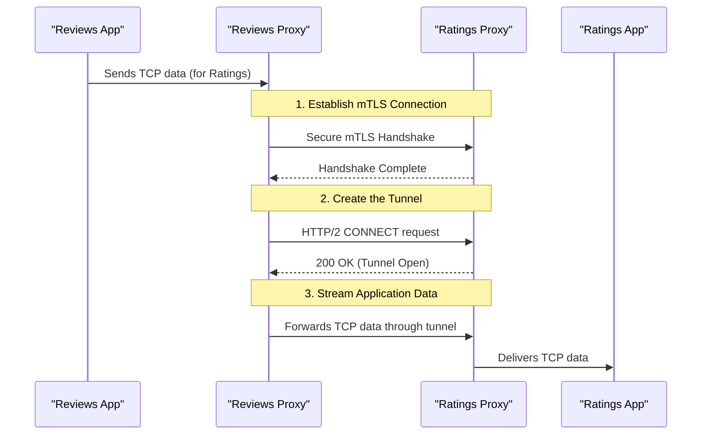

# Chapter 7: HBONE (HTTP-Based Overlay Network)

In the [previous chapter on the XDS Proxy](06_xds_proxy___istioagent_xdsproxy___.md), we saw how the [Istio Agent (`istioagent.Agent`)](05_istio_agent___istioagent_agent___.md) can intelligently manage configuration for Envoy. The agent's role as a smart assistant extends beyond just configuration; it's also responsible for enabling advanced, secure networking for the applications in the mesh.

Imagine you have two services that need to talk to each other. In a simple setup, they might be on the same secure network. But what if they are in different Kubernetes clusters, different cloud providers, or one is on-premise? How can we guarantee that the communication between them is always secure and private, no matter how complex the underlying network is?

This is the problem that HBONE solves.

### The Express Lane on a Public Highway

Think of the internet or your corporate network as a massive public highway system. Anyone can get on it, and it's not always safe. If you want to send a valuable package from one city to another, you wouldn't just put it in a regular car and hope for the best.

Instead, you'd want to use a special armored car service that has access to a private, secure express lane.

**HBONE (HTTP-Based Overlay Network)** is that secure express lane for your service-to-service communication.
*   It creates a **private tunnel** over the public network.
*   All traffic that enters this tunnel is **encrypted and authenticated**.
*   It ensures your application's data travels safely, protected from outside interference, until it reaches its destination.

This is especially critical in Istio's "ambient mesh" mode, where there might not be a dedicated sidecar proxy for every application. HBONE provides the secure foundation for all communication within the mesh.

### How Does It Work?

The magic of HBONE lies in using a standard, well-understood web protocol—HTTP/2—in a clever way. The process of creating this secure express lane involves two simple steps:

1.  **Secure Handshake (mTLS):** Before any tunnel is built, the client proxy and server proxy establish a mutual TLS (mTLS) connection. This is like the security guards for the express lane checking each other's IDs. They verify their identities using certificates, ensuring they are both trusted members of the service mesh.

2.  **The `CONNECT` Request:** Once the secure mTLS channel is established, the client sends a special HTTP/2 request: `CONNECT`. This request essentially says, "Hello, we have a secure connection. Now, please open a tunnel through it to this final destination."

Once the server proxy responds with `200 OK`, the tunnel is officially open! From that point on, any raw TCP data from the client application is simply streamed through this encrypted HTTP/2 connection to the server application, and vice versa. The applications themselves are completely unaware of this; they just think they're talking over a regular network connection.

### A Step-by-Step Look at an HBONE Connection

Let's trace the journey of a single request from a `reviews` service to a `ratings` service using HBONE.



1.  **mTLS Handshake:** The `Reviews Proxy` initiates a secure mTLS connection to the `Ratings Proxy`. They exchange and verify certificates.
2.  **Create Tunnel:** The `Reviews Proxy` sends an `HTTP CONNECT` request over the secure channel.
3.  **Stream Data:** The `Ratings Proxy` accepts the connection, and the tunnel is established. Now, the raw TCP traffic from the `Reviews App` flows through this encrypted tunnel, is received by the `Ratings Proxy`, and is forwarded to the `Ratings App`.

### Diving into the Code

Let's see how this "express lane" is built in the code. We'll look at the client-side (the "dialer") and the server-side.

#### The Client: Building the Tunnel (`dialer.go`)

The client, or "dialer," is responsible for initiating the HBONE connection. The core logic is in a helper function called `hbone`.

```go
// From: hbone/dialer.go

func hbone(conn io.ReadWriteCloser, address string, req Config, transport *http2.Transport, /*...*/) (*http.Response, /*...*/) {
	// Prepare the CONNECT request.
	// The body of the request is a pipe that we will write data to later.
	pr, pw := io.Pipe()
	r, err := http.NewRequest(http.MethodConnect, "http://...", pr)
	// ... error handling ...
	r.Host = address // "address" is the final destination, e.g., "ratings-service"

	// Send the request and establish the stream.
	resp, err := transport.RoundTrip(r)
	// ... error handling ...

	// ...
}
```
This snippet shows the two key steps:
1.  `http.NewRequest(http.MethodConnect, ...)` creates the special request to open a tunnel.
2.  `transport.RoundTrip(r)` sends this request over the mTLS-secured connection. When this returns successfully, the tunnel is open. `resp.Body` is the stream for reading data *from* the server, and `pw` is the writer for sending data *to* the server.

#### The Server: Accepting the Tunnel (`server.go`)

On the other side, the server is listening for these `CONNECT` requests. The `handleConnect` function is the entry point.

```go
// From: hbone/server.go

func handleConnect(w http.ResponseWriter, r *http.Request) bool {
	// Dial the actual application this tunnel is intended for.
	dst, err := (&net.Dialer{}).DialContext(ctx, "tcp", r.Host)
	if err != nil {
		w.WriteHeader(http.StatusServiceUnavailable)
		return true
	}

	// Tell the client "OK, tunnel is open!"
	w.WriteHeader(http.StatusOK)

	// Now, just copy data back and forth.
	go copyBuffered(w, dst) // App -> HBONE Client
	copyBuffered(dst, r.Body) // HBONE Client -> App
	// ...
}
```
This server-side logic is beautifully simple:
1.  When a `CONNECT` request for `ratings-service` arrives, it opens a plain TCP connection to the actual `ratings-service` application.
2.  It sends `200 OK` back to the client to signal that the tunnel is ready.
3.  It starts two "copy" loops: one that copies data from the client (`r.Body`) to the application (`dst`), and another that copies data from the application (`dst`) back to the client (`w`).

### Conclusion

You've just learned about HBONE, the secure communication backbone of the Istio service mesh.

*   It creates a secure **overlay network** for your services, like a private express lane on a public highway.
*   It works by tunneling all TCP traffic through an **HTTP/2 `CONNECT`** request over a secure **mTLS** connection.
*   This process is completely **transparent to your applications**. They communicate normally, while the Istio proxies handle all the complexity of securing the traffic.
*   HBONE ensures that communication is private and authenticated, even across complex and untrusted networks.

We've now seen how Istio manages configuration, how the agent assists Envoy, and how secure communication channels are established. But when things aren't working as expected, how can we look inside these components to diagnose problems? How can we get a real-time status report from Istiod or an Istio agent?

Let's explore the powerful built-in tool that lets you do just that in our next chapter: the [ControlZ Introspection Facility (`ctrlz.Server`)](08_controlz_introspection_facility___ctrlz_server___.md).

---

Generated by [AI Codebase Knowledge Builder](https://github.com/The-Pocket/Tutorial-Codebase-Knowledge)