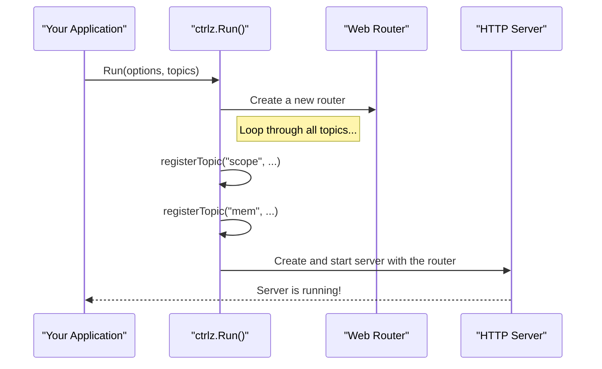

# Chapter 8: ControlZ Introspection Facility (`ctrlz.Server`)

In the [previous chapter on HBONE](07_hbone__http_based_overlay_network__.md), we explored the secure communication backbone that connects services in the mesh. We've seen how Istio manages configuration, how the agent assists Envoy, and how secure connections are made.

But what happens when something goes wrong? How can you look inside a running Istio component like Istiod or an Istio Agent to understand its current state? Restarting a component to get more logs is disruptive, and sometimes you need to diagnose a problem on a live system.

This is where the ControlZ Introspection Facility comes in. It's the built-in diagnostic dashboard for every major Istio component.

### The Dashboard of Your Car

The best way to understand ControlZ is to think about the dashboard of your car. Your car's dashboard gives you real-time information:
*   **Speedometer:** How fast are you going?
*   **Fuel Gauge:** How much fuel is left?
*   **Engine Temperature:** Is the engine running hot?

You wouldn't drive a car without a dashboard. Similarly, you shouldn't run a complex server process without a way to see what it's doing inside. ControlZ is that dashboard for Istio components. It's a small web server that runs inside the component, providing a simple web UI to inspect its internal state.

With ControlZ, you can:
*   View and change logging levels on-the-fly.
*   See memory and CPU usage.
*   Check the command-line arguments the process was started with.
*   Access performance profiles (pprof).

### Getting Started: Launching a ControlZ Server

Every Istio component that needs a dashboard just needs to create and run a `ctrlz.Server`. This is incredibly simple and usually done in just a few lines of code.

#### 1. Define the Options

First, you configure the server's address and port. The `ctrlz` package provides a handy `Options` struct for this.

```go
// From: ctrlz/options.go

// DefaultOptions returns a new set of options, initialized to the defaults
func DefaultOptions() *Options {
	return &Options{
		Port:    9876,
		Address: "localhost",
	}
}
```
This shows that by default, the ControlZ server will be available at `http://localhost:9876`. An operator can change these defaults using command-line flags.

#### 2. Run the Server

Next, you just need to call the `Run` function with your options.

```go
// Create default options for our server.
opts := ctrlz.DefaultOptions()

// Start the ControlZ server.
// The second argument lets us add custom dashboards (topics).
server, err := ctrlz.Run(opts, nil)
if err != nil {
	// handle error
}

// ... your component's main logic continues here ...
```
And that's it! With these few lines, your application now has a fully functional, interactive debugging web server running inside of it.

### The Anatomy of ControlZ: Topics

The ControlZ UI is organized into different pages, or "**Topics**." Each topic corresponds to a specific functional area you can inspect. Think of each topic as a different gauge or screen on your car's dashboard.

The `ctrlz` package provides a standard set of core topics that are useful for any application:
*   **Logging Scopes (`/scopez`)**: View and change the verbosity of different loggers.
*   **Memory (`/memz`)**: See a snapshot of current memory usage.
*   **Arguments (`/argz`)**: View the command-line arguments the process was started with.
*   **Version (`/versionz`)**: See the build information for the component.

This modular design is powered by the `fw.Topic` interface. Each topic is a self-contained unit that knows how to render its own page.

```go
// From: ctrlz/fw/context.go

// Topic is used to describe a single major ControlZ functional area.
type Topic interface {
	Title() string // The name shown in the UI, e.g., "Logging Scopes"
	Prefix() string // The URL path, e.g., "scope"
	Activate(TopicContext) // The function to set up the web page
}
```
This simple interface allows developers to easily add new, custom debug pages to their components just by creating a new `Topic`.

### How It Works Under the Hood

When you call `ctrlz.Run()`, a few simple things happen in sequence to bring the dashboard to life.



1.  **Create Router:** `Run()` creates a new web router to handle incoming HTTP requests.
2.  **Register Topics:** It iterates through the list of core topics (and any custom ones you provided) and registers each one with the router. This means it tells the router, "When a request comes in for `/scopez`, send it to the Logging Scopes topic."
3.  **Start Server:** Finally, it creates and starts a standard Go HTTP server, passing it the fully configured router.

Let's look at the key piece of code that wires up a topic.

```go
// From: ctrlz/ctrlz.go

func registerTopic(router *mux.Router, layout *template.Template, t fw.Topic) {
	// Create a sub-router for HTML requests (e.g., /scopez)
	htmlRouter := router.NewRoute().PathPrefix("/" + t.Prefix() + "z").Subrouter()

	// Create a sub-router for JSON API requests (e.g., /scopej)
	jsonRouter := router.NewRoute().PathPrefix("/" + t.Prefix() + "j").Subrouter()

	// Activate the topic, giving it the routers to attach to.
	t.Activate(fw.NewContext(htmlRouter, jsonRouter, tmpl))
}
```
This function is called for every topic. It cleverly sets up two paths:
*   `/prefix**z**`: This path is for the human-readable HTML user interface.
*   `/prefix**j**`: This path is for the machine-readable JSON API, allowing for programmatic access to the same data.

### A Practical Example: Debugging Live

Imagine your Istiod instance is behaving strangely, and you suspect a specific component is not working right. You want to see more detailed logs from it, but you can't afford to restart the entire control plane.

With ControlZ, the solution is simple:
1.  **Port-forward to Istiod:**
    ```shell
    kubectl port-forward -n istio-system <istiod-pod-name> 9876:9876
    ```
2.  **Open the Dashboard:** Open your web browser and navigate to `http://localhost:9876`.
3.  **Go to Logging Scopes:** Click on the "Logging Scopes" link in the sidebar. This takes you to `/scopez`.
4.  **Change Log Level:** You'll see a list of all registered logging scopes in Istiod. Find the one you're interested in (e.g., `ads` for XDS connections) and change its `Output Level` from `info` to `debug`.
5.  **Observe:** Immediately, you'll start seeing verbose debug logs for that specific component in Istiod's log output, without any service interruption.

This ability to safely and dynamically inspect and control a live component is an invaluable tool for any operator or developer working with Istio.

### Conclusion

You've now reached the end of our journey through the core concepts of Istio's `pkg` library! We've ended with `ctrlz`, the powerful, built-in diagnostic dashboard that gives you a window into the inner workings of Istio.

*   ControlZ is a **built-in web server** that acts as a **dashboard** for Istio components.
*   It provides real-time visibility into memory usage, logging levels, and more, without needing a restart.
*   It's built on a modular system of **Topics**, making it easy to extend.
*   It provides both an HTML UI for humans and a JSON API for machines.

From the universal [Configuration Model (`config.Config`)](01_configuration_model___config_config___.md) to the real-time controller runtime of [krt](04_kubernetes_declarative_controller_runtime__krt__.md), and from the hardworking [Istio Agent (`istioagent.Agent`)](05_istio_agent___istioagent_agent___.md) to the secure tunnels of [HBONE](07_hbone__http_based_overlay_network__.md), you've now seen the fundamental building blocks that make Istio a powerful and flexible service mesh.

Congratulations on completing this series! We hope this tour has demystified some of the magic behind Istio and empowered you to better understand, operate, and contribute to the project.

---

Generated by [AI Codebase Knowledge Builder](https://github.com/The-Pocket/Tutorial-Codebase-Knowledge)