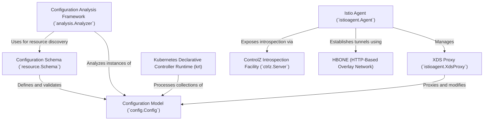

# Tutorial: pkg

This project provides the core components for building and managing a service mesh. It allows you to define networking rules using standardized **configuration objects**, which are then *validated and analyzed* for errors. A powerful controller runtime automatically reacts to changes to manage the mesh. On each workload, an *agent* runs alongside the network proxy to deliver configurations, handle security, and establish secure communication tunnels using the **HBONE protocol**. A built-in debugging interface provides easy introspection into each component's state.

**Source Repository:** [None](None)

## Chapters

1. [Configuration Model (`config.Config`)
](01_configuration_model___config_config___.md)
2. [Configuration Schema (`resource.Schema`)
](02_configuration_schema___resource_schema___.md)
3. [Configuration Analysis Framework (`analysis.Analyzer`)
](03_configuration_analysis_framework___analysis_analyzer___.md)
4. [Kubernetes Declarative Controller Runtime (krt)
](04_kubernetes_declarative_controller_runtime__krt__.md)
5. [Istio Agent (`istioagent.Agent`)
](05_istio_agent___istioagent_agent___.md)
6. [XDS Proxy (`istioagent.XdsProxy`)
](06_xds_proxy___istioagent_xdsproxy___.md)
7. [HBONE (HTTP-Based Overlay Network)
](07_hbone__http_based_overlay_network__.md)
8. [ControlZ Introspection Facility (`ctrlz.Server`)
](08_controlz_introspection_facility___ctrlz_server___.md)

---

Generated by [AI Codebase Knowledge Builder](https://github.com/The-Pocket/Tutorial-Codebase-Knowledge)