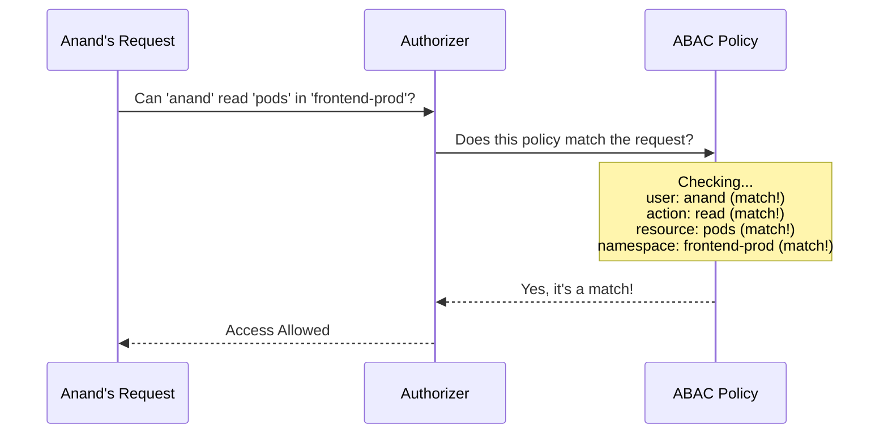

# Chapter 1: ABAC Policy

Welcome to your first step in understanding the `auth` project! We're going to start with the most fundamental concept of our authorization system.

Imagine you're the librarian of a new digital library. You need a simple way to decide who gets to do what. Should a student be able to delete books? Probably not. Should a librarian be able to add new books? Absolutely. How do we write these rules down in a way a computer can understand?

This is where the **ABAC Policy** comes in. It's the simplest, most basic building block for making these decisions.

### What is an ABAC Policy?

An **ABAC Policy** is a single, specific rule that grants a permission. Think of it as one line on a permission slip:

> *"User 'Alice' is allowed to 'read' the 'mystery novels'."*

Each policy answers three simple questions:
1.  **Who?** (The `Subject`, like user 'Alice')
2.  **Can do what?** (The `Action`, like 'read')
3.  **On what?** (The `Object`, like 'mystery novels')

In our system, the entire authorization logic is built by combining many of these simple, single-line rules.

### A Concrete Example: Granting Access

Let's say we have a developer named `anand` who needs to *view* the status of applications (called `pods`) running in a specific project environment named `frontend-prod`. He shouldn't be able to modify or delete them, just look at them.

How would we write this rule as an ABAC Policy? In our system, policies are written in a simple text format (JSON), where each line is one policy. The rule for Anand would look like this:

```json
{"user": "anand", "readonly": true, "resource": "pods", "namespace": "frontend-prod"}
```

Let's break that down:
*   `"user": "anand"`: This is the **Who**. The rule applies specifically to the user `anand`.
*   `"readonly": true`: This is the **Action**. `true` means Anand can only perform read-only actions (like `get` or `list`). He cannot `delete` or `update`.
*   `"resource": "pods"` and `"namespace": "frontend-prod"`: This is the **Object**. The rule applies to the resource type `pods` but *only* within the `frontend-prod` namespace. He can't see pods in the `backend-prod` namespace.

This single line is one ABAC Policy. It's clear, specific, and easy to understand.

### Under the Hood: The Policy Structure

While you'll often write policies in the simple JSON format above, the system internally represents this information in a structured way. In Go, it looks something like this (simplified for clarity):

```go
// Policy represents a single authorization rule.
type Policy struct {
    // Spec defines the details of the policy.
    Spec PolicySpec
}

// PolicySpec contains the attributes of a policy rule.
type PolicySpec struct {
    User      string // e.g., "anand"
    Group     string // e.g., "developers"
    Readonly  bool   // e.g., true

    // For resource requests
    Namespace string // e.g., "frontend-prod"
    Resource  string // e.g., "pods"

    // For non-resource requests (like /healthz)
    NonResourcePath string
}
```
This structure directly maps to our permission slip analogy. The `PolicySpec` holds all the details of our rule: the who (`User`, `Group`), the action (`Readonly`), and the what (`Namespace`, `Resource`, `NonResourcePath`).

### How a Policy is Checked

So, what happens when Anand actually tries to view the pods? The system takes his request and compares it against every policy it knows about, one by one.

Let's visualize this process. When Anand makes a request, the authorizer checks if any policy gives him permission.



The system's logic for this check is quite straightforward. It's a function that essentially asks a series of "yes/no" questions.

Here is a simplified view of the Go code that performs this check from the file `authorizer/abac/abac.go`:

```go
// matches returns true if a policy matches the attributes of a request.
func matches(p abac.Policy, a authorizer.Attributes) bool {
    // 1. Does the user or group match?
    if subjectMatches(p, a.GetUser()) {
        // 2. Does the action (verb) match?
        if verbMatches(p, a) {
            // 3. Does the resource or path match?
            if resourceMatches(p, a) {
                return true
            }
        }
    }
    return false
}
```
This `matches` function is the heart of the decision-making process. It delegates the checks to smaller, more specific functions:

1.  **`subjectMatches`**: Checks if the user making the request (`a.GetUser()`) matches the `user` or `group` specified in the policy (`p`). If the policy says `user: "anand"`, it will only match requests from Anand.

2.  **`verbMatches`**: Checks if the action being attempted (e.g., `get`, `delete`) is allowed by the policy. Our policy has `readonly: true`, so it would allow `get` but deny `delete`.

3.  **`resourceMatches`**: Checks if the object of the request (e.g., `pods` in `frontend-prod`) matches what's specified in the policy.

If all three checks pass for any single policy, the request is allowed! If the system checks all its policies and finds no match, the request is denied.

### Conclusion

You've just learned about the most fundamental concept in our ABAC system: the **Policy**. It's a single, simple rule that acts like a permission slip. We saw how it's defined and how the system uses it to make an authorization decision.

But a real-world system isn't built on a single rule. It needs to manage a whole collection of them. How does the system load a file full of these policies and check a request against the entire list?

That's exactly what we'll cover in the next chapter.

Next: [Policy List Authorizer](02_policy_list_authorizer_.md)

---

Generated by [AI Codebase Knowledge Builder](https://github.com/The-Pocket/Tutorial-Codebase-Knowledge)