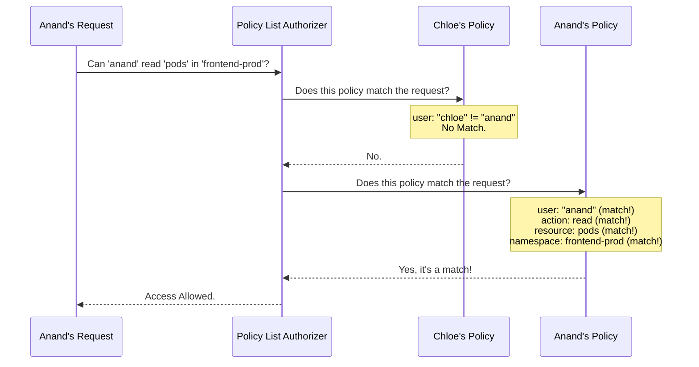

# Chapter 2: Policy List Authorizer

In the [previous chapter](01_abac_policy_.md), we learned about the most basic building block of our system: the [ABAC Policy](01_abac_policy_.md). It's a single, specific rule, like one line on a permission slip.

But a real security system for a large project can't rely on just one rule. You'll have rules for developers, rules for administrators, rules for automated systems, and more. How does our system handle a whole book of these rules, not just a single line?

This is where the **Policy List Authorizer** comes in. It's the engine that takes a list of all our policies and uses it to make a final "yes" or "no" decision.

### The Security Guard with a Clipboard

Think of the Policy List Authorizer as a security guard standing at a door. In their hand, they hold a clipboard (`PolicyList`) with a list of all the permission rules.

When you (the `user`) try to enter a room (the `resource`) to do something (the `action`), the guard doesn't just look for your name. They scan their entire list of rules from top to bottom.

The very first rule they find that says, "Yes, this person is allowed to do this," is enough. The guard stops looking and immediately lets you in. If they scan the entire list and not a single rule grants you access, they shake their head and you can't enter.

This is the core idea: **the first policy that allows the request, wins.**

### A More Complete Example

Let's expand on our example from Chapter 1. We still have our developer, `anand`. But now we also have a new system administrator, `chloe`. We need two different rules:

1.  `anand` can **read** `pods` in the `frontend-prod` namespace.
2.  `chloe` can do **anything** (`readonly: false`) in the `backend-prod` namespace.

Our policy file, which is just a text file with one JSON rule per line, would now look like this:

```json
{"user": "chloe", "readonly": false, "resource": "*", "namespace": "backend-prod"}
{"user": "anand", "readonly": true,  "resource": "pods", "namespace": "frontend-prod"}
```

This collection of rules is our `PolicyList`. The Policy List Authorizer is the component that holds this list.

### How a Decision is Made

Now, let's see the authorizer in action. Suppose Anand tries to read the pods in `frontend-prod`.



The authorizer checks the first policy for Chloe. It's not a match for Anand, so it moves on. It then checks the second policy. It's a perfect match! The authorizer immediately stops searching and returns `Allow`. It doesn't need to look at any other policies that might exist further down the list.

What if Anand tried to *delete* the pods? The authorizer would check Chloe's policy (no match) and then Anand's policy. Anand's policy only allows `readonly` access, so it would also be a "no match" for a delete action. If there are no other policies in the list, the authorizer would reach the end and return `Deny`.

### Under the Hood: The `PolicyList`

In the Go code, this concept is represented very simply. A `PolicyList` is exactly what it sounds like: a list (or "slice" in Go) of individual policies.

Here is the definition from `authorizer/abac/abac.go`:

```go
// PolicyList is simply a slice of Policy structs.
type PolicyList []*abac.Policy
```

That's it! It's just a container for the policies we learned about in the last chapter.

### The Authorization Loop

The real magic happens in the `Authorize` function. This function performs the "scan the clipboard" logic we described. Here is a simplified version of the code:

```go
// Authorize implements the main authorization logic.
func (pl PolicyList) Authorize(ctx context.Context, a authorizer.Attributes) (authorizer.Decision, string, error) {
    // Go through each policy one-by-one.
    for _, p := range pl {
        // Check if this single policy matches the request.
        if matches(*p, a) {
            // Found a match! Immediately allow and stop.
            return authorizer.DecisionAllow, "", nil
        }
    }

    // Checked all policies, no match was found.
    return authorizer.DecisionNoOpinion, "No policy matched.", nil
}
```

Let's walk through this:
1.  **`for _, p := range pl`**: This is a simple loop that goes through every policy (`p`) in the policy list (`pl`).
2.  **`if matches(*p, a)`**: For each policy, it calls the `matches` function. This is the same function we saw in Chapter 1 that checks if a single policy grants permission for the incoming request (`a`).
3.  **`return authorizer.DecisionAllow`**: If `matches` returns `true`, it means we found a rule that allows the request. The function immediately returns `DecisionAllow` and stops processing.
4.  **`return authorizer.DecisionNoOpinion`**: If the loop finishes without finding any matching policy, it means no rule granted access. It returns `DecisionNoOpinion`, which in practice means "I don't have a reason to allow this," so access is denied.

### Conclusion

You've now seen how the `auth` project goes from a single rule to a complete authorization system. The **Policy List Authorizer** is our "engine." It takes a list of simple [ABAC Policies](01_abac_policy_.md) and iterates through them with a clear, predictable "allow on first match" logic.

This simple loop is incredibly powerful. It allows you to build complex permission models by just adding more and more specific rules to a single list.

But we've been glossing over a crucial detail: how does the `matches` function *actually* work? How does it handle wildcards like `*` or know that a `get` action is `readonly`? We'll dive deep into that very topic in our next chapter.

Next: [Attribute Matching Logic](03_attribute_matching_logic_.md)

---

Generated by [AI Codebase Knowledge Builder](https://github.com/The-Pocket/Tutorial-Codebase-Knowledge)