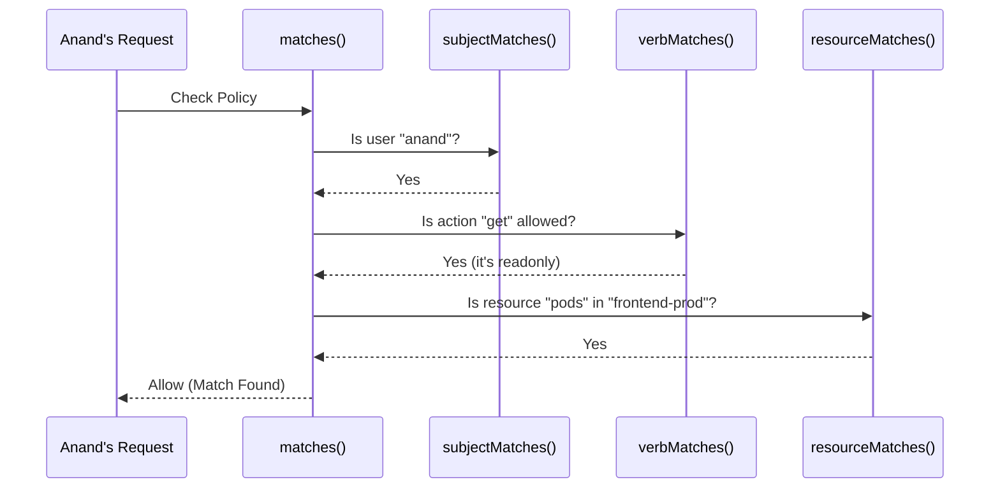

# Chapter 3: Attribute Matching Logic

In the [previous chapter](02_policy_list_authorizer_.md), we learned about the [Policy List Authorizer](02_policy_list_authorizer_.md), our security guard who scans a list of rules to make a decision. We saw that it uses a function called `matches` to check each rule one by one.

But we skipped over the details. How does the `matches` function *actually* work? How does it read one rule and decide if it applies to a specific request?

Welcome to the "fine print" of our authorization system. This is the **Attribute Matching Logic**.

### The Three Questions

Imagine a very specific rule on a permission slip:

> *"Staff members can enter the server room."*

If someone wants to get into a room, you have to check three separate things to see if this rule applies:
1.  **Is this person a staff member?** (The "Who")
2.  **Are they trying to *enter*?** (The "Action")
3.  **Is this room the *server room*?** (The "What")

If the answer to all three questions is "yes," then the rule matches, and they are allowed in. If even one answer is "no," this specific rule doesn't apply, and you'd have to look for another one.

This is exactly what our `matches` function does. It takes a request and a single policy, and it breaks the decision down into smaller, simpler questions.

### The Orchestrator: `matches()`

The main `matches` function doesn't do the hard work itself. It acts like a manager, delegating the checks to three specialist functions.

Here is a simplified look at the `matches` function from `authorizer/abac/abac.go`:

```go
// matches returns true if a policy matches the attributes of a request.
func matches(p abac.Policy, a authorizer.Attributes) bool {
    // 1. Does the "Who" match?
    if subjectMatches(p, a.GetUser()) {
        // 2. Does the "Action" match?
        if verbMatches(p, a) {
            // 3. Does the "What" match?
            if resourceMatches(p, a) || nonResourceMatches(p, a) {
                // If all three checks pass, it's a match!
                return true
            }
        }
    }
    // If any check failed, it's not a match.
    return false
}
```

This code is a clear roadmap. It first calls `subjectMatches`. If that passes, it calls `verbMatches`. If that *also* passes, it finally calls `resourceMatches`. Only if all three return `true` will the `matches` function as a whole return `true`.

Let's look at each of these specialist functions.

### 1. The "Who" Check: `subjectMatches`

This function checks if the user making the request is the same user (or in the same group) specified in the policy. It's like checking the name on an ID card.

Let's look at the logic inside `subjectMatches`:

```go
// subjectMatches checks if the user's name or group matches the policy.
func subjectMatches(p abac.Policy, user user.Info) bool {
    // If the policy is for a specific user...
    if len(p.Spec.User) > 0 {
        // ...and the user name is a wildcard or an exact match, it's a match.
        // Otherwise, it's a failure.
        return p.Spec.User == "*" || p.Spec.User == user.GetName()
    }

    // (Similar logic exists for checking the user's group)

    return false // No user or group was specified in the policy to check against
}
```

This is very straightforward:
*   **Policy:** `{ "user": "anand", ... }`
*   **Request from:** `anand` -> `subjectMatches` returns `true`.
*   **Request from:** `chloe` -> `subjectMatches` returns `false`.
*   **Policy:** `{ "user": "*", ... }` (The `*` is a wildcard meaning "any user")
*   **Request from:** `anand` or `chloe` -> `subjectMatches` returns `true`.

### 2. The "Action" Check: `verbMatches`

This function checks if the action being attempted (like `get`, `list`, `delete`) is allowed by the policy.

The logic here is simple. All policies allow `readonly` actions. If a more powerful action is requested (like `delete`), the policy must explicitly allow it.

```go
// verbMatches checks if the requested action is allowed by the policy.
func verbMatches(p abac.Policy, a authorizer.Attributes) bool {
    // If the request is for a read-only action (like 'get' or 'list'),
    // it's always allowed by any policy.
    if a.IsReadOnly() {
        return true
    }

    // If the request is for a write action (like 'delete'),
    // the policy must NOT be read-only.
    if !p.Spec.Readonly {
        return true
    }

    return false
}
```
*   **Policy:** `{ "readonly": true, ... }`
*   **Request to:** `get` (read-only) -> `verbMatches` returns `true`.
*   **Request to:** `delete` (write) -> `verbMatches` returns `false`.
*   **Policy:** `{ "readonly": false, ... }`
*   **Request to:** `delete` (write) -> `verbMatches` returns `true`.

### 3. The "What" Check: `resourceMatches`

Finally, this function checks if the resource being targeted (like `pods` in the `frontend-prod` namespace) is covered by the policy.

```go
// resourceMatches checks if the request's resource matches the policy.
func resourceMatches(p abac.Policy, a authorizer.Attributes) bool {
    // The request must be for a resource for this to match.
    if a.IsResourceRequest() {
        // Check if the namespace matches (or the policy has a wildcard '*')
        if p.Spec.Namespace == "*" || p.Spec.Namespace == a.GetNamespace() {
            // Check if the resource type matches (or the policy has a wildcard)
            if p.Spec.Resource == "*" || p.Spec.Resource == a.GetResource() {
                return true
            }
        }
    }
    return false
}
```

This logic checks each part of the resource definition (namespace, resource type, etc.) and allows for wildcards at each level.

*   **Policy:** `{ "namespace": "prod", "resource": "pods" }`
*   **Request for:** `pods` in `prod` namespace -> `resourceMatches` returns `true`.
*   **Request for:** `secrets` in `prod` namespace -> `resourceMatches` returns `false`.
*   **Request for:** `pods` in `dev` namespace -> `resourceMatches` returns `false`.

### Putting It All Together

Let's visualize the entire flow for a successful request.

**Scenario:** User `anand` tries to `get` (read) `pods` in the `frontend-prod` namespace. The system checks this against his policy: `{"user": "anand", "readonly": true, "resource": "pods", "namespace": "frontend-prod"}`.


Because all three specialist functions returned "Yes," the main `matches` function returns `true`, and the [Policy List Authorizer](02_policy_list_authorizer_.md) grants access.

### Conclusion

You've just seen the most detailed part of the decision-making process. The **Attribute Matching Logic** isn't one giant, complex function; it's a team of small, focused functions that each answer one simple question: does the who, what, or action match? This design makes the system easy to understand, test, and maintain.

We've seen how policies can match users, actions, and resources like `pods` in a `namespace`. But in a large, distributed system, you might have even more specific attributes. For example, what if a rule only applies to a specific server, or `node`, in your cluster? How does the system identify *which* node a request pertains to?

That's where our next concept comes in.

Next: [Node Identifier](04_node_identifier_.md)

---

Generated by [AI Codebase Knowledge Builder](https://github.com/The-Pocket/Tutorial-Codebase-Knowledge)