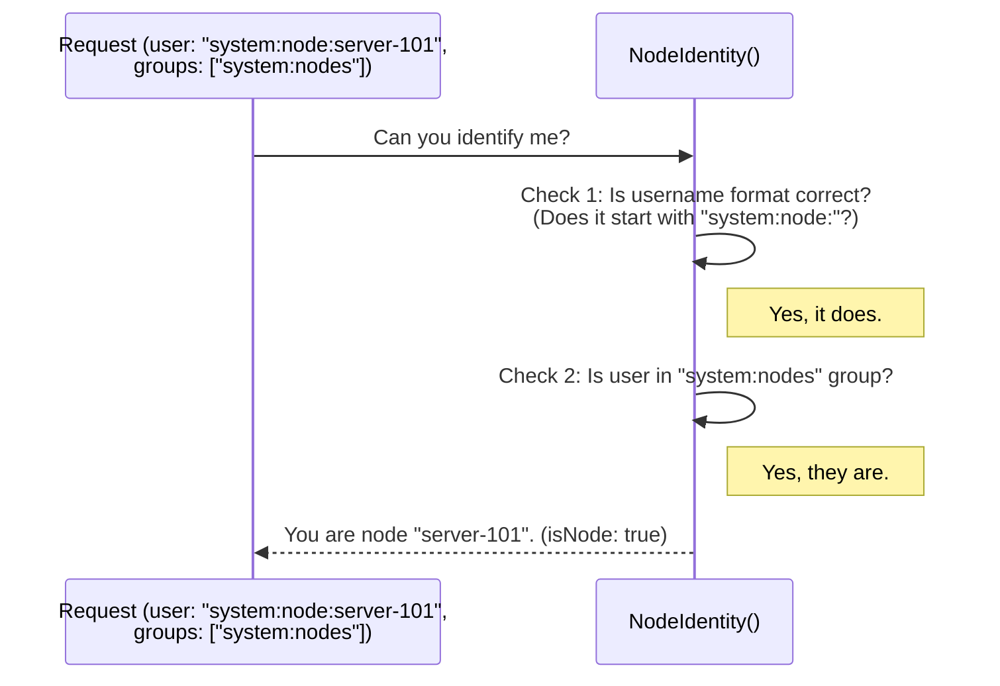

# Chapter 4: Node Identifier

In the [previous chapter](03_attribute_matching_logic_.md), we explored the fine-grained [Attribute Matching Logic](03_attribute_matching_logic_.md) that decides if a user's request matches a policy. We saw how it checks the "who," "what," and "action."

But what if the "who" isn't a human user like `anand` or `chloe`? In a large system like Kubernetes, automated components need permissions too. A critical example is the Kubelet, the agent that runs on every server (or "Node") in the cluster. How do we know a request is *truly* from the Kubelet on `node-A` and not from a malicious actor *pretending* to be it?

This is where the **Node Identifier** comes in. It's a specialized identity check, like a bouncer at a club who is trained specifically to spot and verify staff ID badges.

### The Bouncer for Staff IDs

Imagine our security guard from before. Most of the time, they check regular guest tickets. But sometimes, a staff member (like a technician or a performer) needs to get backstage. They don't have a guest ticket; they have a staff ID badge.

The bouncer needs a special procedure for this:
1.  **Check the badge format:** Does it look like a real staff badge? It must say "Staff: " followed by a name. A badge that just says "Bob" isn't valid.
2.  **Verify the name:** Is the name on the badge on the official staff list?

The Node Identifier does exactly this for requests inside our system. It checks if a request is coming from a trusted cluster node, and if so, it identifies exactly which node it is. This is crucial for security, as it prevents the Kubelet on one node from accessing or modifying things that belong to another node.

### How a Node is Identified

A "node" in our system has a very specific identity. For a request to be identified as coming from a node, it must meet two conditions, just like our staff ID example:

1.  **Group Membership:** The user must belong to the special group `system:nodes`. This is like being on the official staff list.
2.  **Username Format:** The username must follow a strict pattern: `system:node:<nodeName>`. This is like having a correctly formatted ID badge.

If both conditions are met, the Node Identifier confirms the request is from a node and extracts its name (the `<nodeName>` part). If either condition fails, it's treated as a regular request, not a node.

Let's see this in action:

*   **A valid node:** A request from user `system:node:server-101` who is in the `system:nodes` group.
    *   The Node Identifier would see this and say: "Yes, this is a node, and its name is `server-101`."

*   **A regular user:** A request from user `anand`.
    *   The Node Identifier would say: "No, this is not a node."

*   **An impersonator:** A request from user `system:node:server-101` who is *not* in the `system:nodes` group.
    *   The Node Identifier would say: "No, this is not a node." (They have a fake ID badge!).

### Under the Hood: The `NodeIdentifier` Interface

In the code, this concept is defined by a Go `interface`. An interface is like a contract: it says that any component that wants to be a "Node Identifier" must provide a specific function.

Here is the contract from `nodeidentifier/interfaces.go`:

```go
// NodeIdentifier determines node information from a given user
type NodeIdentifier interface {
	// NodeIdentity determines node information from the given user.Info.
	NodeIdentity(user.Info) (nodeName string, isNode bool)
}
```
This is simple and powerful. The contract requires one function, `NodeIdentity`:
*   **Input:** It takes the user's information (`user.Info`).
*   **Output 1:** It returns the `nodeName` as a string (e.g., `"server-101"`). This will be empty if it's not a node.
*   **Output 2:** It returns a boolean `isNode` which is `true` or `false`.

### The Default Implementation

The `auth` project provides a default implementation of this interface that performs the two checks we described. Let's trace how it works when a request comes in.



Now let's look at the simplified Go code from `nodeidentifier/default.go` that performs these steps.

**Step 1: Check the Username Prefix**

The first thing the function does is check if the username starts with the required `system:node:` prefix.

```go
// nodeUserNamePrefix is the prefix for usernames of nodes.
const nodeUserNamePrefix = "system:node:"

func (d defaultNodeIdentifier) NodeIdentity(u user.Info) (string, bool) {
	userName := u.GetName()
	// Check if the username starts with the right prefix.
	if !strings.HasPrefix(userName, nodeUserNamePrefix) {
		return "", false // If not, it's definitely not a node.
	}
    // ... continue to the next check
```
If the username doesn't even have the right format, the function stops immediately and returns `false`.

**Step 2: Check the Group Membership**

If the username format is correct, the function then checks if the user belongs to the `system:nodes` group.

```go
    // Check if the user is in the "system:nodes" group.
	isNode := false
	for _, group := range u.GetGroups() {
		if group == user.NodesGroup { // user.NodesGroup is "system:nodes"
			isNode = true
			break // Found it! No need to check other groups.
		}
	}
	if !isNode {
		return "", false // Not in the group, so not a node.
	}
    // ... continue to the final step
```
This code loops through all the groups the user belongs to. If it finds `system:nodes`, it marks the check as successful and continues. Otherwise, it fails.

**Step 3: Extract the Name and Return Success**

If both checks have passed, the function knows it's a valid node. The final step is to extract the node's actual name from the username string and return success.

```go
    // Both checks passed! Extract the name.
	nodeName := strings.TrimPrefix(userName, nodeUserNamePrefix)
	return nodeName, true
}
```
`strings.TrimPrefix` simply removes the `system:node:` part, leaving just the name (e.g., `"server-101"`). The function returns this name along with `true`.

### Conclusion

You've just learned about the **Node Identifier**, a critical security component that acts as a specialized verifier for system-level identities. By checking for a specific username format and group membership, it ensures that automated components (nodes) can be trusted and cannot impersonate one another. This is a powerful example of how authorization isn't just for human users.

So far, we have covered how authorization rules are defined in [ABAC Policies](01_abac_policy_.md), how a list of them is checked by the [Policy List Authorizer](02_policy_list_authorizer_.md), and how we handle special identities. But we've been assuming that these policies are already loaded into our program. How do they get from a file on the disk into a format the authorizer can use?

That's the job of our next component.

Next: [Policy File Loader](05_policy_file_loader_.md)

---

Generated by [AI Codebase Knowledge Builder](https://github.com/The-Pocket/Tutorial-Codebase-Knowledge)