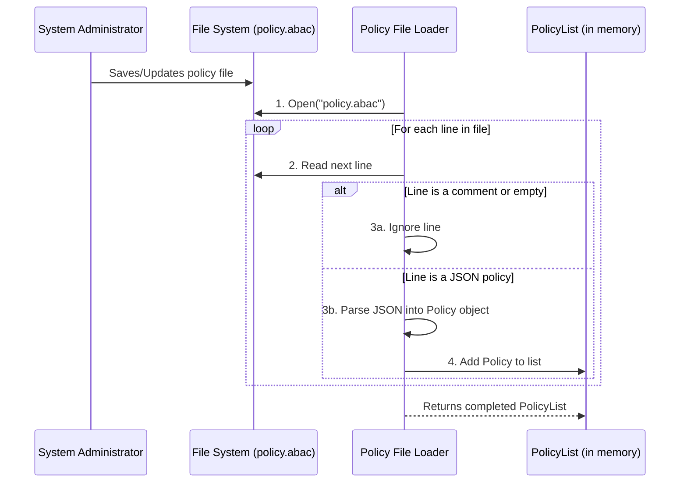

# Chapter 5: Policy File Loader

In the [previous chapter](04_node_identifier_.md), we saw how the [Node Identifier](04_node_identifier_.md) provides a secure way to verify requests from automated components like the Kubelet. We now understand all the individual pieces of our authorization engine: policies, lists, matching logic, and special identities.

But we've been working with a major assumption: that these policies are already loaded and available inside our program. How do they get there? If a system administrator needs to add a new rule, do they have to re-write the code and restart the whole application?

Absolutely not! That would be slow and inefficient. This is where the **Policy File Loader** comes in. It's the component responsible for getting our rules from a simple text file on the disk into the hands of our authorizer.

### The Office Manager and the Rulebook

Think of our [Policy List Authorizer](02_policy_list_authorizer_.md) as the company's official "Rulebook." It contains every permission for every employee. The Policy File Loader is the diligent office manager whose job is to keep this rulebook up to date.

Imagine an administrator leaves a memo on the office manager's desk. The memo is a simple text file (`policy.abac`) with a list of new rules.

The office manager's job is to:
1.  **Pick up the memo** (open the file).
2.  **Read each rule, one by one** (read the file line by line).
3.  **Ignore scribbles and blank spaces** (skip comments and empty lines).
4.  **Type each valid rule neatly into the official Rulebook** (parse the JSON text and add it to the in-memory `PolicyList`).

This process allows the administrator to change the company's rules just by updating a simple text document, without having to reprint the entire rulebook from scratch. The Policy File Loader provides this exact flexibility to our authorization system.

### The Policy File Format

The "memo" our loader reads is just a plain text file. By convention, it might be named `policy.abac` or `abac-policy.jsonl`. Its format is very simple:
*   Each line contains one authorization policy in JSON format.
*   Lines that start with a `#` are treated as comments and are ignored.
*   Blank lines are also ignored.

Here’s what a typical policy file might look like:

```text
# This file defines authorization rules for our application.

# Grant the developer 'anand' read-only access to pods in the frontend.
{"user": "anand", "readonly": true, "resource": "pods", "namespace": "frontend-prod"}

# Grant the admin 'chloe' full access to the backend.
{"user": "chloe", "readonly": false, "resource": "*", "namespace": "backend-prod"}
```

This format is easy for both humans and computers to read. An administrator can open this file, add a new line for a new user, and save it. The next time the authorizer is initialized, it will include the new rule.

### Under the Hood: From File to `PolicyList`

The magic of the loader happens in a single function: `NewFromFile`. This function orchestrates the entire process of reading the file and building the `PolicyList` that our authorizer will use.

Let's visualize the process from start to finish.



The loader systematically goes through the file, filtering out what it doesn't need and carefully converting each valid line into a structured `Policy` object, which it then adds to our final list.

### A Look at the Code

Let's break down the Go code for the `NewFromFile` function in `authorizer/abac/abac.go`. We'll look at it piece by piece.

**1. Opening the File**

The first step is the simplest: open the specified policy file from the disk.

```go
// NewFromFile attempts to create a policy list from the given file.
func NewFromFile(path string) (PolicyList, error) {
    // Attempt to open the file at the given path.
    file, err := os.Open(path)
    if err != nil {
        return nil, err
    }
    // `defer` ensures the file is closed when the function finishes.
    defer file.Close()

    // ... continue to read the file
```
This is standard Go for file handling. If the file can't be opened (e.g., it doesn't exist), it returns an error.

**2. Setting Up the Loop**

Next, we prepare to read the file line by line using a `scanner` and create an empty `PolicyList` to store our results.

```go
    // A scanner is an efficient tool for reading text line-by-line.
    scanner := bufio.NewScanner(file)
    // Create an empty list that we will fill with policies.
    pl := make(PolicyList, 0)

    // Loop through the file until there are no more lines.
    for scanner.Scan() {
        // ... process each line inside this loop
    }
```

**3. Skipping Comments and Blank Lines**

Inside the loop, for each line we read, the first thing we do is check if it's a comment or just empty.

```go
        // Get the current line's content.
        b := scanner.Bytes()

        // Trim whitespace from the line to check it properly.
        trimmed := strings.TrimSpace(string(b))
        if len(trimmed) == 0 || strings.HasPrefix(trimmed, "#") {
            continue // If it's empty or a comment, skip to the next line.
        }
```
The `continue` keyword tells the loop to stop processing the current line and jump straight to the next one.

**4. Parsing the JSON Policy**

If a line isn't a comment or blank, it must be a policy. Now the loader must parse the JSON text into a Go `Policy` struct.

```go
        p := &abac.Policy{} // Create a new, empty policy object.

        // The decoder converts the line of text (b) into our Policy struct (p).
        // It's smart enough to handle different versions of the policy format.
        decodedObj, _, err := decoder.Decode(b, nil, nil)
        if err != nil {
            // Handle any parsing errors.
        }
        
        // Add the successfully parsed policy to our list.
        pl = append(pl, decodedObj.(*abac.Policy))
```
This is the core of the loader. It takes a line of text like `{"user": "anand", ...}` and transforms it into the structured `Policy` object that the [Attribute Matching Logic](03_attribute_matching_logic_.md) can understand. The final step is to `append` this new policy to our growing `PolicyList`.

After the loop finishes, the now-populated `PolicyList` is returned, ready to be used by the authorizer.

### Conclusion

Congratulations! You have reached the end of our journey through the `auth` project.

We started with the smallest possible unit, the single [ABAC Policy](01_abac_policy_.md). We saw how a collection of these policies is managed and checked by the [Policy List Authorizer](02_policy_list_authorizer_.md). We then dove deep into the precise [Attribute Matching Logic](03_attribute_matching_logic_.md) that powers every decision. We learned how special system identities are verified by the [Node Identifier](04_node_identifier_.md).

Finally, with this chapter, you saw how the entire system is initialized by the **Policy File Loader**, the bridge between a simple configuration file on disk and a powerful, live authorization engine.

You now have a complete, end-to-end understanding of how this ABAC authorizer works. From a single line in a text file to a final "Allow" or "Deny" decision, you've seen all the critical components and how they fit together to create a flexible and effective security system.

---

Generated by [AI Codebase Knowledge Builder](https://github.com/The-Pocket/Tutorial-Codebase-Knowledge)