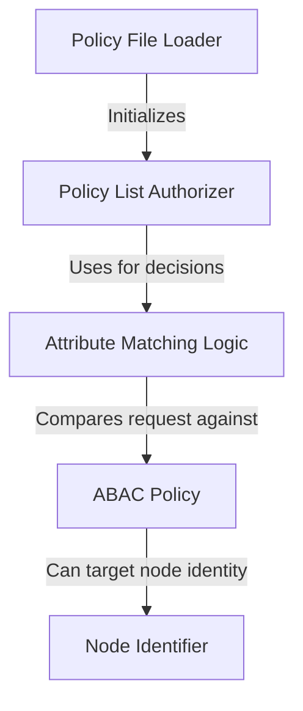

# Tutorial: auth

This project provides an *authorization* system for Kubernetes using **Attribute-Based Access Control (ABAC)**. It works like a security guard checking a list of rules to decide if a request is allowed. These rules, called *policies*, are loaded from a simple text file, making it easy to configure who can access what resources. The project also includes a specialized component to specifically identify requests coming from cluster *nodes* (like Kubelets), ensuring they only get the permissions they need.

**Source Repository:** [None](None)

## Chapters

1. [ABAC Policy
](01_abac_policy_.md)
2. [Policy List Authorizer
](02_policy_list_authorizer_.md)
3. [Attribute Matching Logic
](03_attribute_matching_logic_.md)
4. [Node Identifier
](04_node_identifier_.md)
5. [Policy File Loader
](05_policy_file_loader_.md)

---

Generated by [AI Codebase Knowledge Builder](https://github.com/The-Pocket/Tutorial-Codebase-Knowledge)