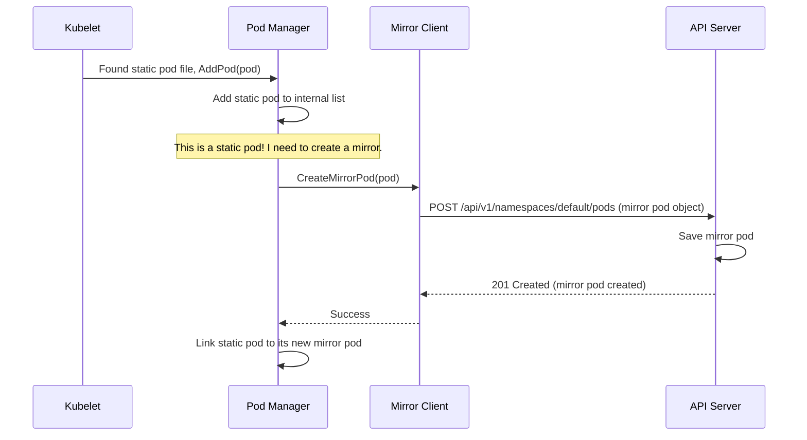

# Chapter 1: Pod Manager

Welcome to our deep dive into the Kubelet! If you've ever wondered how a Kubernetes node knows which Pods to run, you're in the right place. The Kubelet is the primary "node agent" that makes it all happen, and we're going to explore its internal machinery, piece by piece.

In this first chapter, we'll start with the brain of the Kubelet's pod operations: the **Pod Manager**.

### What's the Big Idea?

Imagine you have a critical logging agent that needs to run on *every single node* in your cluster. You need this agent to start up with the node and keep running, even if the node temporarily loses connection to the Kubernetes control plane (the API server).

How can the Kubelet on a node know to run this pod if it can't ask the API server?

This is where **Static Pods** come in. A static pod is just a regular pod defined in a YAML file that you place in a special directory on the node itself. The Kubelet watches this directory and runs any pods it finds.

But this creates a new problem: If the Kubelet is managing this pod all by itself, how does the rest of the cluster know it exists? How can you use `kubectl get pods` to see if your logging agent is running?

The **Pod Manager** is the component that solves this puzzle. It acts as the Kubelet's central "address book" for pods and has a clever trick up its sleeve for handling static pods.

### The Pod Manager's Two Main Jobs

Think of the Pod Manager as a librarian for pods on a single node. Its responsibilities are simple but crucial:

1.  **Keep the Authoritative List**: It maintains the definitive in-memory list of all pods that are *supposed* to be running on its node. It learns about these pods from a few sources:
    *   The **API server** (the most common way).
    *   A **local directory** of static pod files (our logging agent example).
    *   An **HTTP endpoint** serving pod manifests.

2.  **Create "Reflections" for Static Pods**: For every static pod it manages, the Pod Manager creates a special "mirror pod" object on the API server.

#### What is a Mirror Pod?

A mirror pod is a read-only "reflection" of a static pod that lives on the API server. It allows tools like `kubectl` and other cluster components to *see* the static pod, even though they can't control it.

Here’s a simple analogy:
*   A **static pod** is like your personal, physical diary. It's private to you (the Kubelet), and you are the only one who can write in it.
*   A **mirror pod** is like a public blog post where you share what you wrote in your diary. People can read your blog post (view the pod with `kubectl`), but they can't change your original diary entry by editing the blog post. If you try to delete the blog post (`kubectl delete pod ...`), the Kubelet will just create it again, because the source of truth (the diary) still exists.

### A Walkthrough: From Static File to `kubectl`

Let's follow our logging agent pod to see the Pod Manager in action.

1.  **Discovery**: The Kubelet starts and scans a directory like `/etc/kubernetes/manifests`. It finds a file named `logging-agent.yaml`.
2.  **Registration**: The Kubelet passes this pod definition to the Pod Manager. The Pod Manager adds the `logging-agent` pod to its internal list of "pods to run."
3.  **Mirroring**: The Pod Manager recognizes this is a *static pod*. It then asks a helper component to create a corresponding `mirror pod` on the API server. This mirror pod will have a special annotation identifying it as a mirror.
4.  **Visibility**: Now, if you run `kubectl get pods`, you will see a pod named something like `logging-agent-node1`. The cluster sees it!
5.  **Status Updates**: When the Kubelet successfully runs the logging agent's containers, the [Status Manager](06_status_manager_.md) will report its status (e.g., `Running`). This status is updated on the *mirror pod* object in the API server, so you always have an accurate view.

This entire flow can be visualized like this:



### A Peek at the Code

You don't need to understand every line of Go to see how this works. Let's look at a few key pieces.

#### The `Manager` Contract

In `pod/pod_manager.go`, we find the `Manager` interface. An interface is like a job description—it defines *what* a Pod Manager must do, but not *how*.

```go
// pod/pod_manager.go

// Manager stores and manages access to pods...
type Manager interface {
	// AddPod adds the given pod to the manager.
	AddPod(pod *v1.Pod)

	// GetPods returns the regular pods bound to the kubelet and their spec.
	GetPods() []*v1.Pod

	// GetMirrorPodByPod returns the mirror pod for the given static pod...
	GetMirrorPodByPod(*v1.Pod) (*v1.Pod, bool)
	
    // ... other important functions
}
```

This tells us any Pod Manager must be able to add a pod (`AddPod`), list all the pods it's managing (`GetPods`), and find the mirror pod for a given static pod (`GetMirrorPodByPod`).

#### The Pod "Address Book"

The actual implementation, `basicManager`, uses a few maps to keep track of everything. Think of these like different indexes in a book, letting you find pods quickly.

```go
// pod/pod_manager.go

type basicManager struct {
	// Protects all internal maps.
	lock sync.RWMutex

	// Real pods (static and API-server based) indexed by a unique ID.
	podByUID map[kubetypes.ResolvedPodUID]*v1.Pod
	
    // Mirror pods indexed by a unique ID.
	mirrorPodByUID map[kubetypes.MirrorPodUID]*v1.Pod

	// Maps to link static and mirror pods together.
	podByFullName       map[string]*v1.Pod
	mirrorPodByFullName map[string]*v1.Pod
}
```

*   `podByUID`: This holds all the "real" pods that the Kubelet needs to run.
*   `mirrorPodByUID`: This holds all the "mirror" pods that have been created on the API server.
*   The `...ByFullName` maps are the key to linking them. A static pod and its mirror share the same name and namespace, allowing the Pod Manager to easily find one when it has the other.

#### Creating the Mirror

The Pod Manager doesn't talk to the API server directly. It delegates that job to a `MirrorClient`. Here is a simplified look at how the client creates a mirror pod.

```go
// pod/mirror_client.go

func (mc *basicMirrorClient) CreateMirrorPod(pod *v1.Pod) error {
	// 1. Make a copy of the pod object.
	copyPod := *pod
	copyPod.Annotations = make(map[string]string)
	// ... copy existing annotations

	// 2. Add the special annotation that marks it as a mirror pod.
	hash := getPodHash(pod)
	copyPod.Annotations[kubetypes.ConfigMirrorAnnotationKey] = hash

	// 3. Tell the API server to create this new pod object.
	_, err := mc.apiserverClient.CoreV1().Pods(copyPod.Namespace).Create(
		context.TODO(), &copyPod, metav1.CreateOptions{})
	
	return err
}
```

The logic is straightforward: take the static pod, add a special `ConfigMirrorAnnotationKey` to its metadata, and ask the API server to create it. It's that simple!

### Conclusion

The Pod Manager is the Kubelet's source of truth. It answers the fundamental question: "What pods should be running on this node right now?" It keeps an organized list of pods from all sources and uses the elegant "mirror pod" mechanism to make sure that even locally-managed static pods are visible to the entire cluster.

Now that the Pod Manager has established *what* needs to run, how does the Kubelet actually start the containers and manage their lifecycle? That's the job of our next component.

Next, we'll explore how the Kubelet acts on the Pod Manager's list in [Chapter 2: Pod Workers](02_pod_workers_.md).

---

Generated by [AI Codebase Knowledge Builder](https://github.com/The-Pocket/Tutorial-Codebase-Knowledge)