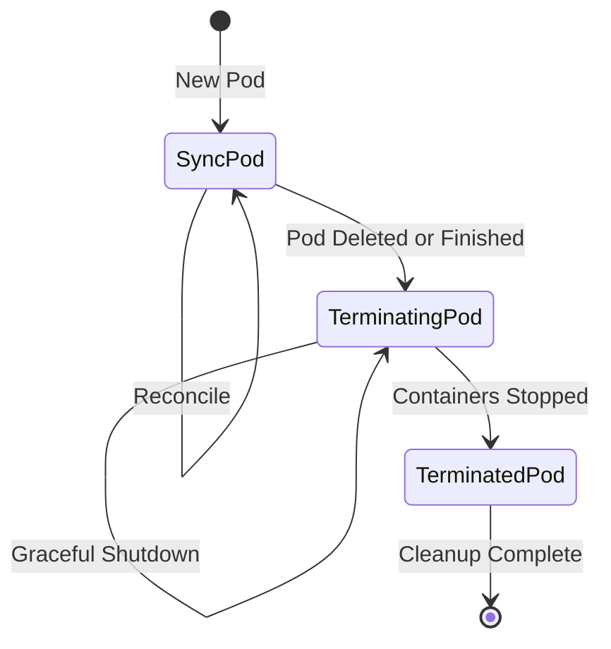
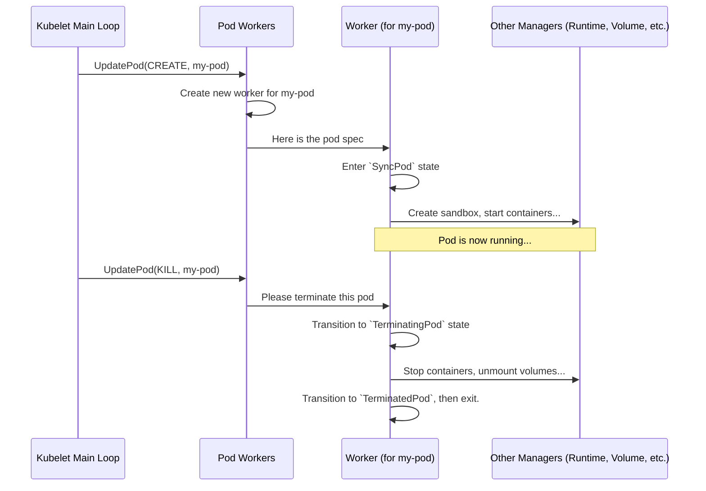

# Chapter 2: Pod Workers

In the [previous chapter](01_pod_manager_.md), we learned how the [Pod Manager](01_pod_manager_.md) acts as the Kubelet's "address book," keeping a definitive list of which pods are supposed to run on the node.

But a list is just a list. How does the Kubelet take that list and turn it into actual running containers? And how does it handle changes, like when a pod needs to be updated or deleted, without causing chaos?

This is where **Pod Workers** come in.

### What's the Big Idea?

Imagine you're a foreman at a construction site (the Kubelet). You have blueprints for several different houses (Pods) that need to be built on your land (the Node).

You wouldn't have all your construction crews work on all the houses at once, randomly switching between laying the foundation for House A and painting the walls of House B. That would be a recipe for disaster! Instead, you assign a dedicated crew to each house.

*   **Crew A** is responsible only for **House A**.
*   **Crew B** is responsible only for **House B**.

Each crew follows the blueprints for its assigned house step-by-step: lay the foundation, build the frame, install plumbing, and so on. If you decide to demolish House A, you tell Crew A, and they handle the demolition process in the correct, safe order.

**Pod Workers are these dedicated crews.** For every pod that needs to run on the node, the Kubelet assigns a special, dedicated "worker" (a goroutine, which is like a lightweight thread in Go). This worker is the single point of contact for all lifecycle operations on that pod, ensuring everything happens sequentially and safely.

### Why Do We Need This? It's All About Order.

The Pod Workers system prevents a classic problem in computing called a **race condition**.

Let's say the Kubelet receives two commands for the same pod at nearly the same time:
1.  **CREATE:** "Start the pod `my-app-pod`!"
2.  **DELETE:** "Stop and remove the pod `my-app-pod`!"

Without a dedicated worker, the Kubelet might start creating the pod's network, then get interrupted by the delete command and start tearing it down, while another part is still trying to pull the container image. This conflict would lead to errors and an unpredictable state.

The Pod Worker solves this by processing updates for a single pod in a First-In, First-Out (FIFO) queue. The "create" request is handled to completion before the "delete" request is even considered.

### The Pod Worker State Machine

Each worker manages its pod by moving it through a simple state machine. Think of it as the pod's lifecycle journey on the node.



1.  **`SyncPod` (The "Running" State)**: When a pod is first created, its worker enters this state. The worker's job is to make the real world match the pod's specification (`spec`). It will:
    *   Create the pod's sandbox (network namespace, etc.).
    *   Mount any necessary volumes using the [Volume Manager](04_volume_manager_.md).
    *   Start the containers using the [Container Runtime Manager](03_container_runtime_manager_.md).
    The worker stays in this state, periodically "syncing" to make sure everything is still running as expected.

2.  **`TerminatingPod` (The "Shutting Down" State)**: If the pod is deleted or its containers finish their job (for non-restarting pods), the worker transitions here. Its job is to gracefully shut everything down:
    *   Send a termination signal (SIGTERM) to the containers.
    *   Wait for a grace period.
    *   If containers don't stop, forcefully kill them (SIGKILL).

3.  **`TerminatedPod` (The "Cleaned Up" State)**: Once all containers are stopped, the worker enters the final state. Here, it performs final cleanup:
    *   Unmount volumes.
    *   Release the network resources.

By following these states in order, the Pod Worker guarantees a smooth and predictable lifecycle for every pod.

### A Walkthrough: A Pod's Life and Death

Let's see how the main components work together when a new pod is created and then deleted.

1.  **Update Arrives**: The Kubelet receives an instruction to create a pod. It calls `UpdatePod` on the Pod Workers system.
2.  **Worker Assigned**: The `podWorkers` system checks if a worker already exists for this pod's unique ID (UID). Since it's a new pod, it creates a new worker (spawns a new goroutine) and gives it the pod's details.
3.  **Syncing the Pod**: The new worker starts its loop in the `SyncPod` state. It calls the main `syncPod` function.
4.  **Delegating Work**: The `syncPod` function doesn't do everything itself. It acts as a coordinator, calling other Kubelet managers to perform specific tasks:
    *   It asks the [Container Runtime Manager](03_container_runtime_manager_.md) to create the containers.
    *   It asks the [Volume Manager](04_volume_manager_.md) to attach and mount volumes.
    *   It asks the [Status Manager](06_status_manager_.md) to report that the pod is now `Running`.
5.  **Deletion Arrives**: Sometime later, a user runs `kubectl delete pod`. The Kubelet receives this and calls `UpdatePod` again, this time with a "kill" instruction.
6.  **Terminating the Pod**: The dedicated worker for that pod receives the "kill" update. It transitions to the `TerminatingPod` state and begins the shutdown sequence, again delegating to the other managers to stop containers and unmount volumes.

This flow ensures that all actions for a single pod happen in a controlled, sequential manner.



### A Peek at the Code

Let's look at the key pieces of code that make this happen.

#### The `PodWorkers` Interface

The main entry point is the `PodWorkers` interface, which defines the contract. The most important function is `UpdatePod`.

```go
// pkg/kubelet/pod_workers.go

// PodWorkers is an abstract interface for testability.
type PodWorkers interface {
	// UpdatePod notifies the pod worker of a change to a pod...
	UpdatePod(options UpdatePodOptions)
    // ... other helper functions
}
```
This is simple: there's one primary way to send work to the system.

#### Sending an Update

When another part of the Kubelet calls `UpdatePod`, it bundles the pod's details and the type of change into an `UpdatePodOptions` struct.

```go
// pkg/kubelet/pod_workers.go

type UpdatePodOptions struct {
	// The type of update (create, update, sync, kill).
	UpdateType kubetypes.SyncPodType
	// Pod to update. Required.
	Pod *v1.Pod
	// ... other options
}
```

The `UpdatePod` function then finds the correct worker (or creates one) and sends a message to its private channel, waking it up to process the new information.

```go
// pkg/kubelet/pod_workers.go

func (p *podWorkers) UpdatePod(options UpdatePodOptions) {
	// ... find or create a 'status' object for the pod UID ...
	
	// Get the update channel for this specific pod's worker.
	podUpdates, exists := p.podUpdates[uid]
	if !exists {
		// If it's the first time, create the channel and start the worker goroutine.
		podUpdates = make(chan struct{}, 1)
		p.podUpdates[uid] = podUpdates
		go p.podWorkerLoop(uid, podUpdates) // This starts the dedicated crew!
	}
	
	// ... store the update details ...

	// Send a signal on the channel to wake up the worker.
	select {
	case podUpdates <- struct{}{}:
	default:
	}
}
```
This code is the dispatcher. It finds the right "crew" and hands them their next task.

#### The Worker's Loop

Each worker runs in its own `podWorkerLoop`. This loop waits for a signal from the `podUpdates` channel, then processes the work according to its current state (`SyncPod`, `TerminatingPod`, etc.).

```go
// pkg/kubelet/pod_workers.go

func (p *podWorkers) podWorkerLoop(podUID types.UID, podUpdates <-chan struct{}) {
	// This loop runs forever for this one pod until it's terminated.
	for range podUpdates {
		// 1. Get the latest update and the pod's current state.
		ctx, update, ... := p.startPodSync(podUID)

		// 2. Decide what to do based on the state.
		switch update.WorkType {
		case TerminatedPod:
			err = p.podSyncer.SyncTerminatedPod(...)
		case TerminatingPod:
			err = p.podSyncer.SyncTerminatingPod(...)
		default: // SyncPod
			isTerminal, err = p.podSyncer.SyncPod(...)
		}

		// 3. Handle results and wait for the next update.
	}
}
```
This is the heart of the worker. It's a simple, powerful loop: **Wait -> Act -> Wait**. This structure guarantees that all actions for a single pod are handled one at a time.

### Conclusion

The **Pod Workers** system is the Kubelet's engine for safe and orderly pod lifecycle management. By assigning a dedicated worker to each pod, it prevents race conditions and ensures that pods transition smoothly from creation to termination. Each worker acts as a state machine, moving its pod through the `Sync`, `Terminating`, and `Terminated` states in a predictable way.

The worker itself is a coordinator. It knows *what* needs to be done and in *what order*, but it relies on other specialists to do the heavy lifting. In the next chapter, we'll meet the most important of these specialists.

Next, we'll dive into the component that actually creates and manages containers: the [Chapter 3: Container Runtime Manager](03_container_runtime_manager_.md).

---

Generated by [AI Codebase Knowledge Builder](https://github.com/The-Pocket/Tutorial-Codebase-Knowledge)