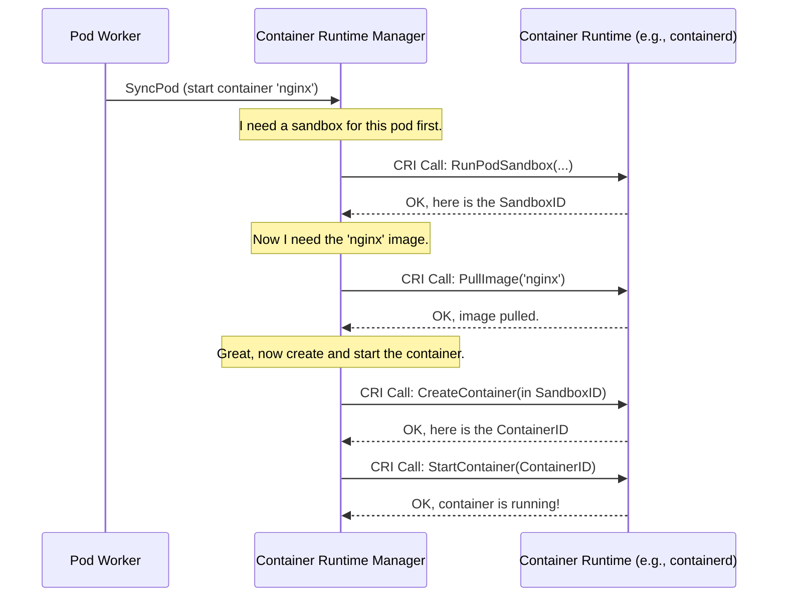

# Chapter 3: Container Runtime Manager

In the [previous chapter](02_pod_workers_.md), we saw how the [Pod Workers](02_pod_workers_.md) act like dedicated foremen, taking the blueprint for a Pod and deciding what needs to be done: "create a network sandbox," "start this container," "stop that container."

But this raises a question: how does the Kubelet *actually* do these things? Kubernetes is famously flexible and can work with different container runtimes like `containerd` or `CRI-O`. How can the Kubelet give orders without needing to know the specific language of each runtime?

This is the job of the **Container Runtime Manager**.

### What's the Big Idea?

Let's stick with our construction site analogy. The [Pod Worker](02_pod_workers_.md) is the architect who provides the high-level plan: "We need to build a two-story house with plumbing and electricity."

The **Container Runtime Manager** is the **general contractor**. The contractor doesn't personally lay bricks or wire outlets. Instead, they take the architect's plan and translate it into specific work orders for the subcontractors:
*   They tell the **plumber** (`containerd`): "Install the pipes according to these specs."
*   They tell the **electrician** (`CRI-O`): "Run the wiring as shown in this diagram."

The general contractor doesn't need to know how to solder a pipe or bend a conduit. They just need to know how to speak the universal language of construction contracts to get the job done.

This "universal language" in Kubernetes is called the **Container Runtime Interface (CRI)**.

### The Universal Language: CRI

The Container Runtime Interface (CRI) is a standard protocol—a set of rules and commands—that defines how the Kubelet talks to any container runtime. It's a gRPC API that includes commands like:

*   `RunPodSandbox`: "Create a secure environment for a Pod."
*   `PullImage`: "Download this container image."
*   `CreateContainer`: "Prepare a container using this image and configuration."
*   `StartContainer`: "Run the container you just created."

Any container runtime that wants to be used by Kubernetes must implement this CRI. This brilliant design means the Kubelet's Container Runtime Manager only needs to learn one language (CRI), and it can then "talk" to any compatible runtime. It completely abstracts away the specific details of `containerd`, `CRI-O`, or any other runtime.

### A Walkthrough: From Blueprint to Running Container

Let's follow a request from a Pod Worker to see the Container Runtime Manager in action.

**The Goal:** Start an `nginx` container for `my-web-pod`.

1.  **Get the Sandbox Ready**: Before we can run a container, we need a **sandbox**. A sandbox provides the isolated environment for the entire Pod, including its own IP address and network namespace. All containers in the Pod will live inside this sandbox, sharing its network.
    *   The Manager translates the Pod's specification into a `RunPodSandbox` request and sends it to the container runtime via CRI.

2.  **Pull the Image**: Next, we need the container image.
    *   The Manager sends a `PullImage` request for `nginx:latest` to the runtime.

3.  **Create and Start the Container**: With the sandbox and image ready, it's time to run the container.
    *   The Manager sends a `CreateContainer` request, providing all the container-specific details from the Pod spec (command, environment variables, volume mounts, etc.).
    *   Once the container is created, the Manager sends a final `StartContainer` request.

This entire conversation happens using CRI, as shown below:



### A Peek at the Code

The main implementation for this is the `kubeGenericRuntimeManager`. Let's see how it works.

#### The Manager and its "Phones"

The `kubeGenericRuntimeManager` has two very important fields: `runtimeService` and `imageService`. Think of these as two different phone lines for talking to the container runtime—one for managing containers and sandboxes, and one for managing images.

```go
// kuberuntime/kuberuntime_manager.go

type kubeGenericRuntimeManager struct {
    // ... other fields ...

    // gRPC service clients that speak the CRI protocol.
    runtimeService internalapi.RuntimeService
    imageService   internalapi.ImageManagerService

    // ... other fields ...
}
```

*   `runtimeService`: Handles sandbox and container lifecycle (start, stop, etc.).
*   `imageService`: Handles image lifecycle (pull, list, remove).

These "services" are just clients that make gRPC calls, which is the technology behind CRI.

#### Making the Call: Creating a Sandbox

Let's look at a simplified version of how the manager creates a pod sandbox. You'll see a clear pattern: **Translate, then Execute**.

```go
// kuberuntime/kuberuntime_sandbox.go

// Simplified version of createPodSandbox
func (m *kubeGenericRuntimeManager) createPodSandbox(ctx context.Context, pod *v1.Pod, attempt uint32) (string, error) {
    // 1. TRANSLATE the Kubernetes Pod spec into a CRI sandbox configuration.
    podSandboxConfig, err := m.generatePodSandboxConfig(pod, attempt)
    // ... handle error ...

    // 2. EXECUTE the call by sending the CRI message to the runtime.
    podSandBoxID, err := m.runtimeService.RunPodSandbox(ctx, podSandboxConfig, "")
    // ... handle error ...

    return podSandBoxID, nil
}
```

The `generatePodSandboxConfig` function is the translator. It reads the `v1.Pod` object and creates a `PodSandboxConfig` message that the runtime can understand. Then, `runtimeService.RunPodSandbox` makes the actual network call.

#### Making the Call: Pulling an Image

The pattern is the same for pulling an image.

```go
// kuberuntime/kuberuntime_image.go

func (m *kubeGenericRuntimeManager) PullImage(ctx context.Context, image kubecontainer.ImageSpec, ...) (string, error) {
    // 1. TRANSLATE Kubelet's image spec to a CRI image spec.
    imgSpec := toRuntimeAPIImageSpec(image)

    // 2. EXECUTE the call using the image service "phone line".
    imageRef, err := m.imageService.PullImage(ctx, imgSpec, ...)
    if err != nil {
        klog.ErrorS(err, "Failed to pull image", "image", image.Image)
        return "", err
    }

    return imageRef, nil
}
```

#### Making the Call: Starting a Container

Starting a container is the most complex operation, but it follows the same principles.

```go
// kuberuntime/kuberuntime_container.go

// A very simplified view of startContainer
func (m *kubeGenericRuntimeManager) startContainer(ctx context.Context, podSandboxID string, ...) (string, error) {
    // (A real pull happens before this, but we'll skip it for simplicity)

    // 1. TRANSLATE the Pod and Container specs into a CRI container config.
    containerConfig, _, err := m.generateContainerConfig(...)
    // ... handle error ...

    // 2. EXECUTE: Create the container first.
    containerID, err := m.runtimeService.CreateContainer(ctx, podSandboxID, containerConfig, ...)
    // ... handle error ...
    
    // 3. EXECUTE: Now start it.
    err = m.runtimeService.StartContainer(ctx, containerID)
    // ... handle error ...
    
    return "", nil
}
```
The `generateContainerConfig` function does the heavy lifting of translating everything—commands, arguments, environment variables, and volume mounts—into the universal CRI format.

### Conclusion

The **Container Runtime Manager** is the Kubelet's diplomat and translator. By speaking the common language of the Container Runtime Interface (CRI), it acts as a crucial abstraction layer. It takes high-level goals from other Kubelet components like the [Pod Workers](02_pod_workers_.md) and turns them into concrete, actionable commands for whatever container runtime is installed on the node. This allows Kubernetes to remain flexible and support a wide ecosystem of runtimes without changing its core logic.

We've seen how the manager creates sandboxes and containers. But where does the container's data live? How does a Pod get access to persistent storage? That's the job of our next component.

Next, we'll explore how data gets attached and mounted for our containers in [Chapter 4: Volume Manager](04_volume_manager_.md).

---

Generated by [AI Codebase Knowledge Builder](https://github.com/The-Pocket/Tutorial-Codebase-Knowledge)