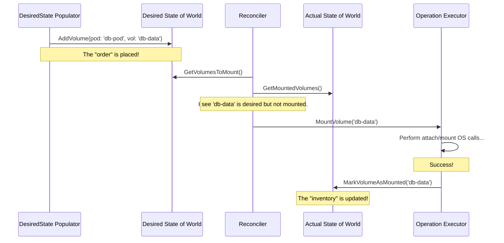

# Chapter 4: Volume Manager

In the [previous chapter](03_container_runtime_manager_.md), we saw how the [Container Runtime Manager](03_container_runtime_manager_.md) acts as a general contractor, translating Kubelet's plans into running containers. But what about a container's data? If you run a database in a Pod, you don't want its data to disappear when the Pod restarts. You need a way to connect persistent storage to it.

How does the Kubelet ensure that a network disk is attached to the node and its filesystem is made available inside the correct container *before* the container's process starts?

This critical task belongs to the **Volume Manager**.

### What's the Big Idea?

Imagine the Kubelet is a manager of a high-tech warehouse. The [Pod Workers](02_pod_workers_.md) are like department supervisors who get orders for what needs to be built (Pods).

The **Volume Manager** is the **logistics expert** for this warehouse. When a supervisor says, "I need to assemble a 'database robot' (a Pod), and it requires a specific power source (a network volume) from our central supply," the Volume Manager takes over the storage part of the job.

The Volume Manager's entire job is to make sure the right supplies (volumes) are delivered to the right assembly stations (Pods) exactly when they're needed. It does this by constantly comparing two lists:

1.  **The Order List (Desired State):** A list of all volumes that *should* be attached and mounted on this node, based on the pods scheduled here.
2.  **The Inventory List (Actual State):** A list of all volumes that *are currently* attached and mounted.

The Volume Manager's primary goal is to make the "Inventory List" perfectly match the "Order List".

### The Core Concepts: Desired vs. Actual

The Volume Manager's logic revolves around two key data structures, or "states":

1.  **Desired State of World (DSW):** This cache holds the "should be" state. A helper component called the **`DesiredStateOfWorldPopulator`** constantly watches the pods assigned to the node (from the [Pod Manager](01_pod_manager_.md)) and adds any required volumes to the DSW. It's like a clerk receiving new orders and adding them to the master order sheet.

2.  **Actual State of World (ASW):** This cache holds the "is" state. It's the ground truth. When a volume is successfully attached to the node or mounted to a pod's directory, the ASW is updated to reflect that reality. It's like the warehouse's live inventory system.

A powerful loop called the **Reconciler** is the engine that drives everything. It periodically wakes up, compares the DSW and ASW, and creates a "to-do" list of actions:
*   Is a volume in the DSW but not the ASW? **To-do: Attach and mount it.**
*   Is a volume in the ASW but no longer in the DSW? **To-do: Unmount and detach it.**

### A Walkthrough: A Pod Gets Its Storage

Let's follow a `database-pod` that needs a persistent volume to see how this works.

1.  **A New Order Arrives**: The Kubelet learns about `database-pod`. The `DesiredStateOfWorldPopulator` sees that this pod requires a volume named `db-data`. It adds `db-data` for `database-pod` to the **Desired State of World (DSW)**.

2.  **The Reconciler Wakes Up**: The reconciler loop runs. It compares the DSW with the **Actual State of World (ASW)** and sees a difference: `db-data` is desired, but not yet actual.

3.  **Taking Action**: The Reconciler tells a component called the `OperationExecutor` to get to work. For a typical network volume, this involves two steps:
    *   **Attach**: Connect the network disk to the node itself. The operating system might see this as a new device, like `/dev/sdb`.
    *   **Mount**: Mount the device to a global directory on the node, and then "bind-mount" it into the specific directory for our `database-pod`.

4.  **Updating the Inventory**: Once these operations succeed, the `OperationExecutor` updates the **Actual State of World (ASW)**. The ASW now reflects that `db-data` is successfully attached and mounted for `database-pod`.

5.  **Pod Can Start**: The [Pod Worker](02_pod_workers_.md) waiting to start the pod's container was blocked on a call to `WaitForAttachAndMount`. Because the ASW is now up-to-date, this call succeeds, and the container can finally start, confident that its storage is ready.

This entire flow ensures storage is handled before the application code ever runs.



### A Peek at the Code

Let's see the building blocks of this system.

#### The Top-Level Manager

The `volumeManager` struct holds all the key components together. It's the main container for the whole system.

```go
// volumemanager/volume_manager.go

type volumeManager struct {
	// The "order list" of what volumes should be mounted.
	desiredStateOfWorld cache.DesiredStateOfWorld

	// The "inventory list" of what volumes are actually mounted.
	actualStateOfWorld cache.ActualStateOfWorld

	// The worker that syncs desired and actual states.
	reconciler reconciler.Reconciler

	// The component that fills the desired state from pods.
	desiredStateOfWorldPopulator populator.DesiredStateOfWorldPopulator
	
	// ... other helpers ...
}
```

#### The "Order List": Desired State of World

The DSW is essentially a list of which pods need which volumes. Adding an item is the first step.

```go
// volumemanager/cache/desired_state_of_world.go

// DesiredStateOfWorld is an interface for the cache.
type DesiredStateOfWorld interface {
	// AddPodToVolume adds a pod and its volume to the desired state.
	AddPodToVolume(podName types.UniquePodName, pod *v1.Pod, ...) (v1.UniqueVolumeName, error)
	
	// GetVolumesToMount returns the list of volumes that should be mounted.
	GetVolumesToMount() []VolumeToMount
	
	// ... other methods ...
}
```
The `DesiredStateOfWorldPopulator` calls `AddPodToVolume` to place the "orders". The `Reconciler` calls `GetVolumesToMount` to read the full order list.

#### The "Inventory List": Actual State of World

The ASW tracks the reality on the node. After a mount operation succeeds, it's marked here.

```go
// volumemanager/cache/actual_state_of_world.go

// ActualStateOfWorld is an interface for the cache.
type ActualStateOfWorld interface {
	// MarkVolumeAsMounted notes that a volume is successfully mounted for a pod.
	MarkVolumeAsMounted(opts MarkVolumeOpts) error
	
	// PodExistsInVolume checks if a pod/volume mount is already recorded.
	PodExistsInVolume(podName, volumeName, ...) (bool, error)

	// ... other methods ...
}
```
The `OperationExecutor` calls `MarkVolumeAsMounted` to update the inventory. The `Pod Worker`'s `WaitForAttachAndMount` call indirectly checks this state via `PodExistsInVolume` to see if it can proceed.

#### The Engine: The Reconciler

The `reconcile` function is the heart of the system. It runs in a loop, orchestrating the entire process.

```go
// volumemanager/reconciler/reconciler.go

func (rc *reconciler) reconcile() {
	// First, unmount any volumes that are no longer needed.
	// This frees up resources quickly.
	rc.unmountVolumes()

	// Next, mount any new volumes that pods are waiting for.
	// This might also trigger an attach operation.
	rc.mountOrAttachVolumes()

	// Finally, detach any devices that are fully unmounted
	// and no longer in use by any pod.
	rc.unmountDetachDevices()
}
```
This simple, three-step logic ensures that volumes are managed in a safe and efficient order.

### Conclusion

The **Volume Manager** is the Kubelet's methodical and reliable logistics expert for storage. By maintaining a clear separation between the **desired state** (what pods want) and the **actual state** (what is real), it can systematically reconcile the two. The `Reconciler` loop works tirelessly to attach and mount required volumes, ensuring that a Pod's storage is fully prepared before its containers are started. This process is fundamental to running stateful applications on Kubernetes.

Now that we have our pods running with their containers and storage, how does the Kubelet check if they are actually working correctly? What happens if an application inside a container freezes?

Next, we'll explore how the Kubelet keeps an eye on the health of your applications in [Chapter 5: Prober Manager](05_prober_manager_.md).

---

Generated by [AI Codebase Knowledge Builder](https://github.com/The-Pocket/Tutorial-Codebase-Knowledge)