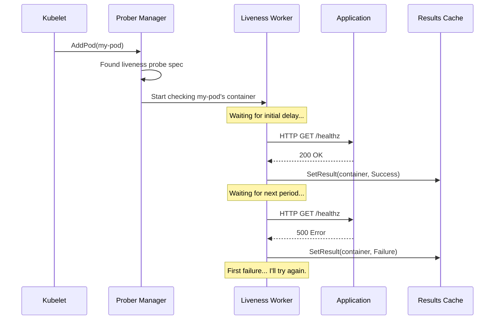

# Chapter 5: Prober Manager

In the [previous chapter](04_volume_manager_.md), we learned how the [Volume Manager](04_volume_manager_.md) ensures that a container gets its necessary storage before it starts. So now we have our pod running, with its containers created and its volumes mounted. Everything is great, right?

But what happens if the application *inside* the container freezes? The container process is still running, so from the outside, it looks fine. But it's not responding to requests and is essentially useless. How does Kubernetes detect this "zombie" state and fix it?

This is where the **Prober Manager** comes in. It's the Kubelet's own health inspector.

### What's the Big Idea?

Imagine you're managing a restaurant. You don't just check that your chefs (containers) show up for work. You also need to periodically check if they are actually cooking and if the food is ready to be served.

The **Prober Manager** is like the head chef who performs these checks. It's responsible for running three types of "health inspections" on your containers:

1.  **Liveness Probe:** "Are you alive?" This is like checking if the chef has a pulse. If this check fails repeatedly, the Prober Manager assumes the chef has passed out, and the Kubelet needs to restart the container to fix it.
2.  **Readiness Probe:** "Are you ready to serve?" This is like checking if the kitchen has finished preparing a dish. A container might be alive but busy loading a large file or waiting for a database connection. If the readiness probe fails, the container isn't ready for traffic, so Kubernetes temporarily removes its pod from the list of available endpoints.
3.  **Startup Probe:** "Are you done starting up?" Some applications take a long time to start. This probe tells the Kubelet to be patient and not trigger the liveness probe until the application is fully initialized.

For every probe you define in your pod's specification, the Prober Manager creates a dedicated **worker** that runs the check over and over again.

### A Walkthrough: Checking an Application's Health

Let's say we have a web server pod with a liveness probe that checks the `/healthz` endpoint.

1.  **A Pod is Added**: The Kubelet sees a new pod with a container that has a `livenessProbe` defined.
2.  **The Manager Takes Notice**: The `Prober Manager` receives this pod information. It sees the `livenessProbe` configuration.
3.  **Assign a Worker**: The manager creates and starts a new "probe worker" (a goroutine) dedicated *only* to this specific liveness check on this specific container.
4.  **The Worker Starts Checking**: The worker begins its loop:
    *   It first waits for any `initialDelaySeconds` you've configured.
    *   Then, every `periodSeconds`, it performs the probe—in this case, sending an HTTP GET request to `/healthz`.
5.  **Record the Result**: The worker gets a response.
    *   If it's a success (e.g., HTTP 200 OK), it records `Success` in a results cache.
    *   If it's a failure (e.g., HTTP 500), it records `Failure`.
6.  **Check the Threshold**: The worker keeps track of how many times in a row the check has failed. If the count reaches the `failureThreshold` (e.g., 3 failures), the official status in the cache is set to `Failure`.
7.  **Action is Taken**: The [Pod Workers](02_pod_workers_.md) periodically check these probe results. When a pod worker sees a persistent `Failure` result for a liveness probe, it knows the container is unhealthy and will initiate the process to restart it.

This flow can be visualized like this:



### A Peek at the Code

Let's look at the key Go code that makes this system work.

#### The Top-Level Manager

The `manager` in `prober/prober_manager.go` is the central coordinator. Its most important job is to keep a map of all the active probe workers.

```go
// prober/prober_manager.go

type manager struct {
	// Map of active workers for probes, indexed by a unique key.
	workers map[probeKey]*worker
	
	// Caches for probe results.
	readinessManager results.Manager
	livenessManager  results.Manager
	startupManager   results.Manager
	
	// ... other helpers ...
}
```
You can see it holds a `workers` map and has separate result managers for each probe type. The `probeKey` is a simple struct that uniquely identifies a probe for a container in a pod.

```go
// prober/prober_manager.go

// Key uniquely identifying container probes
type probeKey struct {
	podUID        types.UID
	containerName string
	probeType     probeType
}
```

#### Adding a Pod and Starting Workers

When a new pod is added, the `AddPod` function iterates through its containers, checks for probes, and creates workers.

```go
// prober/prober_manager.go

func (m *manager) AddPod(pod *v1.Pod) {
	// ... lock for safety ...

	for _, c := range pod.Spec.Containers {
		// Is there a Liveness Probe defined?
		if c.LivenessProbe != nil {
			// Create a new worker for this specific probe.
			w := newWorker(m, liveness, pod, c)
			
			// Store it in the map and run it in the background.
			m.workers[key] = w
			go w.run()
		}
		// ... similar checks for readiness and startup probes ...
	}
}
```
This shows the core logic: for each probe found, create a worker and start its work (`go w.run()`).

#### The Worker's Loop

Each worker runs in its own goroutine, executing the `run` method. This method contains the main probing loop.

```go
// prober/worker.go

// run periodically probes the container.
func (w *worker) run() {
	// Set up a ticker to fire every `PeriodSeconds`.
	probeTicker := time.NewTicker(time.Duration(w.spec.PeriodSeconds) * time.Second)
	defer probeTicker.Stop()

	// This is the main probe loop.
	for {
		// doProbe() performs one health check.
		if !w.doProbe(context.Background()) {
			// If doProbe returns false, it means the pod is finished, so we exit the loop.
			return
		}

		// Wait for the next tick or a stop signal.
		select {
		case <-w.stopCh:
			return
		case <-probeTicker.C:
			// Time for the next check!
		}
	}
}
```
This is a classic Go pattern: a `for` loop with a `select` statement that waits on a timer. The real logic is inside `doProbe`.

#### Performing the Probe and Caching Results

The `doProbe` function orchestrates a single check and decides if the result should be saved.

```go
// prober/worker.go

func (w *worker) doProbe(ctx context.Context) (keepGoing bool) {
	// ... check if pod/container is still running ...

	// Actually execute the probe (HTTP, TCP, or Exec).
	result, _ := w.probeManager.prober.probe(ctx, w.probeType, w.pod, ...)

	// ... logic to handle success/failure thresholds ...
	if (result == results.Failure && w.resultRun < int(w.spec.FailureThreshold)) {
		// Failure is below threshold, so we don't change the official state yet.
		return true
	}
	
	// The threshold has been met! Update the results cache.
	w.resultsManager.Set(w.containerID, result, w.pod)
	return true
}
```
Here, the worker calls a helper to run the actual probe. It then checks if the consecutive success or failure count has met the required threshold. Only then does it call `w.resultsManager.Set` to update the central cache.

#### The Results Cache

The `results.Manager` is surprisingly simple. It's just a cache that stores the result for each container.

```go
// prober/results/results_manager.go

// Manager provides a probe results cache.
type Manager interface {
	// Get returns the cached result for a container.
	Get(kubecontainer.ContainerID) (Result, bool)
	
	// Set sets the cached result for a container.
	Set(kubecontainer.ContainerID, Result, *v1.Pod)
}
```
The implementation uses a simple Go map protected by a lock to store `containerID -> Result`. This cache is the "source of truth" for probe results that other Kubelet components consult.

### Conclusion

The **Prober Manager** is the Kubelet's vigilant health inspector. It ensures that applications aren't just running but are also alive, ready, and behaving as expected. By launching dedicated workers for each liveness, readiness, and startup probe, it systematically checks container health. The results are cached and used by other parts of the Kubelet to make critical decisions, such as restarting an unhealthy container or taking a pod out of service rotation. This is a cornerstone of Kubernetes' self-healing capabilities.

We've seen how the Kubelet runs pods and checks their health. But how does it report all this information—like whether a pod is `Running`, `Pending`, or `Failed`, or if its containers are ready—back to the Kubernetes API server so you can see it with `kubectl`?

Next, we'll explore the component responsible for that in [Chapter 6: Status Manager](06_status_manager_.md).

---

Generated by [AI Codebase Knowledge Builder](https://github.com/The-Pocket/Tutorial-Codebase-Knowledge)