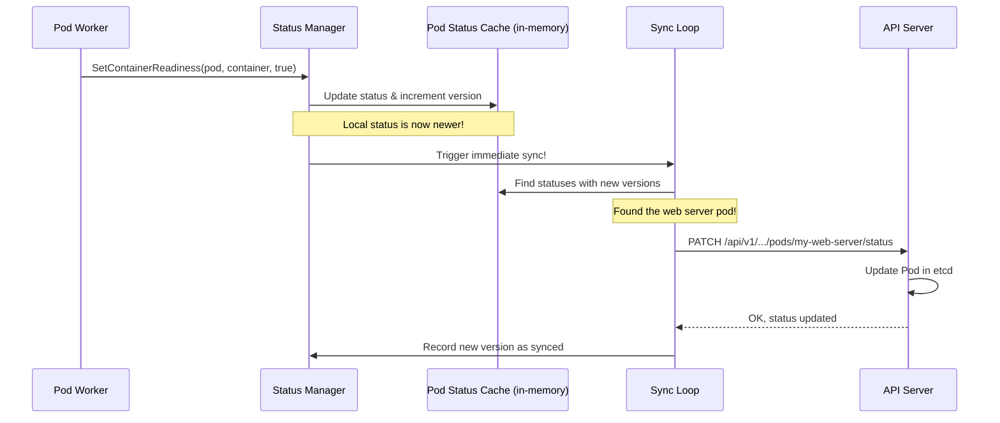

# Chapter 6: Status Manager

In the [previous chapter](05_prober_manager_.md), we learned how the [Prober Manager](05_prober_manager_.md) acts as a health inspector, constantly checking if our containers are alive and ready to serve traffic. When a probe succeeds or fails, it updates a local cache.

But this raises a crucial question: How does this information get from the Kubelet on a single node all the way back to the Kubernetes control plane? When you run `kubectl get pod my-app`, how does it know the pod's `STATUS` is `Running` and that `READY` is `1/1`?

This is the job of the **Status Manager**, the Kubelet's official news reporter.

### What's the Big Idea?

Imagine the Kubelet is a remote research station in Antarctica, and the API Server is the main headquarters back home. The research station (the Node) is buzzing with activity: scientists ([Pod Workers](02_pod_workers_.md)) are running experiments (Containers), and health officers ([Prober Manager](05_prober_manager_.md)) are checking on everyone's well-being.

The **Status Manager** is the **communications officer** for this station. Its job is to send regular reports back to headquarters. However, sending a report is expensive and time-consuming. To be efficient, the communications officer follows two simple rules:

1.  **Keep a Local Logbook:** They maintain a detailed, up-to-the-minute logbook of everything happening at the station. This is the local "source of truth".
2.  **Only Report Changes:** They don't send a new report every hour just to say "everything is the same." They only send an update to headquarters if something *meaningful* has changed since the last report (e.g., an experiment has finished, or a scientist is now ready for a new task).

This is precisely what the Status Manager does. It aggregates status information from all other Kubelet components into a local cache and then efficiently syncs it with the API server, ensuring the cluster's view of the pod is always accurate without flooding the network.

### A Walkthrough: From "Ready" to `kubectl`

Let's follow the journey of a status update for a web server pod.

1.  **Change Detected**: The [Prober Manager](05_prober_manager_.md) runs a readiness probe on our web server container and it succeeds for the first time. The container is now ready!

2.  **Report to Status Manager**: The component that initiated the probe (the [Pod Worker](02_pod_workers_.md)) is notified of the success. It then calls the Status Manager's `SetContainerReadiness` function.

3.  **Update the Local Cache**: The Status Manager receives this update. It finds the pod in its in-memory cache (`podStatuses`) and updates the corresponding container's status to `Ready: true`. It also increments a version number for this pod's status to mark it as "dirty" or "changed".

4.  **The Sync Loop Wakes Up**: A background routine in the Status Manager, `syncBatch`, runs periodically (e.g., every 10 seconds). It also gets triggered immediately when a status is updated. It scans the local cache for any pods whose version number is newer than the version last sent to the API server. It finds our web server pod.

5.  **Send the Report**: The `syncBatch` loop calls `syncPod` for our web server. This function creates a "patch" request containing only the changed status fields and sends it to the API Server.

6.  **Cluster State is Updated**: The API Server receives the patch and updates the Pod object in its database (etcd).

7.  **Visibility**: Now, when you run `kubectl get pod my-web-server`, `kubectl` queries the API Server, which returns the fresh, updated status, showing `READY: 1/1`.



### A Peek at the Code

Let's look at the core pieces in the Go code that implement this efficient reporting system.

#### The `Manager` Interface

The `Manager` interface in `status/status_manager.go` defines what the Status Manager must be able to do. It's a clear contract for other Kubelet components.

```go
// status/status_manager.go

type Manager interface {
	// Start the API server status sync loop.
	Start(ctx context.Context)

	// SetPodStatus caches updates the cached status for the given pod...
	SetPodStatus(logger klog.Logger, pod *v1.Pod, status v1.PodStatus)

	// SetContainerReadiness updates the cached container status...
	SetContainerReadiness(logger klog.Logger, podUID types.UID, containerID kubecontainer.ContainerID, ready bool)

	// ... other setters ...
}
```
Other managers use methods like `SetPodStatus` and `SetContainerReadiness` to report changes. `Start` kicks off the background sync loop.

#### The Local Cache: `podStatuses`

The `manager` struct holds the "local logbook"—a map that stores the latest known status for every pod on the node.

```go
// status/status_manager.go

type manager struct {
	// ...
	// Map from pod UID to sync status of the corresponding pod.
	podStatuses         map[types.UID]versionedPodStatus
	podStatusesLock     sync.RWMutex
	// A channel to trigger an immediate sync.
	podStatusChannel    chan struct{}
	// Map of the latest versions successfully sent to the API server.
	apiStatusVersions map[kubetypes.MirrorPodUID]uint64
	// ...
}
```
*   `podStatuses`: The cache itself. It maps a pod's unique ID to a `versionedPodStatus` struct, which contains the `v1.PodStatus` and a version number.
*   `podStatusChannel`: A simple channel used to signal the sync loop that there's new work to do.
*   `apiStatusVersions`: Keeps track of the last version we successfully sent to the API server for each pod, so we know if our local cache is ahead.

#### Updating the Cache and Triggering a Sync

When another manager calls `SetContainerReadiness`, the status manager updates its cache and gives the sync loop a nudge.

```go
// status/status_manager.go (Simplified)

func (m *manager) SetContainerReadiness(logger klog.Logger, podUID types.UID, ...) {
	m.podStatusesLock.Lock() // a lock to prevent race conditions
	defer m.podStatusesLock.Unlock()

	// ... find the pod and its status in the cache ...
	// ... update the readiness field in a copy of the status ...

	// This internal function updates the cache and triggers the sync.
	m.updateStatusInternal(logger, pod, newStatus, false, false)
}

func (m *manager) updateStatusInternal(logger klog.Logger, pod *v1.Pod, status v1.PodStatus, ...) {
	// ... some logic to see if the status has actually changed ...
	
	// Create a new versioned status with an incremented version number.
	newStatus := versionedPodStatus{
		status:        status,
		version:       cachedStatus.version + 1,
		// ...
	}
	m.podStatuses[pod.UID] = newStatus

	// Send a signal on the channel to wake up the sync loop.
	select {
	case m.podStatusChannel <- struct{}{}:
	default: // A sync is already pending, no need to send another signal.
	}
}
```
This is the heart of the efficiency mechanism: update locally, increment a version, and then signal the background worker.

#### The Sync Loop

The `Start` method launches a `go wait.Forever` loop. Inside this loop, it waits for signals from `podStatusChannel` or a periodic timer. When it wakes up, it calls `syncBatch`.

```go
// status/status_manager.go (Simplified)

func (m *manager) syncBatch(ctx context.Context, all bool) {
	// ... lock and get a list of pods to update ...
	for uid, status := range m.podStatuses {
		// Compare local cache version with the last synced version.
		if m.apiStatusVersions[uidOfStatus] < status.version {
			// Add to list of pods that need a sync.
			updatedStatuses = append(updatedStatuses, ...)
		}
	}
	
	// For each pod in the list, sync it.
	for _, update := range updatedStatuses {
		m.syncPod(ctx, update.podUID, update.status)
	}
}
```

#### Generating the Final Report

The Status Manager doesn't just forward information; it synthesizes it. Helper functions in `status/generate.go` are used to calculate the overall pod conditions based on the state of its individual containers.

```go
// status/generate.go (Simplified)

// GeneratePodReadyCondition determines the overall "Ready" condition of a pod.
func GeneratePodReadyCondition(pod *v1.Pod, ...) v1.PodCondition {
	// First, check if all containers are ready.
	containersReady := GenerateContainersReadyCondition(...)
	if containersReady.Status != v1.ConditionTrue {
		return v1.PodCondition{
			Type:   v1.PodReady,
			Status: v1.ConditionFalse, // If containers aren't ready, the pod isn't ready.
			Reason: containersReady.Reason,
		}
	}

	// Next, check if all "Readiness Gates" are satisfied.
	// ... logic to check readiness gates ...

	// If everything passed, the pod is ready!
	return v1.PodCondition{
		Type:   v1.PodReady,
		Status: v1.ConditionTrue,
	}
}
```
This function is a perfect example of the "compilation" part of the job. It takes multiple inputs (container readiness, readiness gates) and produces a single, definitive `PodReady` condition.

### Conclusion

The **Status Manager** is the Kubelet's essential link to the rest of the cluster. It acts as a diligent and efficient reporter, gathering intelligence from all other node components, compiling it into a coherent status report, and delivering it to the API server. By using a versioned cache and only syncing changes, it provides timely and accurate updates without creating unnecessary network traffic, which is critical for the scalability of a large cluster. It's the reason `kubectl` can give you a real-time view into the health and status of your workloads.

So far, we've seen how pods are started, checked for health, and how their status is reported. But what about resources? How does the Kubelet enforce CPU and memory limits to ensure one noisy pod doesn't take down the entire node?

Next, we'll explore the component responsible for resource accounting and enforcement in [Chapter 7: Container Manager (cm)](07_container_manager__cm__.md).

---

Generated by [AI Codebase Knowledge Builder](https://github.com/The-Pocket/Tutorial-Codebase-Knowledge)