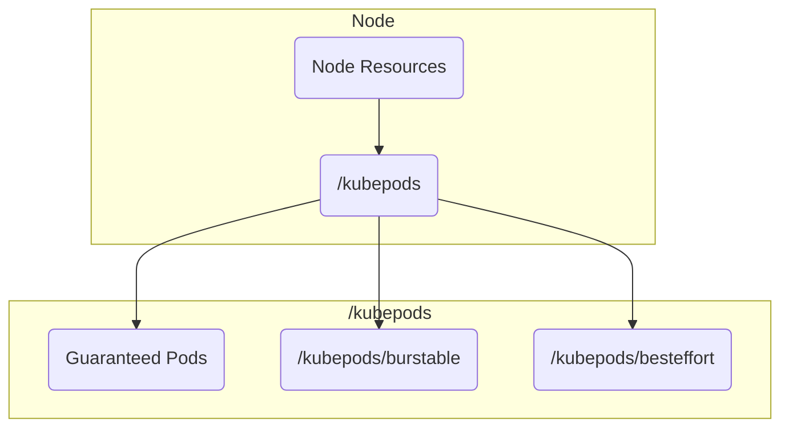
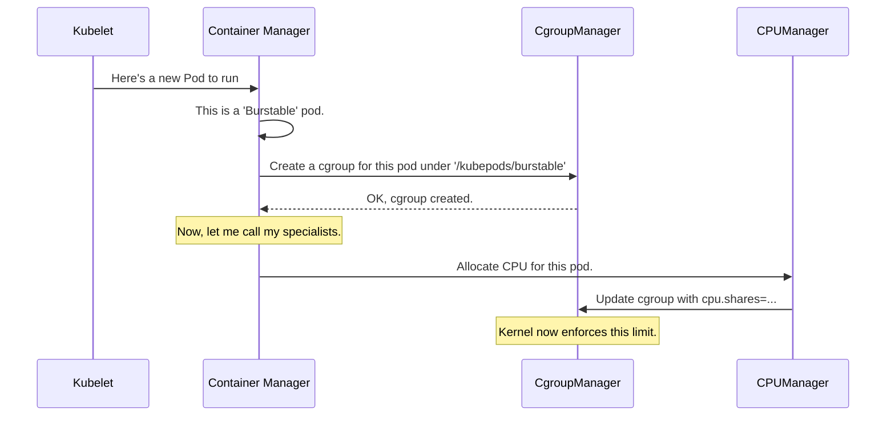

# Chapter 7: Container Manager (cm)

In the [previous chapter](06_status_manager_.md), we saw how the [Status Manager](06_status_manager_.md) acts as a reporter, sending updates about our pods back to the API server. We now have pods running, and we can see their status.

But this brings up a new, critical problem. Your Kubernetes node has a fixed amount of resources—CPU, memory, etc. What stops a single, badly-behaved pod from using up all the CPU and starving every other application, including the Kubelet itself? How does Kubernetes guarantee that a critical database pod gets the resources it needs to run properly?

This is the job of the **Container Manager (cm)**, the Kubelet's strict but fair resource accountant.

### What's the Big Idea?

Imagine a landlord managing an apartment building. The building has a total capacity for electricity and water. The landlord can't let one tenant use all the water for their swimming pool, leaving none for others to shower.

The **Container Manager** is this landlord. Its job is to:
1.  **Know the Building's Capacity:** It knows the total CPU and memory available on the node.
2.  **Offer Different Lease Agreements (QoS):** It provides different levels of service, known as Quality of Service (QoS) classes.
3.  **Enforce the Leases:** It uses a powerful Linux kernel feature called **cgroups** (control groups) to enforce the resource limits for each tenant (Pod).

A **cgroup** is like a special "resource box." You can put a process (like a container) inside this box, and the Linux kernel will make sure it never uses more resources than the box's configuration allows. It's like putting a meter and a circuit breaker on each apartment's power line.

### The Three Lease Agreements: QoS Classes

The Container Manager categorizes every pod into one of three QoS classes based on its resource `requests` and `limits`:

1.  **Guaranteed:** This is the premium lease. A pod is `Guaranteed` if every container in it has a specific CPU and memory `limit`, and the `request` is set to the same value.
    *   **Analogy:** You lease an apartment with a guaranteed 100 amps of power. You are *guaranteed* to get it, and you can't use more.
    *   These pods are the highest priority.

2.  **Burstable:** This is the standard lease. A pod is `Burstable` if it has at least one container with a CPU or memory `request`, but it doesn't meet the criteria for `Guaranteed`.
    *   **Analogy:** You lease an apartment with a *requested* 50 amps but a *limit* of 100. You're guaranteed at least 50, but you can "burst" up to 100 if no one else is using the extra capacity.
    *   These are medium-priority pods.

3.  **BestEffort:** This is the "no promises" lease. A pod is `BestEffort` if it has no CPU or memory `requests` or `limits` at all.
    *   **Analogy:** You're crashing on a friend's couch. You can use the power outlets, but if the paying tenants need more power, your devices get unplugged first.
    *   These are the lowest priority pods and will be the first to be killed if the node runs out of resources.

The Container Manager uses these classes to set up a cgroup hierarchy on the node, ensuring that `BestEffort` pods can't steal resources from `Guaranteed` ones.



### A Walkthrough: A Pod Gets Its Resources

Let's see what happens when a `Burstable` pod is scheduled on a node.

1.  **Pod Arrives**: The Kubelet decides to run a new pod.
2.  **Determine QoS**: The Container Manager examines the pod's spec and determines it's in the `Burstable` QoS class.
3.  **Find the Right Cgroup**: It knows that this pod must live under the `/kubepods/burstable` cgroup.
4.  **Delegate to Specialists**: The Container Manager is a coordinator. It doesn't handle the specifics of each resource itself. It delegates to its team of specialists:
    *   The **CPUManager** is called to decide how to share CPU time.
    *   The **MemoryManager** is called to set memory limits.
    *   The **DeviceManager** is called to allocate devices like GPUs.
5.  **Enforce Limits**: The specialist managers work together to configure the pod's personal cgroup. For our `Burstable` pod, the `CPUManager` might set a `cpu.shares` value (giving it a proportional share of CPU time), and the `MemoryManager` sets the `memory.limit_in_bytes`.
6.  **Kernel Takes Over**: The Linux kernel now enforces these cgroup limits automatically. If the pod tries to use more memory than its limit, the kernel will terminate it (an "OOMKill").

This process ensures that every pod stays within its resource budget, creating a stable, predictable environment for all applications on the node.



### A Peek at the Code

Let's look at the code that manages this cgroup hierarchy and resource enforcement.

#### The Top-Level Manager

The `ContainerManager` interface in `cm/container_manager.go` shows its broad responsibilities. It's not just about one thing; it's the central point for all resource management.

```go
// cm/container_manager.go

// Manages the containers running on a machine.
type ContainerManager interface {
	Start(...) error
	// Creates the cgroups for QoS Tiers.
	UpdateQOSCgroups() error
	// Allocates devices, CPU, memory etc. for a container.
	GetResources(pod *v1.Pod, container *v1.Container) (*kubecontainer.RunContainerOptions, error)
	// Returns a handler that can allocate resources during pod admission.
	GetAllocateResourcesPodAdmitHandler() lifecycle.PodAdmitHandler
	// ...and many other functions
}
```

#### Creating the QoS Cgroups

The `qosContainerManagerImpl` in `cm/qos_container_manager_linux.go` is responsible for setting up the top-level cgroups for `Burstable` and `BestEffort` pods.

```go
// cm/qos_container_manager_linux.go

func (m *qosContainerManagerImpl) Start(...) error {
	// Define the cgroup names for each QoS class.
	qosClasses := map[v1.PodQOSClass]CgroupName{
		v1.PodQOSBurstable:  NewCgroupName(root, "burstable"),
		v1.PodQOSBestEffort: NewCgroupName(root, "besteffort"),
	}

	// Create the cgroups if they don't exist.
	for qosClass, containerName := range qosClasses {
		if !m.cgroupManager.Exists(containerName) {
			m.cgroupManager.Create(...)
		}
	}
	// ...
}
```
This startup logic ensures the basic cgroup structure (`/kubepods/burstable` and `/kubepods/besteffort`) exists. `Guaranteed` pods run directly under `/kubepods`.

#### Updating Cgroup Resources

A background loop periodically calls `UpdateCgroups` to make sure the resource allocations are correct. This function delegates to helpers like `setCPUCgroupConfig`.

```go
// cm/qos_container_manager_linux.go

func (m *qosContainerManagerImpl) setCPUCgroupConfig(configs map[...]*CgroupConfig) error {
	pods := m.activePods()
	burstablePodCPURequest := int64(0)

	// 1. Sum up all CPU requests from Burstable pods.
	for _, pod := range pods {
		if v1qos.GetPodQOS(pod) == v1.PodQOSBurstable {
			// ... add pod's CPU request to burstablePodCPURequest ...
		}
	}

	// 2. Set BestEffort to the minimum possible CPU shares.
	bestEffortCPUShares := uint64(MinShares) // MinShares is 2
	configs[v1.PodQOSBestEffort].ResourceParameters.CPUShares = &bestEffortCPUShares

	// 3. Set Burstable shares based on the sum of requests.
	burstableCPUShares := MilliCPUToShares(burstablePodCPURequest)
	configs[v1.PodQOSBurstable].ResourceParameters.CPUShares = &burstableCPUShares
	return nil
}
```
This logic demonstrates how the manager acts as an accountant. It sums up the "guaranteed" portion for all `Burstable` pods and adjusts their overall cgroup `cpu.shares` value, ensuring they get their fair share of CPU time relative to each other.

#### The Specialist Managers

The Container Manager holds instances of its specialists, like the `CPUManager` and `DeviceManager`.

-   **`CPUManager` (`cm/cpumanager/cpu_manager.go`)**: If you have a `Guaranteed` pod and enable the `static` CPU policy, this manager will give it exclusive access to certain CPU cores. No other process can run on them.
-   **`MemoryManager` (`cm/memorymanager/memory_manager.go`)**: For `Guaranteed` pods, this manager can pin their memory to specific NUMA nodes, which is critical for high-performance computing.
-   **`DeviceManager` (`cm/devicemanager/manager.go`)**: This manager handles special hardware like GPUs or FPGAs, ensuring they are exclusively allocated to the correct containers.

When the Kubelet needs to allocate resources, it asks the main Container Manager, which in turn consults these specialists to get the right settings for the container's cgroup.

### Conclusion

The **Container Manager** is the Kubelet's essential enforcer, guaranteeing stability and fairness on a multi-tenant node. By translating Kubernetes' **QoS classes** into concrete **cgroup** configurations, it ensures that high-priority pods get the resources they need and low-priority pods can't disrupt the whole system. It coordinates a team of specialist sub-managers (`CPUManager`, `MemoryManager`, `DeviceManager`) to handle the fine-grained details of each resource type, making it the cornerstone of resource management in Kubernetes.

But what happens when, despite all this careful management, the node still runs out of resources, perhaps due to a memory leak? The Kubelet needs a plan to gracefully reclaim resources.

Next, we'll explore the Kubelet's last line of defense in [Chapter 8: Eviction Manager](08_eviction_manager_.md).

---

Generated by [AI Codebase Knowledge Builder](https://github.com/The-Pocket/Tutorial-Codebase-Knowledge)